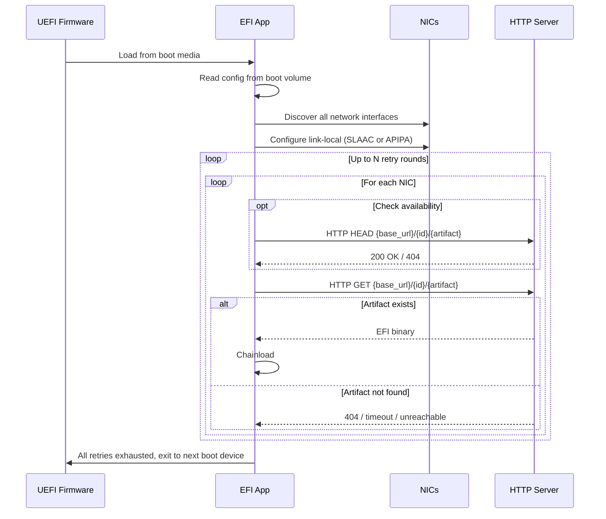
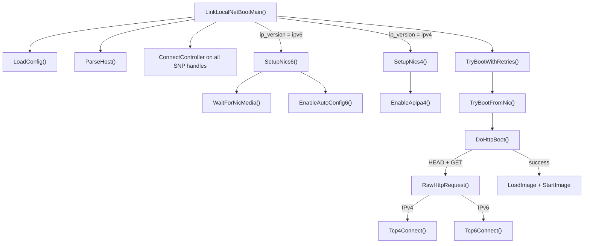
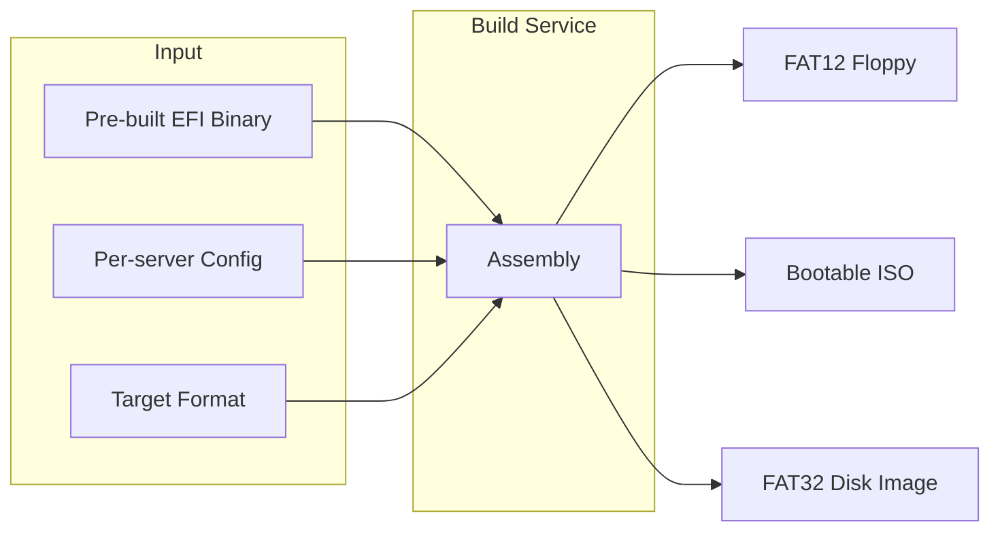

In the [previous post](/modern-baremetal-provisioning/), we designed a baremetal provisioning system from scratch, dropping PXE, TFTP, IPMI, and legacy BIOS entirely. The result was a system built around Redfish BMCs, UEFI firmware, and a build service that assembles UKI artifacts on demand. One of the design constraints was minimal DHCP dependency, and for the provisioning workflow, we achieved something stronger: **no DHCP dependency at all**.

Here's the short version. The orchestrator computes a static IP for the server, builds a cloud-init network config with that IP, injects it into the boot image via a CPIO overlay, and delivers the image through the BMC's virtual media interface. The server boots, cloud-init applies the injected network config, and the server comes up on the predetermined address. No DHCP lease, because the network identity was baked into the artifact before the server ever powered on. The [full provisioning sequence](/modern-baremetal-provisioning/#provisioning-a-known-server) is covered in detail there.

That flow works when the BMC actually supports virtual media properly, Redfish isn't broken, and you've bought whatever license the vendor wants before they'll let you use these features. In practice, not every server meets those conditions. Some BMC firmware has broken or incomplete virtual media support. Some can only handle basic power control and possibly boot order changes. The server itself is UEFI capable, but the BMC can't deliver a boot image to it.

Can we still provision these servers without falling back to PXE and DHCP? Some BMCs expose virtual media through their web UI even when Redfish doesn't support it. You might be able to attach a CD, disk, or floppy image through it, not all options are available on every BMC, but at least one can be present. Some BMCs can also mount virtual CD images over NFS or SMB without any license, even when HTTP-based virtual media is either license-gated or not available at all. If none of that is available either, some servers have an SD card slot on the motherboard, and most have at least one USB port.

All of these methods preserve the no-DHCP property but the problem is that rebuilding and remounting a per-server image for every provisioning run isn't sustainable when the mount itself requires manual steps.

The boot image needs to be semi-static. Still per-server, so we can identify which machine it belongs to, but unchanged across multiple provisioning cycles. Ideally it should also be able to chainload the next boot device when no provisioning is active, so on servers where the boot order has to be set manually due to BMC limitations, the image can stay permanently in place without interfering with normal operation.

## Designing the chainload image

The constraints above give us a fairly specific set of requirements for what this image needs to be:

- **EFI only, multi-architecture.** Legacy BIOS is out of scope. The image must support at least ARM64 and AMD64.
- **Small enough to fit on a floppy image.** Some BMCs only expose a virtual floppy drive. The entire EFI application, including any embedded data, must fit within 1.44 MB.
- **Static across provisioning cycles.** The image should not need to be rebuilt every time the server is reprovisioned. Network configuration in particular must not be baked in, so it can change without touching the image.
- **Uniquely identifies the server.** We cannot rely on data reported by the BMC. In practice, fields like the platform serial number are often empty or duplicated across machines. The image itself must carry a stable, per-server identity.
- **Chainloads next boot device when idle.** If no provisioning artifact is available on the server, the application must hand off to the next boot entry instead of hanging or rebooting. This allows the image to stay permanently mounted without interfering with normal operation.

### Link-local networking

The "static across provisioning cycles" and "no DHCP" constraints together rule out any scheme where network configuration is baked into the image. The application needs to acquire a usable IP address on its own, at boot time, without any external coordination. Link-local addressing does exactly this.

Both IPv6 and IPv4 have a link-local mechanism. IPv6 Stateless Address Autoconfiguration, defined in [RFC 4862](https://datatracker.ietf.org/doc/html/rfc4862), generates an address in the `fe80::/10` range (effectively `fe80::/64`, since the 54 bits between the prefix and the 64-bit interface ID are always zero), typically derived from the interface's MAC address. The process requires no server, no router advertisement, and no configuration. IPv4 has an equivalent in [RFC 3927](https://datatracker.ietf.org/doc/html/rfc3927), which defines automatic assignment of addresses in the `169.254.0.0/16` range using ARP probes for conflict detection. The first and last `/24` subnets (`169.254.0.0/24` and `169.254.255.0/24`) are reserved by IANA and excluded from automatic allocation, so usable addresses fall within `169.254.1.0` through `169.254.254.255`.

Both are needed. Not all UEFI firmware includes IPv6 support, and some environments may not have IPv6 enabled at the network level. IPv4 link-local provides a fallback that works on essentially any UEFI network stack. On the other hand, IPv6 SLAAC is faster to configure and avoids the ARP probe/announce cycle, so it should be preferred when available.

The only requirement is L2 adjacency: the server being provisioned and the HTTP endpoint serving the boot artifact must be on the same broadcast domain. Compared to traditional PXE, where you need a DHCP server with specific options configured, a TFTP server, and often a relay agent if anything crosses subnet boundaries, the link-local requirement is minimal. Any server on the same ToR switch or VLAN can serve the role.

### Server identity and artifact URLs

In the [previous post](/modern-baremetal-provisioning/#build-endpoints), the build service generates artifact IDs automatically. The orchestrator submits a build request, the service computes a SHA-256 content hash from the request body, and uses that as the build ID. Artifact URLs are only known after the build completes, returned in the status response as `artifacts.ukiUrl` and `artifacts.isoUrl`. The orchestrator never constructs these URLs manually.

That model doesn't work for the chainload image. The image needs a predictable artifact URL baked in at creation time, before any build exists. The EFI application would poll this URL on every boot, checking whether a provisioning artifact is available. If the URL changes with every build, the image would need to be rebuilt too, which defeats the "static across provisioning cycles" constraint.

The fix is straightforward: let the client specify the build ID. Instead of the service generating a content hash, `POST /api/v1/builds` would accept an `id` field in the request body. The rest of the API would stay the same. `GET /api/v1/builds/{id}` would still return build status. `GET /artifacts/{id}/{filename}` would still serve the artifact. `DELETE /api/v1/builds/{id}` would still clean up. The only difference is who chooses the ID.

This would make the artifact URL predictable: `http://<base_url>/<id>/<artifact_name>`. The chainload image would carry a small config file on its boot volume with `base_url`, `id`, and per-architecture artifact filenames. The EFI application would read the config, construct the URL, and check whether the artifact is available. An implementation could issue an HTTP HEAD first to check availability before downloading, or go straight to a GET. If the artifact exists, it would download and chainload it. If not, it would fall back to the next boot entry. The `id` would be the only per-server element in the image, and would never change.

### Configuration

A config file on the boot volume would control the application's behavior. The required fields are:

- **`base_url`** and **`id`**: together these form the artifact URL prefix. The application would construct the full URL as `{base_url}/{id}/{artifact_name}`.
- **Per-architecture artifact names**: separate filenames for AMD64 and ARM64, so the same config structure works across architectures.
- **IP version**: whether to use IPv6 (SLAAC) or IPv4 (APIPA) for link-local address configuration.

### Boot flow

On power-on, the UEFI firmware would load the EFI application from whichever medium it was delivered on. From there, the application would take over:



The application would iterate over every discovered NIC on each retry round. If any NIC reaches the server and the artifact is available, it would download and chainload the EFI binary. If all NICs fail across all retries, the application would exit cleanly, handing control back to the UEFI firmware which would proceed to the next entry in the boot order.

### Image delivery

The EFI application could be shipped to the server through any of the methods discussed earlier: a virtual floppy or CD image mounted through the BMC web UI, a virtual CD over NFS or SMB, an SD card on the motherboard, or a USB drive. The packaging format would depend on what the BMC and hardware support. A 1.44 MB FAT12 floppy image, a bootable ISO with an EFI System Partition, or a FAT32 disk image would all work. The EFI application binary and its config file would be the only contents.

If the BMC supports boot order changes through Redfish, the orchestrator could set the chainload image as a one-time boot entry programmatically. If not, the boot order would be configured manually so the EFI application is permanently first. Either way, the application would check the artifact server on every boot. If an artifact exists for its ID, it would download and chainload it. If not, it would release control to the next boot device and the server would proceed with normal operation.

### Artifact serving

The EFI application needs an HTTP server on the same L2 segment to fetch the chainload artifact from. This server needs a well-known link-local address that the application can reach without any discovery protocol. For IPv4, the server would use an address from the `169.254.0.0/24` range that RFC 3927 reserves and excludes from automatic allocation. Since no APIPA client will ever claim an address in this range, there is no risk of conflict. For IPv6, the same principle applies. SLAAC generates interface IDs using EUI-64, which embeds the MAC address with `ff:fe` in the middle and produces a 64-bit identifier. A manually assigned address like `fe80::1:42` has an interface ID that doesn't match the EUI-64 pattern, so no SLAAC client would ever auto-generate it. This makes it safe to use as a well-known server address, and unlike a SLAAC-derived address, it remains stable regardless of which NIC the server uses.

This HTTP server only needs to serve the initial chainload artifact. It could be the build service itself if it happens to be on the same L2 segment, or it could be a lightweight reverse proxy that forwards requests to the build service. The build service from the [previous post](/modern-baremetal-provisioning/#artifacts-and-health) already serves artifacts via `GET /artifacts/{id}/{filename}` with HEAD support, so if it is reachable over link-local, no additional infrastructure is needed.

Once the EFI application chainloads the UKI and the ephemeral OS boots, the link-local phase is over. From that point on, everything proceeds exactly as described in the [previous post](/modern-baremetal-provisioning/#provisioning-a-known-server): cloud-init applies the injected network config from the CPIO overlay, the server comes up on its assigned routable IP, and checkins, SSH, and provisioning tasks happen over normal networking.

### Security

The application would communicate over plain HTTP on link-local addresses. Link-local addresses are not routable, which limits the exposure to the local broadcast domain. In most environments, the provisioning VLAN is already isolated from general-purpose networks. This is the same trust boundary that PXE and TFTP operate within.

## Implementation

The chainload application has two implementations: a custom EDK2 UEFI application and an iPXE-based alternative. Both are cross-compiled for X64 and AARCH64 inside Docker. A minimal test stub serves as the chainload target for end-to-end testing.

### Test stub

For testing the chainload mechanism end-to-end without a full ephemeral OS, a minimal EFI application would serve as a stand-in for the UKI. This would be a trivial EDK2 application that prints a banner to confirm it was successfully chainloaded, then shuts down the machine via `ResetSystem`. It needs no networking, no filesystem access, and no configuration. Its only purpose is to prove that the chainload path works: the main EFI application found the artifact, downloaded it, loaded it into memory, and transferred execution to it. If the banner appears and the machine shuts down cleanly, the entire flow from link-local address configuration through HTTP download to UEFI `LoadImage`/`StartImage` is verified.

The application itself is minimal. It uses three EDK2 libraries: `UefiApplicationEntryPoint` for the entry point, `UefiLib` for console output, and `UefiRuntimeServicesTableLib` for the shutdown call.

<details>
<summary>TestUkiPkg/Application/TestUki/TestUki.c</summary>

```c
#include <Uefi.h>
#include <Library/UefiLib.h>
#include <Library/UefiRuntimeServicesTableLib.h>

EFI_STATUS
EFIAPI
TestUkiMain (
  IN EFI_HANDLE        ImageHandle,
  IN EFI_SYSTEM_TABLE  *SystemTable
  )
{
  (VOID)ImageHandle;
  (VOID)SystemTable;

  Print (L"\n");
  Print (L"==========================================\n");
  Print (L"  Hello from chainloaded UKI!\n");
  Print (L"==========================================\n");
  Print (L"\nShutting down...\n");

  gRT->ResetSystem (EfiResetShutdown, EFI_SUCCESS, 0, NULL);

  /* Not reached */
  return EFI_SUCCESS;
}
```

</details>

Building an EDK2 application requires a module description (`.inf`), a package declaration (`.dec`), and a platform description (`.dsc`) that maps library classes to their implementations. The `.inf` file declares the module's source files and library dependencies. The `.dec` file defines the package. The `.dsc` file ties everything together: it resolves each library class to a concrete implementation from EDK2's `MdePkg` and lists the components to build.

<details>
<summary>TestUkiPkg/Application/TestUki/TestUki.inf</summary>

```ini
[Defines]
  INF_VERSION    = 0x00010005
  BASE_NAME      = TestUki
  FILE_GUID      = aabb0011-2233-4455-6677-8899aabbccdd
  MODULE_TYPE    = UEFI_APPLICATION
  VERSION_STRING = 0.1
  ENTRY_POINT    = TestUkiMain

[Sources]
  TestUki.c

[Packages]
  MdePkg/MdePkg.dec

[LibraryClasses]
  UefiApplicationEntryPoint
  UefiLib
  UefiRuntimeServicesTableLib
```

</details>

<details>
<summary>TestUkiPkg/TestUkiPkg.dec</summary>

```ini
[Defines]
  DEC_SPECIFICATION = 0x00010005
  PACKAGE_NAME      = TestUkiPkg
  PACKAGE_GUID      = 11223344-5566-7788-99aa-bbccddeeff00
  PACKAGE_VERSION   = 0.1
```

</details>

<details>
<summary>TestUkiPkg/TestUkiPkg.dsc</summary>

```ini
[Defines]
  PLATFORM_NAME           = TestUkiPkg
  PLATFORM_GUID           = 00112233-4455-6677-8899-aabbccddeeff
  PLATFORM_VERSION        = 0.1
  DSC_SPECIFICATION       = 0x00010005
  OUTPUT_DIRECTORY        = Build/TestUkiPkg
  SUPPORTED_ARCHITECTURES = X64|AARCH64
  BUILD_TARGETS           = DEBUG|RELEASE
  SKUID_IDENTIFIER        = DEFAULT

[LibraryClasses]
  UefiApplicationEntryPoint|MdePkg/Library/UefiApplicationEntryPoint/UefiApplicationEntryPoint.inf
  UefiLib|MdePkg/Library/UefiLib/UefiLib.inf
  BaseLib|MdePkg/Library/BaseLib/BaseLib.inf
  BaseMemoryLib|MdePkg/Library/BaseMemoryLib/BaseMemoryLib.inf
  PrintLib|MdePkg/Library/BasePrintLib/BasePrintLib.inf
  PcdLib|MdePkg/Library/BasePcdLibNull/BasePcdLibNull.inf
  DebugLib|MdePkg/Library/BaseDebugLibNull/BaseDebugLibNull.inf
  MemoryAllocationLib|MdePkg/Library/UefiMemoryAllocationLib/UefiMemoryAllocationLib.inf
  UefiBootServicesTableLib|MdePkg/Library/UefiBootServicesTableLib/UefiBootServicesTableLib.inf
  UefiRuntimeServicesTableLib|MdePkg/Library/UefiRuntimeServicesTableLib/UefiRuntimeServicesTableLib.inf
  DevicePathLib|MdePkg/Library/UefiDevicePathLib/UefiDevicePathLib.inf
  RegisterFilterLib|MdePkg/Library/RegisterFilterLibNull/RegisterFilterLibNull.inf
  StackCheckLib|MdePkg/Library/StackCheckLibNull/StackCheckLibNull.inf

[LibraryClasses.AARCH64]
  NULL|MdePkg/Library/CompilerIntrinsicsLib/CompilerIntrinsicsLib.inf

[Components]
  TestUkiPkg/Application/TestUki/TestUki.inf
```

</details>

The build itself runs inside a Docker container with EDK2 and cross-compilers for both architectures. The Dockerfile clones the EDK2 source, builds BaseTools, and installs the GCC cross-compilers for X64 and AARCH64.

<details>
<summary>Dockerfile</summary>

```dockerfile
FROM debian:bookworm-slim AS edk2-base

ARG EDK2_TAG=edk2-stable202602
ARG EDK2_REPO=https://github.com/tianocore/edk2.git

RUN apt-get update \
 && apt-get install -y --no-install-recommends \
    git ca-certificates make gcc g++ python3 python-is-python3 \
    uuid-dev nasm iasl bison flex \
 && rm -rf /var/lib/apt/lists/*

WORKDIR /edk2

RUN git clone --depth 1 --branch "${EDK2_TAG}" "${EDK2_REPO}" . \
 && git submodule update --init --depth 1 \
      BaseTools/Source/C/BrotliCompress/brotli \
      MdeModulePkg/Library/BrotliCustomDecompressLib/brotli \
      MdePkg/Library/MipiSysTLib/mipisyst \
      MdePkg/Library/BaseFdtLib/libfdt

RUN make -C BaseTools -j"$(nproc)"

FROM debian:bookworm-slim

RUN apt-get update \
 && apt-get install -y --no-install-recommends \
    make python3 python-is-python3 nasm iasl uuid-dev \
    gcc-x86-64-linux-gnu gcc-aarch64-linux-gnu \
 && rm -rf /var/lib/apt/lists/*

COPY --from=edk2-base /edk2 /edk2

WORKDIR /src
```

</details>

With these files in place, building the test stub for both architectures is straightforward:

```bash
# Build the Docker image (one-time)
docker build -t test-efi .

# Build for X64
docker run --rm -v "$(pwd):/src:ro" -v "$(pwd)/build:/out" test-efi \
  bash -c 'cd /edk2 && . ./edksetup.sh && \
  PACKAGES_PATH="/edk2:/src" GCC5_BIN=x86_64-linux-gnu- \
  build -a X64 -t GCC5 -b RELEASE -p TestUkiPkg/TestUkiPkg.dsc && \
  cp Build/TestUkiPkg/RELEASE_GCC5/X64/TestUki.efi /out/'

# Build for AARCH64
docker run --rm -v "$(pwd):/src:ro" -v "$(pwd)/build:/out" test-efi \
  bash -c 'cd /edk2 && . ./edksetup.sh && \
  PACKAGES_PATH="/edk2:/src" GCC5_AARCH64_PREFIX=aarch64-linux-gnu- \
  build -a AARCH64 -t GCC5 -b RELEASE -p TestUkiPkg/TestUkiPkg.dsc && \
  cp Build/TestUkiPkg/RELEASE_GCC5/AARCH64/TestUki.efi /out/'
```

### EDK2 EFI application

The application is an EDK2 UEFI module built against the public headers and libraries from [TianoCore EDK2](https://github.com/tianocore/edk2). It uses `MdePkg` for core UEFI types and boot services, `NetworkPkg` for the TCP and HTTP libraries, and `RedfishPkg` for JSON parsing. The entry point loads configuration, sets up link-local addressing on all discovered NICs (SLAAC for IPv6, APIPA for IPv4), then enters a retry loop that attempts to download and chainload the artifact from each NIC.

Building a UEFI application that does link-local networking and HTTP download sounds straightforward on paper, but the EDK2 firmware stack has several quirks that force non-obvious implementation choices:

- **Plain HTTP is blocked by default.** EDK2's `HttpDxe` driver has a build-time guard, `PcdAllowHttpConnections`, that defaults to `FALSE`. When disabled, `EFI_HTTP_PROTOCOL` returns `EFI_ACCESS_DENIED` for any non-HTTPS request. The check appears in both `HttpBootDxe` (URI scheme validation) and `HttpDxe` (the `Request()` call itself). For plain HTTP to work, the firmware vendor would need to enable the PCD or expose it as a configurable option, neither can be assumed on real hardware. HTTPS is not a viable workaround either: there is no PKI infrastructure at this stage of provisioning, the firmware's TLS stack may not be able to verify certificates at all, and using self-signed certificates would require injecting a custom CA into the firmware's trust store, assuming the firmware even supports that. The application must bypass `HttpDxe` entirely and implement HTTP over raw TCP.

- **ARP probes require zero sender IP, but EFI_ARP_PROTOCOL rejects it.** RFC 3927 requires ARP probes with sender IP `0.0.0.0` to signal the sender does not yet own an address. EDK2's `EFI_ARP_PROTOCOL` rejects a zero sender, so the application must drop down to `EFI_MANAGED_NETWORK_PROTOCOL` (MNP) and construct raw ARP frames manually, including the Ethernet header.

- **NICs without PXE enabled may not have an IP stack.** UEFI firmware only attaches the full network stack (MnpDxe, Ip4Dxe, TcpDxe) to NICs that have PXE boot enabled in the BIOS. The application must call `ConnectController` recursively on every SNP handle to force the firmware to instantiate the IP stack on all NICs.

- **Link media detection may require explicit polling.** After SNP initialization, `MediaPresent` can be stale. Calling `Snp->GetStatus()` in a poll loop refreshes the hardware link state. On real hardware, link auto-negotiation can take several seconds, so the application should wait for media before attempting any network operation.

- **Ip4Config2 address assignment is asynchronous.** Setting a static address via `Ip4Config2` returns before the IP stack is ready. The application must use `RegisterDataNotify` on `Ip4Config2DataTypeManualAddress` and wait for the event, rather than assuming the address is usable immediately after `SetData` returns.

With these constraints in mind, the implementation breaks down as follows:



The raw HTTP layer uses `EFI_TCP4_PROTOCOL` and `EFI_TCP6_PROTOCOL` directly for transport, and EDK2's `HttpLib` only for message formatting and parsing. `HttpGenRequestMessage` builds the request, `HttpParseMessageBody` handles Content-Length and chunked transfer encoding in the response. Each request opens a new connection with `Connection: close`. A `TCP_CONN` struct abstracts over TCP4 and TCP6 via function pointers, so the HTTP code is IP-version-agnostic.

The APIPA implementation constructs ARP packets over MNP: three probes with sender IP `0.0.0.0`, conflict detection (checking both sender IP match and competing probes for the same candidate), two gratuitous announcements, then `Ip4Config2` static address assignment with an event-based wait.

The configuration is read from `LinkLocalNetBoot.json` on the boot volume using `DxeServicesLib`'s `GetFileBufferByFilePath` and parsed with `RedfishPkg`'s `JsonLib`, which wraps the jansson C library.

Below is an example demo implementation of the application described above.

<details>
<summary>LinkLocalBootPkg/Application/LinkLocalNetBoot/Globals.h</summary>

```c
/** @file
  Shared globals, arch defines, and common UEFI includes.
**/

#ifndef GLOBALS_H_
#define GLOBALS_H_

#include <Uefi.h>
#include <Library/UefiLib.h>
#include <Library/UefiBootServicesTableLib.h>
#include <Library/MemoryAllocationLib.h>
#include <Library/BaseMemoryLib.h>
#include <Library/BaseLib.h>
#include <Library/PrintLib.h>

#if defined (MDE_CPU_X64)
#define ARCH_STRING      "X64"
#define ARCH_CONFIG_KEY  "artifact_x64"
#elif defined (MDE_CPU_AARCH64)
#define ARCH_STRING      "AARCH64"
#define ARCH_CONFIG_KEY  "artifact_aarch64"
#else
#define ARCH_STRING      "Unknown"
#define ARCH_CONFIG_KEY  "artifact_unknown"
#endif

#define MAX_URL_ASCII_SIZE  512

extern EFI_HANDLE  mImageHandle;
extern CHAR16      *mImageUrl;
extern UINT32      mConnectTimeout;
extern UINT32      mHttpTimeout;
extern UINT32      mRetries;
extern CHAR8       *mHostAscii;
extern UINT8       mIpVersion;

#endif
```

</details>

<details>
<summary>LinkLocalBootPkg/Application/LinkLocalNetBoot/Config.h</summary>

```c
/** @file
  Config file loading declaration.
**/

#ifndef CONFIG_H_
#define CONFIG_H_

EFI_STATUS
LoadConfig (
  VOID
  );

#endif
```

</details>

<details>
<summary>LinkLocalBootPkg/Application/LinkLocalNetBoot/Config.c</summary>

```c
/** @file
  Config file reader: loads LinkLocalNetBoot.json from the boot volume
  and populates the global settings using JsonLib.
**/

#include "Globals.h"

#include <Library/DebugLib.h>
#include <Library/JsonLib.h>
#include <Library/NetLib.h>
#include <Library/DevicePathLib.h>
#include <Pi/PiFirmwareFile.h>
#include <Library/DxeServicesLib.h>
#include <Protocol/LoadedImage.h>

#define CONFIG_FILE_NAME  L"LinkLocalNetBoot.json"

/**
  Get a Unicode string value from a JSON object by key.
  Returns an allocated CHAR16 copy (caller must FreePool), or NULL.
**/
STATIC CHAR16 *
JsonGetString (
  IN EDKII_JSON_VALUE  Root,
  IN CONST CHAR8       *Key
  )
{
  EDKII_JSON_VALUE  Val;

  ASSERT (Root != NULL);
  ASSERT (Key != NULL);

  Val = JsonObjectGetValue (JsonValueGetObject (Root), Key);
  if (!JsonValueIsString (Val)) {
    return NULL;
  }

  return JsonValueGetUnicodeString (Val);
}

/**
  Get a UINT32 value from a JSON object by key, with default.
**/
STATIC UINT32
JsonGetUint32 (
  IN EDKII_JSON_VALUE  Root,
  IN CONST CHAR8       *Key,
  IN UINT32            Default
  )
{
  EDKII_JSON_VALUE  Val;

  ASSERT (Root != NULL);
  ASSERT (Key != NULL);

  Val = JsonObjectGetValue (JsonValueGetObject (Root), Key);
  if (JsonValueIsInteger (Val)) {
    INT64  IntVal = JsonValueGetInteger (Val);

    if (IntVal >= 0 && IntVal <= MAX_UINT32) {
      return (UINT32)IntVal;
    }
  }

  return Default;
}

/**
  Parse ip_version field from JSON.  Sets mIpVersion to IP_VERSION_4
  if the value is "ipv4", otherwise keeps the default (IP_VERSION_6).
**/
STATIC VOID
JsonGetIpVersion (
  IN EDKII_JSON_VALUE  Root
  )
{
  CHAR16  *IpVer;

  ASSERT (Root != NULL);

  IpVer = JsonGetString (Root, "ip_version");
  if (IpVer != NULL) {
    if (StrCmp (IpVer, L"ipv4") == 0) {
      mIpVersion = IP_VERSION_4;
    }

    FreePool (IpVer);
  }
}

/**
  Load configuration from LinkLocalNetBoot.json on the boot volume.

  @retval EFI_SUCCESS          Config loaded successfully.
  @retval EFI_NOT_FOUND        Config file not found or missing required keys.
  @retval Others               File system or parse error.
**/
EFI_STATUS
LoadConfig (
  VOID
  )
{
  EFI_STATUS                   Status;
  EFI_LOADED_IMAGE_PROTOCOL    *LoadedImage;
  EFI_DEVICE_PATH_PROTOCOL     *FilePath;
  VOID                         *FileBuffer;
  UINTN                        FileSize;
  UINT32                       AuthStatus;
  EDKII_JSON_VALUE             JsonRoot;
  CHAR16                       *BaseUrl;
  CHAR16                       *Id;
  CHAR16                       *Artifact;

  ASSERT (mImageHandle != NULL);

  Status = gBS->HandleProtocol (mImageHandle, &gEfiLoadedImageProtocolGuid,
                                (VOID **)&LoadedImage);
  if (EFI_ERROR (Status)) {
    return Status;
  }

  FilePath = FileDevicePath (LoadedImage->DeviceHandle, CONFIG_FILE_NAME);
  if (FilePath == NULL) {
    return EFI_OUT_OF_RESOURCES;
  }

  FileBuffer = GetFileBufferByFilePath (FALSE, FilePath, &FileSize, &AuthStatus);
  FreePool (FilePath);
  if (FileBuffer == NULL) {
    Print (L"ERROR: Cannot read %s\n", CONFIG_FILE_NAME);
    return EFI_NOT_FOUND;
  }

  JsonRoot = JsonLoadBuffer ((CHAR8 *)FileBuffer, FileSize, 0, NULL);
  FreePool (FileBuffer);
  if (JsonValueIsNull (JsonRoot) || !JsonValueIsObject (JsonRoot)) {
    Print (L"ERROR: Cannot parse %s\n", CONFIG_FILE_NAME);
    JsonValueFree (JsonRoot);
    return EFI_INVALID_PARAMETER;
  }

  BaseUrl  = JsonGetString (JsonRoot, "base_url");
  Id       = JsonGetString (JsonRoot, "id");
  Artifact = JsonGetString (JsonRoot, ARCH_CONFIG_KEY);

  mConnectTimeout = JsonGetUint32 (JsonRoot, "connect_timeout", mConnectTimeout);
  mHttpTimeout    = JsonGetUint32 (JsonRoot, "http_timeout", mHttpTimeout);
  mRetries        = JsonGetUint32 (JsonRoot, "retries", mRetries);

  JsonGetIpVersion (JsonRoot);

  JsonValueFree (JsonRoot);

  if (BaseUrl == NULL || Id == NULL || Artifact == NULL) {
    Print (L"ERROR: %s must contain base_url, id, and %a\n",
           CONFIG_FILE_NAME, ARCH_CONFIG_KEY);
    if (BaseUrl != NULL) {
      FreePool (BaseUrl);
    }

    if (Id != NULL) {
      FreePool (Id);
    }

    if (Artifact != NULL) {
      FreePool (Artifact);
    }
    return EFI_NOT_FOUND;
  }

  mImageUrl = CatSPrint (NULL, L"%s/%s/%s", BaseUrl, Id, Artifact);
  FreePool (BaseUrl);
  FreePool (Id);
  FreePool (Artifact);

  if (mImageUrl == NULL) {
    return EFI_OUT_OF_RESOURCES;
  }

  return EFI_SUCCESS;
}
```

</details>

<details>
<summary>LinkLocalBootPkg/Application/LinkLocalNetBoot/Boot.h</summary>

```c
/** @file
  Boot function declaration.
**/

#ifndef BOOT_H_
#define BOOT_H_

EFI_STATUS
TryBootFromNic (
  IN UINTN       Index,
  IN EFI_HANDLE  NicHandle,
  IN UINT8       *LocalIpv4  OPTIONAL
  );

#endif
```

</details>

<details>
<summary>LinkLocalBootPkg/Application/LinkLocalNetBoot/Boot.c</summary>

```c
/** @file
  Boot logic: HEAD check for artifact availability, download, and chainload.

  Uses raw HTTP over TCP4/TCP6 (bypasses firmware HttpDxe which may block
  plain HTTP via PcdAllowHttpConnections=FALSE).
**/

#include "Globals.h"
#include "RawHttp.h"

#include <Library/DebugLib.h>
#include <Library/HttpLib.h>
#include <Library/NetLib.h>

#define HTTP_DEFAULT_PORT 80

/**
  Perform HEAD + GET + chainload for a single NIC.
  Parses remote IP and port from mImageUrl, dispatches to RawHttp4/6.
**/
STATIC EFI_STATUS
DoHttpBoot (
  IN EFI_HANDLE  NicHandle,
  IN UINT8       *LocalIpv4  OPTIONAL
  )
{
  EFI_STATUS        Status;
  EFI_IPv4_ADDRESS  RemoteIp4;
  EFI_IPv6_ADDRESS  RemoteIp6;
  VOID              *RemoteAddr;
  UINT16            Port;
  UINT16            ParsedPort;
  CHAR8             *Binary;
  UINTN             BinaryLen;
  EFI_HANDLE        ImageHandle;
  CHAR8             UrlAscii[MAX_URL_ASCII_SIZE];
  VOID              *UrlParser;

  ASSERT (NicHandle != NULL);

  UnicodeStrToAsciiStrS (mImageUrl, UrlAscii, sizeof (UrlAscii));
  Status = HttpParseUrl (UrlAscii, (UINT32)AsciiStrLen (UrlAscii),
                         FALSE, &UrlParser);
  if (EFI_ERROR (Status)) {
    Print (L"  Cannot parse URL '%s' [%r]\n", mImageUrl, Status);
    return Status;
  }

  /* Extract remote address (v4 or v6). */
  if (mIpVersion == IP_VERSION_4) {
    Status = HttpUrlGetIp4 (UrlAscii, UrlParser, &RemoteIp4);
    RemoteAddr = RemoteIp4.Addr;
  } else {
    Status = HttpUrlGetIp6 (UrlAscii, UrlParser, &RemoteIp6);
    RemoteAddr = &RemoteIp6;
  }

  if (EFI_ERROR (Status)) {
    Print (L"  Cannot extract IP from URL [%r]\n", Status);
    HttpUrlFreeParser (UrlParser);
    return Status;
  }

  Port = HTTP_DEFAULT_PORT;
  if (!EFI_ERROR (HttpUrlGetPort (UrlAscii, UrlParser, &ParsedPort))) {
    Port = ParsedPort;
  }

  HttpUrlFreeParser (UrlParser);

  /* HEAD check. */
  Print (L"  HEAD : %s\n", mImageUrl);
  Status = RawHttpRequest (NicHandle, mIpVersion, LocalIpv4, RemoteAddr,
                           mHostAscii, Port, mImageUrl, mConnectTimeout,
                           HttpMethodHead, NULL, NULL);
  if (EFI_ERROR (Status)) {
    Print (L"  HEAD : failed [%r]\n", Status);
    return Status;
  }

  Print (L"  HEAD : OK\n");

  /* GET download. */
  Binary = NULL;
  Print (L"  Download : %s\n", mImageUrl);
  Status = RawHttpRequest (NicHandle, mIpVersion, LocalIpv4, RemoteAddr,
                           mHostAscii, Port, mImageUrl, mHttpTimeout,
                           HttpMethodGet, &Binary, &BinaryLen);

  if (EFI_ERROR (Status)) {
    Print (L"  Download : [%r]\n", Status);
    return Status;
  }

  Print (L"\r  Download : %d bytes received\n", BinaryLen);

  /* Chainload. */
  ImageHandle = NULL;
  Status = gBS->LoadImage (FALSE, mImageHandle, NULL, Binary, BinaryLen,
                           &ImageHandle);
  FreePool (Binary);
  if (EFI_ERROR (Status)) {
    Print (L"  Chainload: [LoadImage: %r]\n", Status);
    return Status;
  }

  Print (L"  Chainload: starting image...\n\n");
  Status = gBS->StartImage (ImageHandle, NULL, NULL);
  Print (L"\n  Chainload: image returned [%r]\n", Status);
  gBS->UnloadImage (ImageHandle);

  return Status;
}

/**
  Check artifact availability via HTTP HEAD, download via GET, and chainload.

  @retval EFI_SUCCESS      Image was chainloaded (and returned).
  @retval EFI_NOT_FOUND    HEAD returned non-200.
  @retval Others           Network or load error.
**/
EFI_STATUS
TryBootFromNic (
  IN UINTN       Index,
  IN EFI_HANDLE  NicHandle,
  IN UINT8       *LocalIpv4  OPTIONAL
  )
{
  EFI_STATUS  Status;
  CHAR16      *MacStr;

  ASSERT (NicHandle != NULL);
  ASSERT (mImageUrl != NULL);

  /* Print NIC info. */
  MacStr = NULL;
  Status = NetLibGetMacString (NicHandle, mImageHandle, &MacStr);
  if (!EFI_ERROR (Status) && MacStr != NULL) {
    Print (L"NIC%d: %s\n", Index, MacStr);
  } else {
    Print (L"NIC%d:\n", Index);
  }

  if (MacStr != NULL) {
    FreePool (MacStr);
  }

  return DoHttpBoot (NicHandle, LocalIpv4);
}
```

</details>

<details>
<summary>LinkLocalBootPkg/Application/LinkLocalNetBoot/RawHttp.h</summary>

```c
/** @file
  Raw HTTP over TCP — bypasses EFI_HTTP_PROTOCOL for firmware that blocks
  plain HTTP via PcdAllowHttpConnections=FALSE.

  Uses EFI_TCP4_PROTOCOL / EFI_TCP6_PROTOCOL for transport and HttpLib
  for request building and response parsing.
**/

#ifndef RAW_HTTP_H_
#define RAW_HTTP_H_

#include "Globals.h"

#include <Library/HttpLib.h>

/**
  HTTP request over raw TCP (IPv4 or IPv6).

  @param[in]  NicHandle   Handle with TCP service binding.
  @param[in]  IpVersion   IP_VERSION_4 or IP_VERSION_6.
  @param[in]  LocalAddr   IPv4: UINT8[4] APIPA address, or NULL for default.
                          IPv6: ignored (uses firmware link-local).
  @param[in]  RemoteAddr  IPv4: UINT8[4].  IPv6: EFI_IPv6_ADDRESS*.
  @param[in]  HostAscii   Server hostname for HTTP Host header.
  @param[in]  Port        Server port.
  @param[in]  Url         Full URL (CHAR16) for the request line.
  @param[in]  TimeoutSec  Connection/response timeout in seconds.
  @param[in]  Method      HttpMethodHead or HttpMethodGet.
  @param[out] Body        GET only: allocated buffer.  Caller must FreePool.
  @param[out] BodyLen     GET only: body length in bytes.

  @retval EFI_SUCCESS     HEAD: server responded 200.  GET: body downloaded.
  @retval EFI_NOT_FOUND   Server responded non-200.
  @retval Others          Network or protocol error.
**/
EFI_STATUS
RawHttpRequest (
  IN  EFI_HANDLE       NicHandle,
  IN  UINT8            IpVersion,
  IN  VOID             *LocalAddr   OPTIONAL,
  IN  VOID             *RemoteAddr,
  IN  CHAR8            *HostAscii,
  IN  UINT16           Port,
  IN  CHAR16           *Url,
  IN  UINT32           TimeoutSec,
  IN  EFI_HTTP_METHOD  Method,
  OUT CHAR8            **Body      OPTIONAL,
  OUT UINTN            *BodyLen    OPTIONAL
  );

#endif
```

</details>

<details>
<summary>LinkLocalBootPkg/Application/LinkLocalNetBoot/RawHttp.c</summary>

```c
/** @file
  Raw HTTP over TCP4/TCP6 — bypasses EFI_HTTP_PROTOCOL (HttpDxe) which may
  block plain HTTP when PcdAllowHttpConnections=FALSE.

  Uses HttpLib for request generation and response parsing (headers,
  chunked transfer encoding, Content-Length bodies).

  TCP transport is provided by Tcp4Transport.c / Tcp6Transport.c via
  the TCP_CONN abstraction in TcpTransport.h.
**/

#include "Globals.h"
#include "RawHttp.h"
#include "TcpTransport.h"

#include <Library/DebugLib.h>
#include <Library/HttpLib.h>
#include <Library/NetLib.h>
#include <Protocol/HttpUtilities.h>

#define TCP_RECV_BUF_SIZE    8192
#define MAX_HEADER_SIZE      4096
#define INITIAL_BODY_SIZE    (256ULL * 1024)          /* 256 KB */
#define MAX_BODY_SIZE        (256ULL * 1024 * 1024)   /* 256 MB */

/* HTTP helpers */

STATIC EFI_STATUS
BuildHttpRequest (
  IN  EFI_HTTP_METHOD  Method,
  IN  CHAR16           *Url,
  IN  CHAR8            *HostAscii,
  OUT CHAR8            **ReqMsg,
  OUT UINTN            *ReqMsgSize
  )
{
  EFI_HTTP_MESSAGE      Message;
  EFI_HTTP_REQUEST_DATA ReqData;
  EFI_HTTP_HEADER       HostHdr;
  CHAR8                 UrlAscii[MAX_URL_ASCII_SIZE];

  ASSERT (Url != NULL);
  ASSERT (HostAscii != NULL);
  ASSERT (ReqMsg != NULL);
  ASSERT (ReqMsgSize != NULL);

  UnicodeStrToAsciiStrS (Url, UrlAscii, sizeof (UrlAscii));

  EFI_HTTP_HEADER     ConnHdr;

  HostHdr.FieldName  = "Host";
  HostHdr.FieldValue = HostAscii;

  ConnHdr.FieldName  = "Connection";
  ConnHdr.FieldValue = "close";

  EFI_HTTP_HEADER     ReqHeaders[2];

  ReqHeaders[0] = HostHdr;
  ReqHeaders[1] = ConnHdr;

  ReqData.Method = Method;
  ReqData.Url    = Url;

  ZeroMem (&Message, sizeof (Message));
  Message.Data.Request = &ReqData;
  Message.HeaderCount  = 2;
  Message.Headers      = ReqHeaders;

  return HttpGenRequestMessage (&Message, UrlAscii, ReqMsg, ReqMsgSize);
}

STATIC UINTN
ParseStatusCode (
  IN CHAR8  *Response
  )
{
  CHAR8  *Ptr;

  ASSERT (Response != NULL);

  Ptr = Response;
  while (*Ptr != '\0' && *Ptr != ' ') {
    Ptr++;
  }

  if (*Ptr == ' ') {
    Ptr++;
  }

  return AsciiStrDecimalToUintn (Ptr);
}

STATIC CHAR8 *
FindHeaderEnd (
  IN CHAR8  *Buf
  )
{
  CHAR8  *End;

  ASSERT (Buf != NULL);

  End = AsciiStrStr (Buf, "\r\n\r\n");
  if (End != NULL) {
    return End + 4;
  }

  return NULL;
}

STATIC EFI_STATUS
ParseResponseHeaders (
  IN  CHAR8            *HeaderBuf,
  IN  UINTN            HeaderBufSize,
  OUT EFI_HTTP_HEADER  **Headers,
  OUT UINTN            *HeaderCount
  )
{
  EFI_STATUS                   Status;
  EFI_HTTP_UTILITIES_PROTOCOL  *HttpUtils;

  ASSERT (HeaderBuf != NULL);
  ASSERT (Headers != NULL);
  ASSERT (HeaderCount != NULL);

  Status = gBS->LocateProtocol (&gEfiHttpUtilitiesProtocolGuid, NULL,
                                (VOID **)&HttpUtils);
  if (EFI_ERROR (Status)) {
    return Status;
  }

  return HttpUtils->Parse (HttpUtils, HeaderBuf, HeaderBufSize,
                           Headers, HeaderCount);
}

/**
  Receive HTTP response body via TCP, using HttpLib message parser
  for Content-Length and chunked transfer encoding support.
**/
STATIC EFI_STATUS
ReceiveBody (
  IN  TCP_CONN         *Conn,
  IN  UINTN            StatusCode,
  IN  UINTN            HeaderCount,
  IN  EFI_HTTP_HEADER  *Headers,
  IN  CHAR8            *Leftover,
  IN  UINTN            LeftoverLen,
  OUT CHAR8            **OutBody,
  OUT UINTN            *OutBodyLen
  )
{
  EFI_STATUS  Status;
  VOID        *MsgParser;
  UINTN       BodyBufSize;
  UINTN       BodyOffset;
  CHAR8       *BodyBuf;

  ASSERT (Conn != NULL);
  ASSERT (Headers != NULL);
  ASSERT (OutBody != NULL);
  ASSERT (OutBodyLen != NULL);

  CHAR8       ChunkBuf[TCP_RECV_BUF_SIZE];
  UINTN       ChunkRecv;
  UINTN       EntityLen;

  Status = HttpInitMsgParser (
             HttpMethodGet,
             HttpMappingToStatusCode (StatusCode),
             HeaderCount,
             Headers,
             NULL,
             NULL,
             &MsgParser
             );
  if (EFI_ERROR (Status)) {
    Print (L"    RawHTTP: init parser [%r]\n", Status);
    return Status;
  }

  BodyBufSize = INITIAL_BODY_SIZE;
  BodyBuf     = AllocateZeroPool (BodyBufSize);
  if (BodyBuf == NULL) {
    HttpFreeMsgParser (MsgParser);
    return EFI_OUT_OF_RESOURCES;
  }

  BodyOffset = 0;

  /* Feed leftover bytes that arrived with headers. */
  if (LeftoverLen > 0) {
    if (LeftoverLen > BodyBufSize) {
      FreePool (BodyBuf);
      HttpFreeMsgParser (MsgParser);
      return EFI_OUT_OF_RESOURCES;
    }

    CopyMem (BodyBuf, Leftover, LeftoverLen);
    BodyOffset = LeftoverLen;

    Status = HttpParseMessageBody (MsgParser, LeftoverLen, BodyBuf);
    if (EFI_ERROR (Status)) {
      FreePool (BodyBuf);
      HttpFreeMsgParser (MsgParser);
      return Status;
    }
  }

  /* Receive remaining body. */
  while (!HttpIsMessageComplete (MsgParser)) {
    Status = Conn->Recv (Conn, ChunkBuf, sizeof (ChunkBuf), &ChunkRecv);
    if (EFI_ERROR (Status)) {
      if (HttpIsMessageComplete (MsgParser)) {
        break;
      }

      FreePool (BodyBuf);
      HttpFreeMsgParser (MsgParser);
      return Status;
    }

    if (ChunkRecv == 0) {
      break;
    }

    /* Grow buffer if needed. */
    while (BodyOffset + ChunkRecv > BodyBufSize) {
      CHAR8  *NewBuf;

      if (BodyBufSize >= MAX_BODY_SIZE) {
        FreePool (BodyBuf);
        HttpFreeMsgParser (MsgParser);
        return EFI_OUT_OF_RESOURCES;
      }

      BodyBufSize *= 2;
      if (BodyBufSize > MAX_BODY_SIZE) {
        BodyBufSize = MAX_BODY_SIZE;
      }

      NewBuf = AllocateZeroPool (BodyBufSize);
      if (NewBuf == NULL) {
        FreePool (BodyBuf);
        HttpFreeMsgParser (MsgParser);
        return EFI_OUT_OF_RESOURCES;
      }

      CopyMem (NewBuf, BodyBuf, BodyOffset);
      FreePool (BodyBuf);
      BodyBuf = NewBuf;
    }

    CopyMem (BodyBuf + BodyOffset, ChunkBuf, ChunkRecv);
    BodyOffset += ChunkRecv;

    Print (L"\r    RawHTTP: %d bytes received", BodyOffset);

    Status = HttpParseMessageBody (MsgParser, ChunkRecv,
                                   BodyBuf + BodyOffset - ChunkRecv);
    if (EFI_ERROR (Status)) {
      FreePool (BodyBuf);
      HttpFreeMsgParser (MsgParser);
      return Status;
    }
  }

  if (!EFI_ERROR (HttpGetEntityLength (MsgParser, &EntityLen))) {
    Print (L"\r    RawHTTP: %d bytes received\n", EntityLen);
  } else {
    Print (L"\r    RawHTTP: %d bytes received\n", BodyOffset);
  }

  HttpFreeMsgParser (MsgParser);

  *OutBody    = BodyBuf;
  *OutBodyLen = BodyOffset;
  return EFI_SUCCESS;
}

/* Core HTTP-over-TCP request */

STATIC EFI_STATUS
DoRawHttpRequest (
  IN  TCP_CONN         *Conn,
  IN  CHAR8            *HostAscii,
  IN  CHAR16           *Url,
  IN  EFI_HTTP_METHOD  Method,
  OUT CHAR8            **OutBody   OPTIONAL,
  OUT UINTN            *OutBodyLen OPTIONAL
  )
{
  EFI_STATUS        Status;
  CHAR8             *ReqMsg;
  UINTN             ReqMsgSize;
  CHAR8             *RecvBuf;
  UINTN             RecvLen;
  UINTN             RecvTotal;
  CHAR8             *BodyStart;
  UINTN             StatusCode;
  EFI_HTTP_HEADER   *Headers;

  ASSERT (Conn != NULL);
  ASSERT (HostAscii != NULL);
  ASSERT (Url != NULL);

  UINTN             HeaderCount;
  CHAR8             *HeaderBufStart;

  ReqMsg  = NULL;
  RecvBuf = NULL;
  Headers = NULL;

  Status = BuildHttpRequest (Method, Url, HostAscii, &ReqMsg, &ReqMsgSize);
  if (EFI_ERROR (Status)) {
    Print (L"    RawHTTP: build request [%r]\n", Status);
    return Status;
  }

  Status = Conn->Send (Conn, ReqMsg, ReqMsgSize);
  FreePool (ReqMsg);
  if (EFI_ERROR (Status)) {
    Print (L"    RawHTTP: send [%r]\n", Status);
    return Status;
  }

  /* Receive until we have the full header block. */
  RecvBuf = AllocateZeroPool (MAX_HEADER_SIZE + 1);
  if (RecvBuf == NULL) {
    return EFI_OUT_OF_RESOURCES;
  }

  RecvTotal = 0;
  BodyStart = NULL;
  while (RecvTotal < MAX_HEADER_SIZE) {
    Status = Conn->Recv (Conn, RecvBuf + RecvTotal,
                         MAX_HEADER_SIZE - RecvTotal, &RecvLen);
    if (EFI_ERROR (Status)) {
      Print (L"    RawHTTP: recv headers [%r]\n", Status);
      goto Done;
    }

    if (RecvLen == 0) {
      break;
    }

    RecvTotal += RecvLen;
    RecvBuf[RecvTotal] = '\0';

    BodyStart = FindHeaderEnd (RecvBuf);
    if (BodyStart != NULL) {
      break;
    }
  }

  if (BodyStart == NULL) {
    Print (L"    RawHTTP: header too large\n");
    Status = EFI_BUFFER_TOO_SMALL;
    goto Done;
  }

  /* Parse status line. */
  StatusCode = ParseStatusCode (RecvBuf);
  if (StatusCode == 0) {
    Print (L"    RawHTTP: invalid status line\n");
    Status = EFI_PROTOCOL_ERROR;
    goto Done;
  }

  Print (L"    RawHTTP: status %d\n", StatusCode);

  if (HttpMappingToStatusCode (StatusCode) != HTTP_STATUS_200_OK) {
    Status = EFI_NOT_FOUND;
    goto Done;
  }

  /* Parse headers — skip past status line. */
  HeaderBufStart = RecvBuf;
  while (*HeaderBufStart != '\0' && *HeaderBufStart != '\n') {
    HeaderBufStart++;
  }

  if (*HeaderBufStart == '\n') {
    HeaderBufStart++;
  }

  Status = ParseResponseHeaders (HeaderBufStart,
                                  (UINTN)(BodyStart - HeaderBufStart),
                                  &Headers, &HeaderCount);
  if (EFI_ERROR (Status)) {
    goto Done;
  }

  /* For HEAD, we're done. */
  if (Method == HttpMethodHead) {
    Status = EFI_SUCCESS;
    goto Done;
  }

  /* For GET — receive body. */
  if (OutBody == NULL || OutBodyLen == NULL) {
    Status = EFI_INVALID_PARAMETER;
    goto Done;
  }

  Status = ReceiveBody (Conn, StatusCode, HeaderCount, Headers,
                        BodyStart, RecvTotal - (UINTN)(BodyStart - RecvBuf),
                        OutBody, OutBodyLen);

Done:
  if (Headers != NULL) {
    HttpFreeHeaderFields (Headers, HeaderCount);
  }

  if (RecvBuf != NULL) {
    FreePool (RecvBuf);
  }

  return Status;
}

/* Public API */

EFI_STATUS
RawHttpRequest (
  IN  EFI_HANDLE       NicHandle,
  IN  UINT8            IpVersion,
  IN  VOID             *LocalAddr   OPTIONAL,
  IN  VOID             *RemoteAddr,
  IN  CHAR8            *HostAscii,
  IN  UINT16           Port,
  IN  CHAR16           *Url,
  IN  UINT32           TimeoutSec,
  IN  EFI_HTTP_METHOD  Method,
  OUT CHAR8            **Body      OPTIONAL,
  OUT UINTN            *BodyLen    OPTIONAL
  )
{
  EFI_STATUS  Status;
  TCP_CONN    Conn;

  ASSERT (NicHandle != NULL);
  ASSERT (RemoteAddr != NULL);
  ASSERT (HostAscii != NULL);
  ASSERT (Url != NULL);

  if (IpVersion == IP_VERSION_4) {
    Status = Tcp4Connect (NicHandle, (UINT8 *)LocalAddr,
                          (UINT8 *)RemoteAddr, Port, TimeoutSec, &Conn);
  } else {
    Status = Tcp6Connect (NicHandle, (EFI_IPv6_ADDRESS *)RemoteAddr,
                          Port, TimeoutSec, &Conn);
  }

  if (EFI_ERROR (Status)) {
    Print (L"    RawHTTP: TCP connect [%r]\n", Status);
    return Status;
  }

  Status = DoRawHttpRequest (&Conn, HostAscii, Url, Method, Body, BodyLen);
  Conn.Close (&Conn);
  return Status;
}
```

</details>

<details>
<summary>LinkLocalBootPkg/Application/LinkLocalNetBoot/TcpTransport.h</summary>

```c
/** @file
  Abstract TCP connection used by RawHttp.
  Tcp4Transport.c and Tcp6Transport.c provide the concrete implementations.
**/

#ifndef TCP_TRANSPORT_H_
#define TCP_TRANSPORT_H_

#include "Globals.h"

#define DEFAULT_IP_TTL  64

typedef struct TCP_CONN TCP_CONN;

typedef EFI_STATUS (*TCP_SEND_FN)(TCP_CONN *Conn, CHAR8 *Buf, UINTN Len);
typedef EFI_STATUS (*TCP_RECV_FN)(TCP_CONN *Conn, CHAR8 *Buf, UINTN MaxLen, UINTN *Received);
typedef VOID       (*TCP_CLOSE_FN)(TCP_CONN *Conn);

struct TCP_CONN {
  EFI_HANDLE    NicHandle;
  EFI_HANDLE    TcpChild;
  UINT32        TimeoutSec;
  VOID          *Tcp;       /* EFI_TCP4_PROTOCOL* or EFI_TCP6_PROTOCOL* */
  EFI_GUID      *SbGuid;    /* service binding GUID for cleanup */
  TCP_SEND_FN   Send;
  TCP_RECV_FN   Recv;
  TCP_CLOSE_FN  Close;
};

EFI_STATUS
Tcp4Connect (
  IN  EFI_HANDLE  NicHandle,
  IN  UINT8       *LocalIpv4  OPTIONAL,
  IN  UINT8       *RemoteIpv4,
  IN  UINT16      Port,
  IN  UINT32      TimeoutSec,
  OUT TCP_CONN    *Conn
  );

EFI_STATUS
Tcp6Connect (
  IN  EFI_HANDLE       NicHandle,
  IN  EFI_IPv6_ADDRESS *RemoteIpv6,
  IN  UINT16           Port,
  IN  UINT32           TimeoutSec,
  OUT TCP_CONN         *Conn
  );

#endif
```

</details>

<details>
<summary>LinkLocalBootPkg/Application/LinkLocalNetBoot/Tcp4Transport.c</summary>

```c
/** @file
  TCP4 transport for RawHttp — send, receive, connect, close.
**/

#include "TcpTransport.h"

#include <Library/DebugLib.h>
#include <Library/NetLib.h>
#include <Protocol/Tcp4.h>

STATIC EFI_STATUS
Tcp4SendImpl (
  IN TCP_CONN  *Conn,
  IN CHAR8     *Buf,
  IN UINTN     Len
  )
{
  EFI_TCP4_PROTOCOL       *Tcp4;
  EFI_STATUS              Status;
  EFI_TCP4_IO_TOKEN       TxToken;
  EFI_TCP4_TRANSMIT_DATA  TxData;
  EFI_TCP4_FRAGMENT_DATA  Fragment;
  EFI_EVENT               TxEvent;
  EFI_EVENT               Timer;
  EFI_EVENT               WaitEvents[2];
  UINTN                   WaitIdx;

  ASSERT (Conn != NULL);
  ASSERT (Buf != NULL);

  Tcp4 = (EFI_TCP4_PROTOCOL *)Conn->Tcp;

  Status = gBS->CreateEvent (0, TPL_CALLBACK, NULL, NULL, &TxEvent);
  if (EFI_ERROR (Status)) {
    return Status;
  }

  Fragment.FragmentLength = (UINT32)Len;
  Fragment.FragmentBuffer = Buf;

  ZeroMem (&TxData, sizeof (TxData));
  TxData.Push             = TRUE;
  TxData.DataLength       = (UINT32)Len;
  TxData.FragmentCount    = 1;
  TxData.FragmentTable[0] = Fragment;

  ZeroMem (&TxToken, sizeof (TxToken));
  TxToken.CompletionToken.Event = TxEvent;
  TxToken.Packet.TxData         = &TxData;

  Status = Tcp4->Transmit (Tcp4, &TxToken);
  if (EFI_ERROR (Status)) {
    gBS->CloseEvent (TxEvent);
    return Status;
  }

  Status = gBS->CreateEvent (EVT_TIMER, TPL_CALLBACK, NULL, NULL, &Timer);
  if (EFI_ERROR (Status)) {
    Tcp4->Cancel (Tcp4, &TxToken.CompletionToken);
    gBS->CloseEvent (TxEvent);
    return Status;
  }

  gBS->SetTimer (Timer, TimerRelative, EFI_TIMER_PERIOD_SECONDS (Conn->TimeoutSec));
  WaitEvents[0] = TxEvent;
  WaitEvents[1] = Timer;
  gBS->WaitForEvent (2, WaitEvents, &WaitIdx);
  gBS->CloseEvent (Timer);

  if (WaitIdx == 1) {
    Tcp4->Cancel (Tcp4, &TxToken.CompletionToken);
    gBS->CloseEvent (TxEvent);
    return EFI_TIMEOUT;
  }

  Status = TxToken.CompletionToken.Status;
  gBS->CloseEvent (TxEvent);
  return Status;
}

STATIC EFI_STATUS
Tcp4RecvImpl (
  IN  TCP_CONN  *Conn,
  IN  CHAR8     *Buf,
  IN  UINTN     MaxLen,
  OUT UINTN     *Received
  )
{
  EFI_TCP4_PROTOCOL      *Tcp4;
  EFI_STATUS             Status;
  EFI_TCP4_IO_TOKEN      RxToken;
  EFI_TCP4_RECEIVE_DATA  RxData;
  EFI_TCP4_FRAGMENT_DATA Fragment;
  EFI_EVENT              RxEvent;

  ASSERT (Conn != NULL);
  ASSERT (Buf != NULL);
  ASSERT (Received != NULL);

  EFI_EVENT              Timer;
  EFI_EVENT              WaitEvents[2];
  UINTN                  WaitIdx;

  Tcp4      = (EFI_TCP4_PROTOCOL *)Conn->Tcp;
  *Received = 0;

  Status = gBS->CreateEvent (0, TPL_CALLBACK, NULL, NULL, &RxEvent);
  if (EFI_ERROR (Status)) {
    return Status;
  }

  Fragment.FragmentLength = (UINT32)MaxLen;
  Fragment.FragmentBuffer = Buf;

  ZeroMem (&RxData, sizeof (RxData));
  RxData.DataLength       = (UINT32)MaxLen;
  RxData.FragmentCount    = 1;
  RxData.FragmentTable[0] = Fragment;

  ZeroMem (&RxToken, sizeof (RxToken));
  RxToken.CompletionToken.Event = RxEvent;
  RxToken.Packet.RxData         = &RxData;

  Status = Tcp4->Receive (Tcp4, &RxToken);
  if (EFI_ERROR (Status)) {
    gBS->CloseEvent (RxEvent);
    return Status;
  }

  Status = gBS->CreateEvent (EVT_TIMER, TPL_CALLBACK, NULL, NULL, &Timer);
  if (EFI_ERROR (Status)) {
    Tcp4->Cancel (Tcp4, &RxToken.CompletionToken);
    gBS->CloseEvent (RxEvent);
    return Status;
  }

  gBS->SetTimer (Timer, TimerRelative, EFI_TIMER_PERIOD_SECONDS (Conn->TimeoutSec));
  WaitEvents[0] = RxEvent;
  WaitEvents[1] = Timer;
  gBS->WaitForEvent (2, WaitEvents, &WaitIdx);
  gBS->CloseEvent (Timer);

  if (WaitIdx == 1) {
    Tcp4->Cancel (Tcp4, &RxToken.CompletionToken);
    gBS->CloseEvent (RxEvent);
    return EFI_TIMEOUT;
  }

  gBS->CloseEvent (RxEvent);

  Status = RxToken.CompletionToken.Status;
  if (!EFI_ERROR (Status)) {
    *Received = RxData.DataLength;
  }

  return Status;
}

STATIC VOID
Tcp4CloseImpl (
  IN TCP_CONN  *Conn
  )
{
  ASSERT (Conn != NULL);

  if (Conn->Tcp != NULL) {
    ((EFI_TCP4_PROTOCOL *)Conn->Tcp)->Configure (
      (EFI_TCP4_PROTOCOL *)Conn->Tcp, NULL);
  }

  if (Conn->TcpChild != NULL) {
    NetLibDestroyServiceChild (Conn->NicHandle, mImageHandle,
                               &gEfiTcp4ServiceBindingProtocolGuid,
                               Conn->TcpChild);
  }

  Conn->Tcp      = NULL;
  Conn->TcpChild = NULL;
}

EFI_STATUS
Tcp4Connect (
  IN  EFI_HANDLE  NicHandle,
  IN  UINT8       *LocalIpv4  OPTIONAL,
  IN  UINT8       *RemoteIpv4,
  IN  UINT16      Port,
  IN  UINT32      TimeoutSec,
  OUT TCP_CONN    *Conn
  )
{
  EFI_STATUS                 Status;
  EFI_TCP4_PROTOCOL          *Tcp4;
  EFI_TCP4_CONFIG_DATA       CfgData;

  ASSERT (NicHandle != NULL);
  ASSERT (RemoteIpv4 != NULL);
  ASSERT (Conn != NULL);

  EFI_TCP4_CONNECTION_TOKEN  ConnToken;
  EFI_EVENT                  ConnEvent;
  EFI_EVENT                  Timer;
  EFI_EVENT                  WaitEvents[2];
  UINTN                      WaitIdx;

  ZeroMem (Conn, sizeof (*Conn));
  Conn->NicHandle  = NicHandle;
  Conn->TimeoutSec = TimeoutSec;
  Conn->SbGuid     = &gEfiTcp4ServiceBindingProtocolGuid;
  Conn->Send       = Tcp4SendImpl;
  Conn->Recv       = Tcp4RecvImpl;
  Conn->Close      = Tcp4CloseImpl;

  Status = NetLibCreateServiceChild (NicHandle, mImageHandle,
                                     &gEfiTcp4ServiceBindingProtocolGuid,
                                     &Conn->TcpChild);
  if (EFI_ERROR (Status)) {
    return Status;
  }

  Status = gBS->HandleProtocol (Conn->TcpChild, &gEfiTcp4ProtocolGuid,
                                (VOID **)&Tcp4);
  if (EFI_ERROR (Status)) {
    goto Fail;
  }

  Conn->Tcp = Tcp4;

  ZeroMem (&CfgData, sizeof (CfgData));
  CfgData.TimeToLive             = DEFAULT_IP_TTL;
  CfgData.AccessPoint.ActiveFlag = TRUE;
  CfgData.AccessPoint.RemotePort = Port;
  IP4_COPY_ADDRESS (&CfgData.AccessPoint.RemoteAddress, RemoteIpv4);

  if (LocalIpv4 != NULL) {
    CfgData.AccessPoint.UseDefaultAddress = FALSE;
    IP4_COPY_ADDRESS (&CfgData.AccessPoint.StationAddress, LocalIpv4);
    CfgData.AccessPoint.SubnetMask.Addr[0] = 255;
    CfgData.AccessPoint.SubnetMask.Addr[1] = 255;
    CfgData.AccessPoint.SubnetMask.Addr[2] = 0;
    CfgData.AccessPoint.SubnetMask.Addr[3] = 0;
  } else {
    CfgData.AccessPoint.UseDefaultAddress = TRUE;
  }

  Status = Tcp4->Configure (Tcp4, &CfgData);
  if (EFI_ERROR (Status)) {
    goto Fail;
  }

  Status = gBS->CreateEvent (0, TPL_CALLBACK, NULL, NULL, &ConnEvent);
  if (EFI_ERROR (Status)) {
    Tcp4->Configure (Tcp4, NULL);
    goto Fail;
  }

  ZeroMem (&ConnToken, sizeof (ConnToken));
  ConnToken.CompletionToken.Event = ConnEvent;

  Status = Tcp4->Connect (Tcp4, &ConnToken);
  if (EFI_ERROR (Status)) {
    gBS->CloseEvent (ConnEvent);
    Tcp4->Configure (Tcp4, NULL);
    goto Fail;
  }

  Status = gBS->CreateEvent (EVT_TIMER, TPL_CALLBACK, NULL, NULL, &Timer);
  if (EFI_ERROR (Status)) {
    Tcp4->Cancel (Tcp4, &ConnToken.CompletionToken);
    gBS->CloseEvent (ConnEvent);
    Tcp4->Configure (Tcp4, NULL);
    goto Fail;
  }

  gBS->SetTimer (Timer, TimerRelative, EFI_TIMER_PERIOD_SECONDS (TimeoutSec));
  WaitEvents[0] = ConnEvent;
  WaitEvents[1] = Timer;
  gBS->WaitForEvent (2, WaitEvents, &WaitIdx);
  gBS->CloseEvent (Timer);

  if (WaitIdx == 1) {
    Tcp4->Cancel (Tcp4, &ConnToken.CompletionToken);
    gBS->CloseEvent (ConnEvent);
    Status = EFI_TIMEOUT;
    Tcp4->Configure (Tcp4, NULL);
    goto Fail;
  }

  gBS->CloseEvent (ConnEvent);

  if (EFI_ERROR (ConnToken.CompletionToken.Status)) {
    Status = ConnToken.CompletionToken.Status;
    Tcp4->Configure (Tcp4, NULL);
    goto Fail;
  }

  return EFI_SUCCESS;

Fail:
  Tcp4CloseImpl (Conn);
  return Status;
}
```

</details>

<details>
<summary>LinkLocalBootPkg/Application/LinkLocalNetBoot/Tcp6Transport.c</summary>

```c
/** @file
  TCP6 transport for RawHttp — send, receive, connect, close.
**/

#include "TcpTransport.h"

#include <Library/DebugLib.h>
#include <Library/NetLib.h>
#include <Protocol/Tcp6.h>

STATIC EFI_STATUS
Tcp6SendImpl (
  IN TCP_CONN  *Conn,
  IN CHAR8     *Buf,
  IN UINTN     Len
  )
{
  EFI_TCP6_PROTOCOL       *Tcp6;
  EFI_STATUS              Status;
  EFI_TCP6_IO_TOKEN       TxToken;
  EFI_TCP6_TRANSMIT_DATA  TxData;

  ASSERT (Conn != NULL);
  ASSERT (Buf != NULL);

  EFI_TCP6_FRAGMENT_DATA  Fragment;
  EFI_EVENT               TxEvent;
  EFI_EVENT               Timer;
  EFI_EVENT               WaitEvents[2];
  UINTN                   WaitIdx;

  Tcp6 = (EFI_TCP6_PROTOCOL *)Conn->Tcp;

  Status = gBS->CreateEvent (0, TPL_CALLBACK, NULL, NULL, &TxEvent);
  if (EFI_ERROR (Status)) {
    return Status;
  }

  Fragment.FragmentLength = (UINT32)Len;
  Fragment.FragmentBuffer = Buf;

  ZeroMem (&TxData, sizeof (TxData));
  TxData.Push             = TRUE;
  TxData.DataLength       = (UINT32)Len;
  TxData.FragmentCount    = 1;
  TxData.FragmentTable[0] = Fragment;

  ZeroMem (&TxToken, sizeof (TxToken));
  TxToken.CompletionToken.Event = TxEvent;
  TxToken.Packet.TxData         = &TxData;

  Status = Tcp6->Transmit (Tcp6, &TxToken);
  if (EFI_ERROR (Status)) {
    gBS->CloseEvent (TxEvent);
    return Status;
  }

  Status = gBS->CreateEvent (EVT_TIMER, TPL_CALLBACK, NULL, NULL, &Timer);
  if (EFI_ERROR (Status)) {
    Tcp6->Cancel (Tcp6, &TxToken.CompletionToken);
    gBS->CloseEvent (TxEvent);
    return Status;
  }

  gBS->SetTimer (Timer, TimerRelative, EFI_TIMER_PERIOD_SECONDS (Conn->TimeoutSec));
  WaitEvents[0] = TxEvent;
  WaitEvents[1] = Timer;
  gBS->WaitForEvent (2, WaitEvents, &WaitIdx);
  gBS->CloseEvent (Timer);

  if (WaitIdx == 1) {
    Tcp6->Cancel (Tcp6, &TxToken.CompletionToken);
    gBS->CloseEvent (TxEvent);
    return EFI_TIMEOUT;
  }

  Status = TxToken.CompletionToken.Status;
  gBS->CloseEvent (TxEvent);
  return Status;
}

STATIC EFI_STATUS
Tcp6RecvImpl (
  IN  TCP_CONN  *Conn,
  IN  CHAR8     *Buf,
  IN  UINTN     MaxLen,
  OUT UINTN     *Received
  )
{
  EFI_TCP6_PROTOCOL      *Tcp6;
  EFI_STATUS             Status;
  EFI_TCP6_IO_TOKEN      RxToken;
  EFI_TCP6_RECEIVE_DATA  RxData;
  EFI_TCP6_FRAGMENT_DATA Fragment;
  EFI_EVENT              RxEvent;

  ASSERT (Conn != NULL);
  ASSERT (Buf != NULL);
  ASSERT (Received != NULL);

  EFI_EVENT              Timer;
  EFI_EVENT              WaitEvents[2];
  UINTN                  WaitIdx;

  Tcp6      = (EFI_TCP6_PROTOCOL *)Conn->Tcp;
  *Received = 0;

  Status = gBS->CreateEvent (0, TPL_CALLBACK, NULL, NULL, &RxEvent);
  if (EFI_ERROR (Status)) {
    return Status;
  }

  Fragment.FragmentLength = (UINT32)MaxLen;
  Fragment.FragmentBuffer = Buf;

  ZeroMem (&RxData, sizeof (RxData));
  RxData.DataLength       = (UINT32)MaxLen;
  RxData.FragmentCount    = 1;
  RxData.FragmentTable[0] = Fragment;

  ZeroMem (&RxToken, sizeof (RxToken));
  RxToken.CompletionToken.Event = RxEvent;
  RxToken.Packet.RxData         = &RxData;

  Status = Tcp6->Receive (Tcp6, &RxToken);
  if (EFI_ERROR (Status)) {
    gBS->CloseEvent (RxEvent);
    return Status;
  }

  Status = gBS->CreateEvent (EVT_TIMER, TPL_CALLBACK, NULL, NULL, &Timer);
  if (EFI_ERROR (Status)) {
    Tcp6->Cancel (Tcp6, &RxToken.CompletionToken);
    gBS->CloseEvent (RxEvent);
    return Status;
  }

  gBS->SetTimer (Timer, TimerRelative, EFI_TIMER_PERIOD_SECONDS (Conn->TimeoutSec));
  WaitEvents[0] = RxEvent;
  WaitEvents[1] = Timer;
  gBS->WaitForEvent (2, WaitEvents, &WaitIdx);
  gBS->CloseEvent (Timer);

  if (WaitIdx == 1) {
    Tcp6->Cancel (Tcp6, &RxToken.CompletionToken);
    gBS->CloseEvent (RxEvent);
    return EFI_TIMEOUT;
  }

  gBS->CloseEvent (RxEvent);

  Status = RxToken.CompletionToken.Status;
  if (!EFI_ERROR (Status)) {
    *Received = RxData.DataLength;
  }

  return Status;
}

STATIC VOID
Tcp6CloseImpl (
  IN TCP_CONN  *Conn
  )
{
  ASSERT (Conn != NULL);

  if (Conn->Tcp != NULL) {
    ((EFI_TCP6_PROTOCOL *)Conn->Tcp)->Configure (
      (EFI_TCP6_PROTOCOL *)Conn->Tcp, NULL);
  }

  if (Conn->TcpChild != NULL) {
    NetLibDestroyServiceChild (Conn->NicHandle, mImageHandle,
                               &gEfiTcp6ServiceBindingProtocolGuid,
                               Conn->TcpChild);
  }

  Conn->Tcp      = NULL;
  Conn->TcpChild = NULL;
}

EFI_STATUS
Tcp6Connect (
  IN  EFI_HANDLE       NicHandle,
  IN  EFI_IPv6_ADDRESS *RemoteIpv6,
  IN  UINT16           Port,
  IN  UINT32           TimeoutSec,
  OUT TCP_CONN         *Conn
  )
{
  EFI_STATUS                 Status;
  EFI_TCP6_PROTOCOL          *Tcp6;
  EFI_TCP6_CONFIG_DATA       CfgData;
  EFI_TCP6_CONNECTION_TOKEN  ConnToken;

  ASSERT (NicHandle != NULL);
  ASSERT (RemoteIpv6 != NULL);
  ASSERT (Conn != NULL);

  EFI_EVENT                  ConnEvent;
  EFI_EVENT                  Timer;
  EFI_EVENT                  WaitEvents[2];
  UINTN                      WaitIdx;

  ZeroMem (Conn, sizeof (*Conn));
  Conn->NicHandle  = NicHandle;
  Conn->TimeoutSec = TimeoutSec;
  Conn->SbGuid     = &gEfiTcp6ServiceBindingProtocolGuid;
  Conn->Send       = Tcp6SendImpl;
  Conn->Recv       = Tcp6RecvImpl;
  Conn->Close      = Tcp6CloseImpl;

  Status = NetLibCreateServiceChild (NicHandle, mImageHandle,
                                     &gEfiTcp6ServiceBindingProtocolGuid,
                                     &Conn->TcpChild);
  if (EFI_ERROR (Status)) {
    return Status;
  }

  Status = gBS->HandleProtocol (Conn->TcpChild, &gEfiTcp6ProtocolGuid,
                                (VOID **)&Tcp6);
  if (EFI_ERROR (Status)) {
    goto Fail;
  }

  Conn->Tcp = Tcp6;

  ZeroMem (&CfgData, sizeof (CfgData));
  CfgData.HopLimit               = DEFAULT_IP_TTL;
  CfgData.AccessPoint.ActiveFlag = TRUE;
  CfgData.AccessPoint.RemotePort = Port;
  CopyMem (&CfgData.AccessPoint.RemoteAddress, RemoteIpv6,
            sizeof (EFI_IPv6_ADDRESS));

  Status = Tcp6->Configure (Tcp6, &CfgData);
  if (EFI_ERROR (Status)) {
    goto Fail;
  }

  Status = gBS->CreateEvent (0, TPL_CALLBACK, NULL, NULL, &ConnEvent);
  if (EFI_ERROR (Status)) {
    Tcp6->Configure (Tcp6, NULL);
    goto Fail;
  }

  ZeroMem (&ConnToken, sizeof (ConnToken));
  ConnToken.CompletionToken.Event = ConnEvent;

  Status = Tcp6->Connect (Tcp6, &ConnToken);
  if (EFI_ERROR (Status)) {
    gBS->CloseEvent (ConnEvent);
    Tcp6->Configure (Tcp6, NULL);
    goto Fail;
  }

  Status = gBS->CreateEvent (EVT_TIMER, TPL_CALLBACK, NULL, NULL, &Timer);
  if (EFI_ERROR (Status)) {
    Tcp6->Cancel (Tcp6, &ConnToken.CompletionToken);
    gBS->CloseEvent (ConnEvent);
    Tcp6->Configure (Tcp6, NULL);
    goto Fail;
  }

  gBS->SetTimer (Timer, TimerRelative, EFI_TIMER_PERIOD_SECONDS (TimeoutSec));
  WaitEvents[0] = ConnEvent;
  WaitEvents[1] = Timer;
  gBS->WaitForEvent (2, WaitEvents, &WaitIdx);
  gBS->CloseEvent (Timer);

  if (WaitIdx == 1) {
    Tcp6->Cancel (Tcp6, &ConnToken.CompletionToken);
    gBS->CloseEvent (ConnEvent);
    Status = EFI_TIMEOUT;
    Tcp6->Configure (Tcp6, NULL);
    goto Fail;
  }

  gBS->CloseEvent (ConnEvent);

  if (EFI_ERROR (ConnToken.CompletionToken.Status)) {
    Status = ConnToken.CompletionToken.Status;
    Tcp6->Configure (Tcp6, NULL);
    goto Fail;
  }

  return EFI_SUCCESS;

Fail:
  Tcp6CloseImpl (Conn);
  return Status;
}
```

</details>

<details>
<summary>LinkLocalBootPkg/Application/LinkLocalNetBoot/Apipa.h</summary>

```c
/** @file
  APIPA (RFC 3927) — IPv4 link-local address auto-configuration.
**/

#ifndef APIPA_H_
#define APIPA_H_

#include "Globals.h"

/**
  Configure an IPv4 link-local address on a NIC using RFC 3927 APIPA.
  Sends ARP probes via MNP, detects conflicts, announces the claimed
  address, and configures the IPv4 stack.

  @param[in]  NicHandle       Handle with MNP and Ip4Config2 service bindings.
  @param[out] ClaimedAddress  Optional.  On success, receives the 4-byte
                              IPv4 address that was claimed.

  @retval EFI_SUCCESS       Address configured successfully.
  @retval EFI_NOT_FOUND     No MNP service binding on this handle.
  @retval EFI_NO_MAPPING    Could not claim an address after MAX_CONFLICTS.
  @retval Others            MNP or Ip4Config2 error.
**/
EFI_STATUS
EnableApipa4 (
  IN  EFI_HANDLE  NicHandle,
  OUT UINT8       ClaimedAddress[4]  OPTIONAL
  );

#endif
```

</details>

<details>
<summary>LinkLocalBootPkg/Application/LinkLocalNetBoot/Apipa.c</summary>

```c
/** @file
  APIPA (RFC 3927) — IPv4 link-local address auto-configuration.

  Uses MNP to send/receive raw ARP frames for RFC-compliant probing
  with sender IP 0.0.0.0.  On success, configures Ip4Config2 with the
  claimed 169.254.x.y address.
**/

#include "Globals.h"
#include "Apipa.h"

#include <Library/DebugLib.h>
#include <Library/NetLib.h>
#include <Protocol/ManagedNetwork.h>
#include <Protocol/Ip4Config2.h>
#include <Protocol/SimpleNetwork.h>

/* RFC 3927 §9 — protocol constants */
#define PROBE_WAIT_MS         1000
#define PROBE_NUM             3
#define PROBE_MIN_MS          1000
#define PROBE_MAX_MS          2000
#define ANNOUNCE_WAIT_MS      2000
#define ANNOUNCE_NUM          2
#define ANNOUNCE_INTERVAL_US  2000000    /* 2 seconds in microseconds */
#define MAX_CONFLICTS         10
#define RATE_LIMIT_INTERVAL_US 60000000  /* 60 seconds in microseconds */
#define IP4_STACK_SETTLE_US    1000000   /* 1 second for Ip4Config2 to settle */
#define MEDIA_POLL_US          100000   /* 100 ms between media-present polls */

/* ARP constants (NET_ETHER_ADDR_LEN, NET_IFTYPE_ETHERNET from NetLib.h) */
#define ARP_ETHER_PROTO_TYPE   0x0806
#define IPV4_ETHER_PROTO_TYPE  0x0800
#define ARP_OPCODE_REQUEST     1
#define KNUTH_MULTIPLIER       2654435761U
#define IPV4_ALEN              4
#define ETH_HDR_SIZE           14U
#define ARP_ADDR_PAIR_SIZE     ((UINTN)(NET_ETHER_ADDR_LEN + IPV4_ALEN))
#define ARP_MIN_PAYLOAD        (sizeof (ARP_HEAD) + 2U * ARP_ADDR_PAIR_SIZE)
#define ARP_PKT_SIZE           (ETH_HDR_SIZE + ARP_MIN_PAYLOAD)

/* Pointer to first address field (sender HW) right after ARP_HEAD. */
#define ARP_SENDER_HW(ArpHdr)  ((UINT8 *)((ArpHdr) + 1))

#pragma pack(1)
typedef struct {
  UINT16  HwType;
  UINT16  ProtoType;
  UINT8   HwAddrLen;
  UINT8   ProtoAddrLen;
  UINT16  OpCode;
} ARP_HEAD;
#pragma pack()

/* Helpers */

/**
  Generate a pseudo-random APIPA candidate address (169.254.1.0–169.254.254.255)
  by hashing the MAC address.
**/
STATIC VOID
GenerateCandidate (
  IN  EFI_MAC_ADDRESS  *Mac,
  IN  UINT32           Attempt,
  OUT UINT8            Candidate[4]
  )
{
  UINT32  Rand;
  UINT32  Seed;
  UINT8   Byte2;
  UINT8   Byte3;

  ASSERT (Mac != NULL);
  ASSERT (Candidate != NULL);

  /* Mix MAC bytes + attempt counter for deterministic-but-varying seed. */
  Seed  = ReadUnaligned32 (Mac->Addr);
  Seed ^= ReadUnaligned16 (Mac->Addr + 4);
  Seed += Attempt * KNUTH_MULTIPLIER;

  if (EFI_ERROR (PseudoRandomU32 (&Rand))) {
    Rand = Seed;
  } else {
    Rand ^= Seed;
  }

  Byte2 = (UINT8)(1 + (Rand % 254));            /* 1–254: skip .0 and .255 subnets (RFC 3927 §2.1) */
  Byte3 = (UINT8)((Rand >> 8) & 0xFF);          /* 0–255: use different bits from Rand for independence */

  Candidate[0] = 169;
  Candidate[1] = 254;
  Candidate[2] = Byte2;
  Candidate[3] = Byte3;
}

/**
  Build a raw ARP packet (Ethernet header + ARP payload) in the caller's buffer.
**/
STATIC VOID
BuildArpPacket (
  OUT UINT8            *Pkt,
  IN  EFI_MAC_ADDRESS  *SrcMac,
  IN  EFI_MAC_ADDRESS  *BcastMac,
  IN  UINT8            SenderIp[4],
  IN  UINT8            TargetIp[4]
  )
{
  ARP_HEAD  *Arp;
  UINT8     *Ptr;

  ASSERT (Pkt != NULL);
  ASSERT (SrcMac != NULL);
  ASSERT (BcastMac != NULL);
  ASSERT (SenderIp != NULL);
  ASSERT (TargetIp != NULL);

  Ptr = Pkt;

  /* Ethernet header */
  CopyMem (Ptr, BcastMac, NET_ETHER_ADDR_LEN);                    /* dest = broadcast */
  Ptr += NET_ETHER_ADDR_LEN;
  CopyMem (Ptr, SrcMac, NET_ETHER_ADDR_LEN);                      /* src = our MAC */
  Ptr += NET_ETHER_ADDR_LEN;
  WriteUnaligned16 (Ptr, HTONS (ARP_ETHER_PROTO_TYPE));           /* ethertype = ARP */
  Ptr += 2;

  /* ARP header */
  Arp = (ARP_HEAD *)Ptr;
  Arp->HwType      = HTONS (NET_IFTYPE_ETHERNET);
  Arp->ProtoType   = HTONS (IPV4_ETHER_PROTO_TYPE);
  Arp->HwAddrLen   = NET_ETHER_ADDR_LEN;
  Arp->ProtoAddrLen = IPV4_ALEN;
  Arp->OpCode      = HTONS (ARP_OPCODE_REQUEST);
  Ptr += sizeof (ARP_HEAD);

  /* Sender hardware address */
  CopyMem (Ptr, SrcMac, NET_ETHER_ADDR_LEN);
  Ptr += NET_ETHER_ADDR_LEN;

  /* Sender protocol address (0.0.0.0 for probe, candidate for announce) */
  CopyMem (Ptr, SenderIp, IPV4_ALEN);
  Ptr += IPV4_ALEN;

  /* Target hardware address (all zeroes) */
  ZeroMem (Ptr, NET_ETHER_ADDR_LEN);
  Ptr += NET_ETHER_ADDR_LEN;

  /* Target protocol address */
  CopyMem (Ptr, TargetIp, IPV4_ALEN);
}

/**
  Transmit a raw frame via MNP (synchronous: waits for completion).
**/
STATIC EFI_STATUS
MnpTransmit (
  IN EFI_MANAGED_NETWORK_PROTOCOL  *Mnp,
  IN UINT8                         *Pkt,
  IN UINTN                         PktLen
  )
{
  EFI_STATUS                          Status;
  EFI_EVENT                           TxEvent;
  EFI_MANAGED_NETWORK_COMPLETION_TOKEN TxToken;
  EFI_MANAGED_NETWORK_TRANSMIT_DATA   TxData;

  ASSERT (Mnp != NULL);
  ASSERT (Pkt != NULL);

  Status = gBS->CreateEvent (0, TPL_CALLBACK, NULL, NULL, &TxEvent);
  if (EFI_ERROR (Status)) {
    return Status;
  }

  TxData.DestinationAddress = NULL;
  TxData.SourceAddress      = NULL;
  TxData.ProtocolType       = 0;
  TxData.DataLength         = (UINT32)(PktLen - ETH_HDR_SIZE);
  TxData.HeaderLength       = (UINT16)ETH_HDR_SIZE;
  TxData.FragmentCount      = 1;
  TxData.FragmentTable[0].FragmentLength = (UINT32)PktLen;
  TxData.FragmentTable[0].FragmentBuffer = Pkt;

  TxToken.Event        = TxEvent;
  TxToken.Status       = EFI_NOT_READY;
  TxToken.Packet.TxData = &TxData;

  Status = Mnp->Transmit (Mnp, &TxToken);
  if (EFI_ERROR (Status)) {
    gBS->CloseEvent (TxEvent);
    return Status;
  }

  /* Poll until complete (bounded to prevent infinite hang). */
  {
    UINTN  Polls;

    for (Polls = 0; TxToken.Status == EFI_NOT_READY && Polls < 10000; Polls++) {
      Mnp->Poll (Mnp);
    }

    if (TxToken.Status == EFI_NOT_READY) {
      Mnp->Cancel (Mnp, &TxToken);
      gBS->CloseEvent (TxEvent);
      return EFI_TIMEOUT;
    }
  }

  gBS->CloseEvent (TxEvent);
  return TxToken.Status;
}

/**
  Check for ARP conflict: post a receive, poll for WaitMs, see if anyone
  claims our candidate address.

  @retval TRUE   Conflict detected.
  @retval FALSE  No conflict within the wait period.
**/
/**
  Check if a received ARP frame indicates a conflict with our candidate IP.
  Returns TRUE if another host claims the candidate or is probing for it.
**/
STATIC BOOLEAN
IsArpConflict (
  IN EFI_MANAGED_NETWORK_RECEIVE_DATA  *RxData,
  IN EFI_MAC_ADDRESS                   *OurMac,
  IN UINT8                             Candidate[4]
  )
{
  ARP_HEAD  *Arp;
  UINT8     *SenderHw;
  UINT8     *SenderIp;
  UINT8     *TargetIp;
  UINT8     ZeroIp[4];

  ASSERT (RxData != NULL);
  ASSERT (OurMac != NULL);
  ASSERT (Candidate != NULL);

  if (RxData->DataLength < ARP_MIN_PAYLOAD) {
    return FALSE;
  }

  Arp      = (ARP_HEAD *)RxData->PacketData;
  SenderHw = ARP_SENDER_HW (Arp);
  SenderIp = SenderHw + NET_ETHER_ADDR_LEN;
  TargetIp = SenderHw + NET_ETHER_ADDR_LEN + IPV4_ALEN + NET_ETHER_ADDR_LEN;

  /* Someone else already owns our candidate IP. */
  if (EFI_IP4_EQUAL (SenderIp, Candidate) &&
      !NET_MAC_EQUAL (SenderHw, OurMac, NET_ETHER_ADDR_LEN))
  {
    return TRUE;
  }

  /* Another host is probing for the same candidate (tie-break by MAC). */
  ZeroMem (ZeroIp, sizeof (ZeroIp));
  if (EFI_IP4_EQUAL (SenderIp, ZeroIp) &&
      EFI_IP4_EQUAL (TargetIp, Candidate) &&
      !NET_MAC_EQUAL (SenderHw, OurMac, NET_ETHER_ADDR_LEN))
  {
    return TRUE;
  }

  return FALSE;
}

/**
  Wait for ARP frames on the network and check for address conflicts.
  Returns TRUE if a conflict is detected within WaitMs milliseconds.
**/
STATIC BOOLEAN
CheckArpConflict (
  IN EFI_MANAGED_NETWORK_PROTOCOL  *Mnp,
  IN EFI_MAC_ADDRESS               *OurMac,
  IN UINT8                         Candidate[4],
  IN UINTN                         WaitMs
  )
{
  EFI_STATUS                          Status;
  EFI_EVENT                           RxEvent;
  EFI_MANAGED_NETWORK_COMPLETION_TOKEN RxToken;
  EFI_EVENT                           Timer;
  BOOLEAN                             Conflict;

  ASSERT (Mnp != NULL);
  ASSERT (OurMac != NULL);
  ASSERT (Candidate != NULL);

  Conflict = FALSE;

  Status = gBS->CreateEvent (0, TPL_CALLBACK, NULL, NULL, &RxEvent);
  if (EFI_ERROR (Status)) {
    return FALSE;
  }

  Status = gBS->CreateEvent (EVT_TIMER, TPL_CALLBACK, NULL, NULL, &Timer);
  if (EFI_ERROR (Status)) {
    gBS->CloseEvent (RxEvent);
    return FALSE;
  }

  gBS->SetTimer (Timer, TimerRelative, EFI_TIMER_PERIOD_MILLISECONDS (WaitMs));

  RxToken.Event  = RxEvent;
  RxToken.Status = EFI_NOT_READY;
  RxToken.Packet.RxData = NULL;

  Status = Mnp->Receive (Mnp, &RxToken);
  if (EFI_ERROR (Status)) {
    gBS->CloseEvent (Timer);
    gBS->CloseEvent (RxEvent);
    return FALSE;
  }

  /* Poll until we get a frame or the timer fires. */
  while (!Conflict) {
    Status = gBS->CheckEvent (Timer);
    if (Status == EFI_SUCCESS) {
      break;
    }

    Mnp->Poll (Mnp);

    if (RxToken.Status != EFI_NOT_READY) {
      if (RxToken.Packet.RxData != NULL) {
        Conflict = IsArpConflict (RxToken.Packet.RxData, OurMac, Candidate);
        gBS->SignalEvent (RxToken.Packet.RxData->RecycleEvent);
        RxToken.Packet.RxData = NULL;
      }

      if (!Conflict) {
        RxToken.Status = EFI_NOT_READY;
        RxToken.Packet.RxData = NULL;
        Status = Mnp->Receive (Mnp, &RxToken);
        if (EFI_ERROR (Status)) {
          break;
        }
      }
    }
  }

  Mnp->Cancel (Mnp, &RxToken);
  if (RxToken.Packet.RxData != NULL) {
    gBS->SignalEvent (RxToken.Packet.RxData->RecycleEvent);
  }

  gBS->CloseEvent (Timer);
  gBS->CloseEvent (RxEvent);

  return Conflict;
}

/**
  Random delay between MinMs and MaxMs.
**/
STATIC VOID
RandomDelay (
  IN UINTN  MinMs,
  IN UINTN  MaxMs
  )
{
  UINT32  Rand;
  UINTN   DelayMs;

  if (EFI_ERROR (PseudoRandomU32 (&Rand))) {
    DelayMs = MinMs;
  } else {
    DelayMs = MinMs + (Rand % (MaxMs - MinMs + 1));
  }

  gBS->Stall (DelayMs * 1000);
}

/**
  Configure Ip4Config2 with the claimed APIPA address.
**/
STATIC EFI_STATUS
ConfigureIp4 (
  IN EFI_HANDLE  NicHandle,
  IN UINT8       Address[4]
  )
{
  EFI_STATUS                     Status;
  EFI_IP4_CONFIG2_PROTOCOL       *Ip4Cfg;
  EFI_IP4_CONFIG2_POLICY         Policy;
  EFI_IP4_CONFIG2_MANUAL_ADDRESS ManualAddr;

  ASSERT (NicHandle != NULL);
  ASSERT (Address != NULL);

  Status = gBS->HandleProtocol (NicHandle, &gEfiIp4Config2ProtocolGuid,
                                (VOID **)&Ip4Cfg);
  if (EFI_ERROR (Status)) {
    return Status;
  }

  Policy = Ip4Config2PolicyStatic;
  Status = Ip4Cfg->SetData (Ip4Cfg, Ip4Config2DataTypePolicy,
                            sizeof (Policy), &Policy);
  if (EFI_ERROR (Status)) {
    return Status;
  }

  ZeroMem (&ManualAddr, sizeof (ManualAddr));
  IP4_COPY_ADDRESS (&ManualAddr.Address, Address);
  ManualAddr.SubnetMask.Addr[0] = 255;
  ManualAddr.SubnetMask.Addr[1] = 255;
  ManualAddr.SubnetMask.Addr[2] = 0;
  ManualAddr.SubnetMask.Addr[3] = 0;

  Status = Ip4Cfg->SetData (Ip4Cfg, Ip4Config2DataTypeManualAddress,
                            sizeof (ManualAddr), &ManualAddr);
  if (EFI_ERROR (Status)) {
    return Status;
  }

  /* Wait for the IP4 stack to apply the address. */
  {
    EFI_EVENT  NotifyEvent;
    EFI_EVENT  Timer;
    EFI_EVENT  WaitEvents[2];
    UINTN      WaitIdx;

    Status = gBS->CreateEvent (0, TPL_CALLBACK, NULL, NULL, &NotifyEvent);
    if (EFI_ERROR (Status)) {
      gBS->Stall (IP4_STACK_SETTLE_US);
      return EFI_SUCCESS;
    }

    Ip4Cfg->RegisterDataNotify (Ip4Cfg, Ip4Config2DataTypeManualAddress,
                                NotifyEvent);

    Status = gBS->CreateEvent (EVT_TIMER, TPL_CALLBACK, NULL, NULL, &Timer);
    if (EFI_ERROR (Status)) {
      Ip4Cfg->UnregisterDataNotify (Ip4Cfg, Ip4Config2DataTypeManualAddress,
                                    NotifyEvent);
      gBS->CloseEvent (NotifyEvent);
      gBS->Stall (IP4_STACK_SETTLE_US);
      return EFI_SUCCESS;
    }

    gBS->SetTimer (Timer, TimerRelative, EFI_TIMER_PERIOD_SECONDS (mConnectTimeout));
    WaitEvents[0] = NotifyEvent;
    WaitEvents[1] = Timer;
    gBS->WaitForEvent (2, WaitEvents, &WaitIdx);

    gBS->CloseEvent (Timer);
    Ip4Cfg->UnregisterDataNotify (Ip4Cfg, Ip4Config2DataTypeManualAddress,
                                  NotifyEvent);
    gBS->CloseEvent (NotifyEvent);
  }

  return EFI_SUCCESS;
}

/**
  Create an MNP child configured to receive ARP frames, and retrieve
  the NIC's MAC address.
**/
STATIC EFI_STATUS
MnpSetup (
  IN  EFI_HANDLE                    NicHandle,
  OUT EFI_HANDLE                    *MnpChild,
  OUT EFI_MANAGED_NETWORK_PROTOCOL  **Mnp,
  OUT EFI_SIMPLE_NETWORK_MODE       *SnpMode
  )
{
  EFI_STATUS                       Status;
  EFI_MANAGED_NETWORK_CONFIG_DATA  MnpConfig;

  ASSERT (NicHandle != NULL);
  ASSERT (MnpChild != NULL);
  ASSERT (Mnp != NULL);
  ASSERT (SnpMode != NULL);

  *MnpChild = NULL;
  Status = NetLibCreateServiceChild (NicHandle, mImageHandle,
                                     &gEfiManagedNetworkServiceBindingProtocolGuid,
                                     MnpChild);
  if (EFI_ERROR (Status)) {
    Print (L"  APIPA: MNP CreateChild [%r]\n", Status);
    return EFI_NOT_FOUND;
  }

  Status = gBS->OpenProtocol (*MnpChild,
                              &gEfiManagedNetworkProtocolGuid,
                              (VOID **)Mnp,
                              mImageHandle,
                              NicHandle,
                              EFI_OPEN_PROTOCOL_GET_PROTOCOL);
  if (EFI_ERROR (Status)) {
    Print (L"  APIPA: MNP OpenProtocol [%r]\n", Status);
    NetLibDestroyServiceChild (NicHandle, mImageHandle,
                               &gEfiManagedNetworkServiceBindingProtocolGuid,
                               *MnpChild);
    return Status;
  }

  ZeroMem (&MnpConfig, sizeof (MnpConfig));
  MnpConfig.ProtocolTypeFilter     = ARP_ETHER_PROTO_TYPE;
  MnpConfig.EnableUnicastReceive   = TRUE;
  MnpConfig.EnableBroadcastReceive = TRUE;
  MnpConfig.FlushQueuesOnReset     = TRUE;

  Status = (*Mnp)->Configure (*Mnp, &MnpConfig);
  if (EFI_ERROR (Status)) {
    Print (L"  APIPA: MNP Configure [%r]\n", Status);
    goto Fail;
  }

  Status = (*Mnp)->GetModeData (*Mnp, NULL, SnpMode);
  if (EFI_ERROR (Status)) {
    Print (L"  APIPA: MNP GetModeData [%r]\n", Status);
    goto Fail;
  }

  return EFI_SUCCESS;

Fail:
  NetLibDestroyServiceChild (NicHandle, mImageHandle,
                             &gEfiManagedNetworkServiceBindingProtocolGuid,
                             *MnpChild);
  return Status;
}

/**
  Send ARP probes for a candidate address and check for conflicts.
  Returns TRUE if the candidate is free (no conflicts detected).
**/
STATIC BOOLEAN
ProbeCandidate (
  IN EFI_MANAGED_NETWORK_PROTOCOL  *Mnp,
  IN EFI_SIMPLE_NETWORK_MODE       *SnpMode,
  IN UINT8                         Candidate[4]
  )
{
  EFI_STATUS  Status;
  UINT8       Pkt[ARP_PKT_SIZE];
  UINT8       ZeroIp[4];
  UINT32      ProbeIdx;
  BOOLEAN     Conflict;

  ASSERT (Mnp != NULL);
  ASSERT (SnpMode != NULL);
  ASSERT (Candidate != NULL);

  ZeroMem (ZeroIp, sizeof (ZeroIp));
  RandomDelay (0, PROBE_WAIT_MS);

  Conflict = FALSE;
  for (ProbeIdx = 0; ProbeIdx < PROBE_NUM && !Conflict; ProbeIdx++) {
    BuildArpPacket (Pkt, &SnpMode->CurrentAddress, &SnpMode->BroadcastAddress,
                    ZeroIp, Candidate);
    Status = MnpTransmit (Mnp, Pkt, ARP_PKT_SIZE);
    if (EFI_ERROR (Status)) {
      Print (L"  APIPA: transmit error [%r]\n", Status);
      return FALSE;
    }

    if (ProbeIdx < PROBE_NUM - 1) {
      Conflict = CheckArpConflict (Mnp, &SnpMode->CurrentAddress, Candidate,
                                   PROBE_MIN_MS);
      if (!Conflict) {
        RandomDelay (0, PROBE_MAX_MS - PROBE_MIN_MS);
      }
    } else {
      Conflict = CheckArpConflict (Mnp, &SnpMode->CurrentAddress, Candidate,
                                   ANNOUNCE_WAIT_MS);
    }
  }

  return !Conflict;
}

/**
  Send ANNOUNCE_NUM gratuitous ARP announcements for the claimed address.
**/
STATIC VOID
AnnounceAddress (
  IN EFI_MANAGED_NETWORK_PROTOCOL  *Mnp,
  IN EFI_SIMPLE_NETWORK_MODE       *SnpMode,
  IN UINT8                         Address[4]
  )
{
  UINT8   Pkt[ARP_PKT_SIZE];
  UINT32  AnnIdx;

  ASSERT (Mnp != NULL);
  ASSERT (SnpMode != NULL);
  ASSERT (Address != NULL);

  for (AnnIdx = 0; AnnIdx < ANNOUNCE_NUM; AnnIdx++) {
    BuildArpPacket (Pkt, &SnpMode->CurrentAddress, &SnpMode->BroadcastAddress,
                    Address, Address);
    if (EFI_ERROR (MnpTransmit (Mnp, Pkt, ARP_PKT_SIZE))) {
      Print (L"  APIPA: announce error\n");
      break;
    }

    if (AnnIdx < ANNOUNCE_NUM - 1) {
      gBS->Stall (ANNOUNCE_INTERVAL_US);
    }
  }
}

/**
  Wait for link media to become present after SNP initialization.
  On real hardware, link auto-negotiation can take several seconds.
  Uses SNP GetStatus to refresh hardware link state each poll.

  @retval EFI_SUCCESS   Media is present.
  @retval EFI_NO_MEDIA  Media not detected within mConnectTimeout seconds.
**/
STATIC EFI_STATUS
WaitForMedia (
  IN EFI_HANDLE  NicHandle
  )
{
  EFI_STATUS                   Status;
  EFI_SIMPLE_NETWORK_PROTOCOL  *Snp;
  EFI_EVENT                    Timer;

  ASSERT (NicHandle != NULL);

  Status = gBS->HandleProtocol (NicHandle, &gEfiSimpleNetworkProtocolGuid,
                                (VOID **)&Snp);
  if (EFI_ERROR (Status)) {
    return EFI_SUCCESS;
  }

  if (Snp->Mode->State == EfiSimpleNetworkStopped) {
    Status = Snp->Start (Snp);
    if (EFI_ERROR (Status)) {
      return Status;
    }
  }

  if (Snp->Mode->State == EfiSimpleNetworkStarted) {
    Status = Snp->Initialize (Snp, 0, 0);
    if (EFI_ERROR (Status)) {
      return Status;
    }
  }

  Snp->GetStatus (Snp, NULL, NULL);

  if (!Snp->Mode->MediaPresentSupported || Snp->Mode->MediaPresent) {
    return EFI_SUCCESS;
  }

  Print (L"  APIPA: waiting for link...\n");

  Status = gBS->CreateEvent (EVT_TIMER, TPL_CALLBACK, NULL, NULL, &Timer);
  if (EFI_ERROR (Status)) {
    return EFI_NO_MEDIA;
  }

  gBS->SetTimer (Timer, TimerRelative, EFI_TIMER_PERIOD_SECONDS (mConnectTimeout));

  while (gBS->CheckEvent (Timer) != EFI_SUCCESS) {
    gBS->Stall (MEDIA_POLL_US);
    Snp->GetStatus (Snp, NULL, NULL);

    if (Snp->Mode->MediaPresent) {
      gBS->CloseEvent (Timer);
      return EFI_SUCCESS;
    }
  }

  gBS->CloseEvent (Timer);
  return EFI_NO_MEDIA;
}

/* Public API */

EFI_STATUS
EnableApipa4 (
  IN  EFI_HANDLE  NicHandle,
  OUT UINT8       ClaimedAddress[4]  OPTIONAL
  )
{
  EFI_STATUS                    Status;
  EFI_HANDLE                    MnpChild;
  EFI_MANAGED_NETWORK_PROTOCOL  *Mnp;
  EFI_SIMPLE_NETWORK_MODE       SnpMode;
  UINT8                         Candidate[4];
  UINT32                        Conflicts;

  ASSERT (NicHandle != NULL);

  Status = MnpSetup (NicHandle, &MnpChild, &Mnp, &SnpMode);
  if (EFI_ERROR (Status)) {
    return Status;
  }

  Status = WaitForMedia (NicHandle);
  if (EFI_ERROR (Status)) {
    Print (L"  APIPA: no media detected\n");
    goto Cleanup;
  }

  for (Conflicts = 0; Conflicts < MAX_CONFLICTS; Conflicts++) {
    GenerateCandidate (&SnpMode.CurrentAddress, Conflicts, Candidate);

    Print (L"  APIPA: probing %d.%d.%d.%d...\n",
           Candidate[0], Candidate[1], Candidate[2], Candidate[3]);

    if (!ProbeCandidate (Mnp, &SnpMode, Candidate)) {
      Print (L"  APIPA: conflict detected\n");
      if (Conflicts >= MAX_CONFLICTS - 1) {
        Print (L"  APIPA: too many conflicts, rate limiting\n");
        gBS->Stall (RATE_LIMIT_INTERVAL_US);
      }

      continue;
    }

    AnnounceAddress (Mnp, &SnpMode, Candidate);

    Print (L"  APIPA: claimed %d.%d.%d.%d\n",
           Candidate[0], Candidate[1], Candidate[2], Candidate[3]);

    Mnp->Configure (Mnp, NULL);

    Status = ConfigureIp4 (NicHandle, Candidate);
    if (EFI_ERROR (Status)) {
      Print (L"  APIPA: Ip4Config2 error [%r]\n", Status);
      goto Cleanup;
    }

    if (ClaimedAddress != NULL) {
      IP4_COPY_ADDRESS (ClaimedAddress, Candidate);
    }

    Status = EFI_SUCCESS;
    goto Cleanup;
  }

  Status = EFI_NO_MAPPING;
  Print (L"  APIPA: failed after %d conflicts\n", MAX_CONFLICTS);

Cleanup:
  NetLibDestroyServiceChild (NicHandle, mImageHandle,
                             &gEfiManagedNetworkServiceBindingProtocolGuid,
                             MnpChild);
  return Status;
}
```

</details>

<details>
<summary>LinkLocalBootPkg/Application/LinkLocalNetBoot/LinkLocalNetBoot.c</summary>

```c
/** @file
  Link-local network boot: checks artifact availability via HTTP HEAD,
  downloads and chainloads the EFI image.

  Configuration is read from LinkLocalNetBoot.json on the boot volume.
  The image URL is constructed from base_url, id, and per-arch artifact name.

  Requires: VirtioNetDxe/SnpDxe -> MnpDxe -> Ip4Dxe/Ip6Dxe -> TcpDxe
**/

#include "Globals.h"
#include "Config.h"
#include "Boot.h"
#include "Apipa.h"

#include <Library/DebugLib.h>
#include <Library/HttpLib.h>
#include <Library/NetLib.h>
#include <Protocol/Ip6Config.h>
#include <Protocol/Ip4Config2.h>
#include <Protocol/SimpleNetwork.h>

#define DEFAULT_CONNECT_TIMEOUT  30
#define DEFAULT_HTTP_TIMEOUT     30
#define DEFAULT_RETRIES          5
#define MAX_NIC_NOTIFY           16
#define RETRY_DELAY_US           2000000  /* 2 seconds */
#define MAX_HOST_PORT_SIZE       280

/* Globals */

EFI_HANDLE  mImageHandle;
CHAR16      *mImageUrl;
UINT32      mConnectTimeout;
UINT32      mHttpTimeout;
UINT32      mRetries;
CHAR8       *mHostAscii;
UINT8       mIpVersion;

/* Helpers */

/**
  Extract hostname for HTTP Host header from a URL.
**/
STATIC EFI_STATUS
ParseHost (
  IN  CHAR16  *Url16,
  OUT CHAR8   **HostName
  )
{
  EFI_STATUS  Status;
  CHAR8       UrlAscii[MAX_URL_ASCII_SIZE];
  UINT32      UrlLen;
  VOID        *Parser;

  ASSERT (Url16 != NULL);
  ASSERT (HostName != NULL);
  UINT16      Port;
  CHAR8       HostPort[MAX_HOST_PORT_SIZE];

  *HostName = NULL;

  UnicodeStrToAsciiStrS (Url16, UrlAscii, sizeof (UrlAscii));
  UrlLen = (UINT32)AsciiStrLen (UrlAscii);

  Status = HttpParseUrl (UrlAscii, UrlLen, FALSE, &Parser);
  if (EFI_ERROR (Status)) {
    return Status;
  }

  Status = HttpUrlGetHostName (UrlAscii, Parser, HostName);
  if (EFI_ERROR (Status)) {
    HttpUrlFreeParser (Parser);
    return Status;
  }

  /* Append non-default port to Host header per RFC 7230 §5.4. */
  if (!EFI_ERROR (HttpUrlGetPort (UrlAscii, Parser, &Port)) && Port != 80) {
    AsciiSPrint (HostPort, sizeof (HostPort), "%a:%d", *HostName, Port);
    FreePool (*HostName);
    *HostName = NULL;
    *HostName = AllocateCopyPool (AsciiStrSize (HostPort), HostPort);
    if (*HostName == NULL) {
      HttpUrlFreeParser (Parser);
      return EFI_OUT_OF_RESOURCES;
    }
  }

  HttpUrlFreeParser (Parser);
  return EFI_SUCCESS;
}

#define MEDIA_POLL_US    100000  /* 100 ms between media-present polls */

/**
  Wait for link media to become present on a NIC.
  Uses SNP GetStatus to refresh hardware link state each poll.

  @retval TRUE   Media is present (or NIC cannot detect media).
  @retval FALSE  No media after mConnectTimeout seconds.
**/
STATIC BOOLEAN
WaitForNicMedia (
  IN EFI_HANDLE  NicHandle
  )
{
  EFI_STATUS                   Status;
  EFI_SIMPLE_NETWORK_PROTOCOL  *Snp;
  EFI_EVENT                    Timer;

  ASSERT (NicHandle != NULL);

  Status = gBS->HandleProtocol (NicHandle, &gEfiSimpleNetworkProtocolGuid,
                                (VOID **)&Snp);
  if (EFI_ERROR (Status)) {
    return TRUE;
  }

  if (Snp->Mode->State == EfiSimpleNetworkStopped) {
    Status = Snp->Start (Snp);
    if (EFI_ERROR (Status)) {
      return FALSE;
    }
  }

  if (Snp->Mode->State == EfiSimpleNetworkStarted) {
    Status = Snp->Initialize (Snp, 0, 0);
    if (EFI_ERROR (Status)) {
      return FALSE;
    }
  }

  Snp->GetStatus (Snp, NULL, NULL);

  if (!Snp->Mode->MediaPresentSupported || Snp->Mode->MediaPresent) {
    return TRUE;
  }

  Status = gBS->CreateEvent (EVT_TIMER, TPL_CALLBACK, NULL, NULL, &Timer);
  if (EFI_ERROR (Status)) {
    return FALSE;
  }

  gBS->SetTimer (Timer, TimerRelative, EFI_TIMER_PERIOD_SECONDS (mConnectTimeout));

  while (gBS->CheckEvent (Timer) != EFI_SUCCESS) {
    gBS->Stall (MEDIA_POLL_US);
    Snp->GetStatus (Snp, NULL, NULL);

    if (Snp->Mode->MediaPresent) {
      gBS->CloseEvent (Timer);
      return TRUE;
    }
  }

  gBS->CloseEvent (Timer);
  return FALSE;
}

/**
  Enable IPv6 auto-configuration on all NICs and wait for at least
  one to complete link-local address assignment (DAD).  Without this
  HttpIoCreateIo fails with EFI_NO_MAPPING.
**/
STATIC VOID
EnableAutoConfig6 (
  IN EFI_HANDLE  *Handles,
  IN UINTN       Count
  )
{
  EFI_STATUS               Status;
  EFI_IP6_CONFIG_PROTOCOL  *Ip6Cfg;
  EFI_IP6_CONFIG_POLICY    Policy;
  EFI_EVENT                NotifyEvents[MAX_NIC_NOTIFY];
  EFI_EVENT                WaitEvents[MAX_NIC_NOTIFY + 1];
  EFI_EVENT                Timer;
  UINTN                    NumNotify;
  UINTN                    WaitIdx;
  UINTN                    Idx;

  ASSERT (Handles != NULL);
  ASSERT (Count > 0);

  Policy    = Ip6ConfigPolicyAutomatic;
  NumNotify = 0;

  for (Idx = 0; Idx < Count && NumNotify < MAX_NIC_NOTIFY; Idx++) {
    if (!WaitForNicMedia (Handles[Idx])) {
      Print (L"  NIC%d: no media detected, skipping\n", Idx);
      continue;
    }

    Status = gBS->HandleProtocol (Handles[Idx], &gEfiIp6ConfigProtocolGuid,
                                  (VOID **)&Ip6Cfg);
    if (EFI_ERROR (Status)) {
      continue;
    }

    Status = Ip6Cfg->SetData (Ip6Cfg, Ip6ConfigDataTypePolicy,
                              sizeof (Policy), &Policy);
    if (EFI_ERROR (Status)) {
      continue;
    }

    Status = gBS->CreateEvent (0, TPL_CALLBACK, NULL, NULL, &NotifyEvents[NumNotify]);
    if (!EFI_ERROR (Status)) {
      Ip6Cfg->RegisterDataNotify (Ip6Cfg, Ip6ConfigDataTypeInterfaceInfo,
                                  NotifyEvents[NumNotify]);
      WaitEvents[NumNotify] = NotifyEvents[NumNotify];
      NumNotify++;
    }
  }

  if (NumNotify == 0) {
    return;
  }

  Print (L"Waiting for IPv6 link-local...\n");

  Status = gBS->CreateEvent (EVT_TIMER, TPL_CALLBACK, NULL, NULL, &Timer);
  if (EFI_ERROR (Status)) {
    goto CleanupEvents;
  }

  gBS->SetTimer (Timer, TimerRelative, EFI_TIMER_PERIOD_SECONDS (mConnectTimeout));
  ASSERT (NumNotify <= MAX_NIC_NOTIFY);
  WaitEvents[NumNotify] = Timer;

  gBS->WaitForEvent (NumNotify + 1, WaitEvents, &WaitIdx);
  gBS->CloseEvent (Timer);

CleanupEvents:
  for (Idx = 0; Idx < NumNotify; Idx++) {
    if (!EFI_ERROR (gBS->HandleProtocol (Handles[Idx], &gEfiIp6ConfigProtocolGuid,
                                         (VOID **)&Ip6Cfg)))
    {
      Ip6Cfg->UnregisterDataNotify (Ip6Cfg, Ip6ConfigDataTypeInterfaceInfo,
                                    NotifyEvents[Idx]);
    }

    gBS->CloseEvent (NotifyEvents[Idx]);
  }
}

/**
  Print MAC addresses for all discovered NICs.
**/
STATIC VOID
PrintNicMacs (
  IN EFI_HANDLE  *Handles,
  IN UINTN       Count
  )
{
  UINTN   Idx;
  CHAR16  *MacStr;

  ASSERT (Handles != NULL);
  ASSERT (Count > 0);

  for (Idx = 0; Idx < Count; Idx++) {
    MacStr = NULL;
    NetLibGetMacString (Handles[Idx], mImageHandle, &MacStr);
    Print (L"  NIC%d: %s\n", Idx, MacStr != NULL ? MacStr : L"(unknown)");
    if (MacStr != NULL) {
      FreePool (MacStr);
    }
  }
}

/**
  Discover IPv6 NICs, enable SLAAC, and return handles.
  Caller must FreePool *OutHandles.
**/
STATIC EFI_STATUS
SetupNics6 (
  OUT EFI_HANDLE  **OutHandles,
  OUT UINTN       *OutCount
  )
{
  EFI_STATUS  Status;
  EFI_HANDLE  *Handles;
  UINTN       Count;

  ASSERT (OutHandles != NULL);
  ASSERT (OutCount != NULL);

  Status = gBS->LocateHandleBuffer (ByProtocol, &gEfiIp6ConfigProtocolGuid,
                                    NULL, &Count, &Handles);
  if (EFI_ERROR (Status)) {
    Print (L"ERROR: No Ip6Config handles [%r]\n", Status);
    return Status;
  }

  Print (L"Found %d NIC(s)\n", Count);
  PrintNicMacs (Handles, Count);
  Print (L"\n");
  EnableAutoConfig6 (Handles, Count);

  *OutHandles = Handles;
  *OutCount   = Count;
  return EFI_SUCCESS;
}

/**
  Discover IPv4 NICs, configure APIPA on each, and return handles
  plus claimed addresses.  Caller must FreePool *OutHandles and *OutIpv4Addrs.
**/
STATIC EFI_STATUS
SetupNics4 (
  OUT EFI_HANDLE  **OutHandles,
  OUT UINTN       *OutCount,
  OUT UINT8       (**OutIpv4Addrs)[4]
  )
{
  EFI_STATUS  Status;
  EFI_HANDLE  *Handles;
  UINTN       Count;
  UINT8       (*Ipv4Addrs)[4];
  UINTN       Idx;

  ASSERT (OutHandles != NULL);
  ASSERT (OutCount != NULL);
  ASSERT (OutIpv4Addrs != NULL);

  Status = gBS->LocateHandleBuffer (ByProtocol, &gEfiIp4Config2ProtocolGuid,
                                    NULL, &Count, &Handles);
  if (EFI_ERROR (Status)) {
    Print (L"ERROR: No Ip4Config2 handles [%r]\n", Status);
    return Status;
  }

  Print (L"Found %d NIC(s)\n\n", Count);

  Ipv4Addrs = AllocateZeroPool (Count * sizeof (*Ipv4Addrs));

  for (Idx = 0; Idx < Count; Idx++) {
    CHAR16  *MacStr;

    MacStr = NULL;
    NetLibGetMacString (Handles[Idx], mImageHandle, &MacStr);
    Print (L"NIC%d: %s\n", Idx, MacStr != NULL ? MacStr : L"(unknown)");
    if (MacStr != NULL) {
      FreePool (MacStr);
    }

    Status = EnableApipa4 (Handles[Idx],
                           Ipv4Addrs != NULL ? Ipv4Addrs[Idx] : NULL);
    if (EFI_ERROR (Status)) {
      Print (L"  APIPA failed [%r]\n", Status);
    }
  }

  Print (L"\n");

  *OutHandles   = Handles;
  *OutCount     = Count;
  *OutIpv4Addrs = Ipv4Addrs;
  return EFI_SUCCESS;
}

/**
  Try booting from each NIC, retrying up to mRetries times.
  Returns EFI_SUCCESS if any NIC boots successfully.
**/
STATIC EFI_STATUS
TryBootWithRetries (
  IN EFI_HANDLE  *Handles,
  IN UINTN       Count,
  IN UINT8       (*Ipv4Addrs)[4]  OPTIONAL
  )
{
  UINT32  Attempt;
  UINTN   Idx;

  ASSERT (Handles != NULL);
  ASSERT (Count > 0);

  for (Attempt = 0; Attempt < mRetries; Attempt++) {
    if (Attempt > 0) {
      Print (L"\nRetry %d/%d...\n", Attempt + 1, mRetries);
      gBS->Stall (RETRY_DELAY_US);
    }

    for (Idx = 0; Idx < Count; Idx++) {
      if (!EFI_ERROR (TryBootFromNic (Idx, Handles[Idx],
                                      Ipv4Addrs != NULL ? Ipv4Addrs[Idx] : NULL)))
      {
        return EFI_SUCCESS;
      }
    }
  }

  return EFI_NOT_FOUND;
}

/* Entry point */

EFI_STATUS
EFIAPI
LinkLocalNetBootMain (
  IN EFI_HANDLE        ImageHandle,
  IN EFI_SYSTEM_TABLE  *SystemTable
  )
{
  EFI_STATUS  Status;
  UINTN       Count;
  EFI_HANDLE  *Handles;
  UINT8       (*Ipv4Addrs)[4];

  (VOID)SystemTable;

  mImageHandle    = ImageHandle;
  mImageUrl       = NULL;
  mConnectTimeout = DEFAULT_CONNECT_TIMEOUT;
  mHttpTimeout    = DEFAULT_HTTP_TIMEOUT;
  mRetries        = DEFAULT_RETRIES;
  mHostAscii      = NULL;
  mIpVersion      = IP_VERSION_6;
  Ipv4Addrs       = NULL;

  Status = LoadConfig ();
  if (EFI_ERROR (Status)) {
    return Status;
  }

  Status = ParseHost (mImageUrl, &mHostAscii);
  if (EFI_ERROR (Status)) {
    Print (L"ERROR: Cannot parse URL '%s' [%r]\n", mImageUrl, Status);
    FreePool (mImageUrl);
    return EFI_INVALID_PARAMETER;
  }

  Print (L"\nLink-Local Net Boot\n");
  Print (L"===================\n");
  Print (L"Arch:            " ARCH_STRING L"\n");
  Print (L"IP version:      %a\n", mIpVersion == IP_VERSION_4 ? "IPv4" : "IPv6");
  Print (L"Image URL:       %s\n", mImageUrl);
  Print (L"Connect timeout: %d s\n", mConnectTimeout);
  Print (L"HTTP timeout:    %d s\n", mHttpTimeout);
  Print (L"Retries:         %d\n\n", mRetries);

  /* Connect network stack drivers to all NICs.  The firmware may not
     have instantiated IP4/IP6 on every NIC (e.g. NICs without PXE
     enabled).  ConnectController triggers MnpDxe, Ip4Dxe, Tcp4Dxe
     etc. to attach to any NIC that has an SNP driver loaded. */
  {
    EFI_HANDLE  *SnpHandles;
    UINTN       SnpCount;
    UINTN       Idx;

    Status = gBS->LocateHandleBuffer (ByProtocol, &gEfiSimpleNetworkProtocolGuid,
                                      NULL, &SnpCount, &SnpHandles);
    if (!EFI_ERROR (Status)) {
      for (Idx = 0; Idx < SnpCount; Idx++) {
        gBS->ConnectController (SnpHandles[Idx], NULL, NULL, TRUE);
      }

      FreePool (SnpHandles);
    }
  }

  if (mIpVersion == IP_VERSION_6) {
    Status = SetupNics6 (&Handles, &Count);
  } else {
    Status = SetupNics4 (&Handles, &Count, &Ipv4Addrs);
  }

  if (EFI_ERROR (Status)) {
    FreePool (mImageUrl);
    FreePool (mHostAscii);
    return Status;
  }

  Status = TryBootWithRetries (Handles, Count, Ipv4Addrs);

  FreePool (Handles);
  if (Ipv4Addrs != NULL) {
    FreePool (Ipv4Addrs);
  }

  FreePool (mImageUrl);
  FreePool (mHostAscii);

  if (EFI_ERROR (Status)) {
    Print (L"\nArtifact not available after %d attempts.\n", mRetries);
  }

  return Status;
}
```

</details>

<details>
<summary>LinkLocalBootPkg/Application/LinkLocalNetBoot/LinkLocalNetBoot.inf</summary>

```ini
## @file
#  Link-local network boot: checks artifact availability via HTTP HEAD,
#  downloads and chainloads the EFI image.
#  Configuration read from LinkLocalNetBoot.json on the boot volume.
#  Requires: SnpDxe + MnpDxe + Ip4Dxe/Ip6Dxe + TcpDxe.
##

[Defines]
  INF_VERSION    = 0x00010005
  BASE_NAME      = LinkLocalNetBoot
  FILE_GUID      = 11223344-5566-7788-99aa-bbccddeeff00
  MODULE_TYPE    = UEFI_APPLICATION
  VERSION_STRING = 0.5
  ENTRY_POINT    = LinkLocalNetBootMain

[Sources]
  Globals.h
  Config.h
  Boot.h
  Apipa.h
  RawHttp.h
  TcpTransport.h
  LinkLocalNetBoot.c
  Config.c
  Boot.c
  Apipa.c
  RawHttp.c
  Tcp4Transport.c
  Tcp6Transport.c

[Packages]
  MdePkg/MdePkg.dec
  MdeModulePkg/MdeModulePkg.dec
  NetworkPkg/NetworkPkg.dec
  RedfishPkg/RedfishPkg.dec
  LinkLocalBootPkg/LinkLocalBootPkg.dec

[LibraryClasses]
  UefiApplicationEntryPoint
  UefiLib
  UefiBootServicesTableLib
  MemoryAllocationLib
  BaseMemoryLib
  BaseLib
  PrintLib
  NetLib
  HttpLib
  JsonLib
  DxeServicesLib

[Protocols]
  gEfiIp6ConfigProtocolGuid                    ## CONSUMES
  gEfiLoadedImageProtocolGuid                  ## CONSUMES
  gEfiManagedNetworkServiceBindingProtocolGuid ## CONSUMES
  gEfiManagedNetworkProtocolGuid               ## CONSUMES
  gEfiIp4Config2ProtocolGuid                   ## CONSUMES
  gEfiTcp4ServiceBindingProtocolGuid           ## CONSUMES
  gEfiTcp4ProtocolGuid                         ## CONSUMES
  gEfiTcp6ServiceBindingProtocolGuid           ## CONSUMES
  gEfiTcp6ProtocolGuid                         ## CONSUMES
  gEfiHttpUtilitiesProtocolGuid                ## CONSUMES
  gEfiSimpleNetworkProtocolGuid                ## CONSUMES
```

</details>

<details>
<summary>LinkLocalBootPkg/LinkLocalBootPkg.dec</summary>

```ini
## @file
#  LinkLocalBootPkg — IPv6 link-local network boot provisioner and UKI chainloader.
##

[Defines]
  DEC_SPECIFICATION = 0x00010005
  PACKAGE_NAME      = LinkLocalBootPkg
  PACKAGE_GUID      = a1b2c3d4-e5f6-7890-abcd-ef1234567890
  PACKAGE_VERSION   = 0.1
```

</details>

<details>
<summary>LinkLocalBootPkg/LinkLocalBootPkg.dsc</summary>

```ini
## @file
#  LinkLocalBootPkg platform description — builds LinkLocalNetBoot for X64 and AARCH64.
##

[Defines]
  PLATFORM_NAME           = LinkLocalBootPkg
  PLATFORM_GUID           = fedcba98-7654-3210-fedc-ba9876543210
  PLATFORM_VERSION        = 0.1
  DSC_SPECIFICATION       = 0x00010005
  OUTPUT_DIRECTORY        = Build/LinkLocalBootPkg
  SUPPORTED_ARCHITECTURES = X64|AARCH64
  BUILD_TARGETS           = DEBUG|RELEASE
  SKUID_IDENTIFIER        = DEFAULT

[LibraryClasses]
  UefiApplicationEntryPoint|MdePkg/Library/UefiApplicationEntryPoint/UefiApplicationEntryPoint.inf
  UefiLib|MdePkg/Library/UefiLib/UefiLib.inf
  BaseLib|MdePkg/Library/BaseLib/BaseLib.inf
  BaseMemoryLib|MdePkg/Library/BaseMemoryLib/BaseMemoryLib.inf
  PrintLib|MdePkg/Library/BasePrintLib/BasePrintLib.inf
  PcdLib|MdePkg/Library/BasePcdLibNull/BasePcdLibNull.inf
  DebugLib|MdePkg/Library/BaseDebugLibNull/BaseDebugLibNull.inf
  MemoryAllocationLib|MdePkg/Library/UefiMemoryAllocationLib/UefiMemoryAllocationLib.inf
  UefiBootServicesTableLib|MdePkg/Library/UefiBootServicesTableLib/UefiBootServicesTableLib.inf
  UefiRuntimeServicesTableLib|MdePkg/Library/UefiRuntimeServicesTableLib/UefiRuntimeServicesTableLib.inf
  DevicePathLib|MdePkg/Library/UefiDevicePathLib/UefiDevicePathLib.inf
  RegisterFilterLib|MdePkg/Library/RegisterFilterLibNull/RegisterFilterLibNull.inf
  StackCheckLib|MdePkg/Library/StackCheckLibNull/StackCheckLibNull.inf
  NetLib|NetworkPkg/Library/DxeNetLib/DxeNetLib.inf
  HttpLib|NetworkPkg/Library/DxeHttpLib/DxeHttpLib.inf
  DpcLib|NetworkPkg/Library/DxeDpcLib/DxeDpcLib.inf
  JsonLib|RedfishPkg/Library/JsonLib/JsonLib.inf
  RedfishCrtLib|RedfishPkg/PrivateLibrary/RedfishCrtLib/RedfishCrtLib.inf
  Ucs2Utf8Lib|RedfishPkg/Library/BaseUcs2Utf8Lib/BaseUcs2Utf8Lib.inf
  SortLib|MdeModulePkg/Library/BaseSortLib/BaseSortLib.inf
  DxeServicesLib|MdePkg/Library/DxeServicesLib/DxeServicesLib.inf
  HobLib|MdePkg/Library/DxeHobLib/DxeHobLib.inf
  DxeServicesTableLib|MdePkg/Library/DxeServicesTableLib/DxeServicesTableLib.inf

# Force-link CompilerIntrinsicsLib on ARM targets via NULL class so GCC LTO can
# resolve built-in memcpy/memset references it injects during link-time optimisation.
[LibraryClasses.AARCH64]
  NULL|MdePkg/Library/CompilerIntrinsicsLib/CompilerIntrinsicsLib.inf

# Allow plain HTTP (non-HTTPS) connections.  This only affects libraries
# linked into our binary.  The actual check lives in the firmware's HttpDxe
# driver, so the firmware must also be built with PcdAllowHttpConnections=TRUE
# (or HTTP Boot enabled in BIOS) for plain http:// URLs to work.
[PcdsFixedAtBuild]
  gEfiNetworkPkgTokenSpaceGuid.PcdAllowHttpConnections|TRUE

[Components]
  LinkLocalBootPkg/Application/LinkLocalNetBoot/LinkLocalNetBoot.inf
  LinkLocalBootPkg/Application/TestUki/TestUki.inf
```

</details>

The following recordings show the application booting on real ARM64 hardware, configuring a link-local address, and chainloading the test stub over HTTP.

**IPv6 (SLAAC)**



**IPv4 (APIPA)**



### iPXE as an alternative

[iPXE](https://ipxe.org/) already has a built-in scripting language, HTTP client, and IPv6 SLAAC support. What it lacks out of the box is IPv4 link-local (APIPA) address configuration. The patch below adds an `apipa` network configurator to iPXE that implements RFC 3927 probing and announcement, registering itself alongside the existing DHCP and DHCPv6 configurators. With this patch applied, an iPXE script can call `ifconf -c apipa net0` to claim a link-local address before issuing HTTP requests.

The iPXE approach trades implementation complexity for operational simplicity. Instead of a compiled EDK2 application with multiple source files, the boot logic is a short iPXE script embedded alongside the iPXE binary. The script loops over all NICs, configures link-local addressing, and attempts to chainload the artifact via HTTP.

**IPv4 (APIPA) boot script:**

```bash
#!ipxe
# Loop NICs, configure APIPA, HTTP boot, retry, exit to next boot device.

isset ${base_url}    || set base_url http://169.254.1.42
isset ${image_path}  || set image_path test-build/uki/test.efi
isset ${max_nics}    || set max_nics:int8 12
isset ${max_retries} || set max_retries:int8 5
isset ${retry_delay} || set retry_delay:int8 2

echo
echo Link-Local Net Boot (IPv4 APIPA)
echo   URL: ${base_url}/${image_path}
echo   Retries: ${max_retries}
echo

set attempt:int8 0

:retry
iseq ${attempt} ${max_retries} && goto exhausted ||
iseq ${attempt} 0 || echo
iseq ${attempt} 0 || echo Retry ${attempt}/${max_retries}...
iseq ${attempt} 0 || sleep ${retry_delay}
set i:int8 0

:try_nic
iseq ${i} ${max_nics} && goto next_attempt ||
ifstat net${i} || goto skip_nic
ifconf -c apipa net${i} || goto skip_nic
imgexec ${base_url}/${image_path} && exit 0 ||
echo net${i}: boot failed
ifclose net${i} ||

:skip_nic
inc i
goto try_nic

:next_attempt
inc attempt
goto retry

:exhausted
echo
echo Boot failed after ${max_retries} attempts, exiting to next boot device
exit 1
```

The script defaults to `http://169.254.1.42` as the server address (from the reserved `169.254.0.0/24` range that no APIPA client will claim). `base_url`, `image_path`, retry count, and delay are all overridable via iPXE variables. For each NIC, `ifconf -c apipa` runs the RFC 3927 probe/announce cycle, then `imgexec` downloads and chainloads the artifact. If all NICs fail, it retries up to `max_retries` times before exiting to the next boot device.

**IPv6 (SLAAC) boot script:**

```bash
#!ipxe
# Loop NICs, open interface for IPv6 link-local, HTTP boot, retry, exit to next boot device.

isset ${base_url}    || set base_url http://[fe80::1:42]
isset ${image_path}  || set image_path test-build/uki/test.efi
isset ${max_nics}    || set max_nics:int8 12
isset ${max_retries} || set max_retries:int8 5
isset ${retry_delay} || set retry_delay:int8 2

echo
echo Link-Local Net Boot (IPv6)
echo   URL: ${base_url}/${image_path}
echo   Retries: ${max_retries}
echo

set attempt:int8 0

:retry
iseq ${attempt} ${max_retries} && goto exhausted ||
iseq ${attempt} 0 || echo
iseq ${attempt} 0 || echo Retry ${attempt}/${max_retries}...
iseq ${attempt} 0 || sleep ${retry_delay}
set i:int8 0

:try_nic
iseq ${i} ${max_nics} && goto next_attempt ||
ifstat net${i} || goto skip_nic
ifopen net${i} || goto skip_nic
imgexec ${base_url}/${image_path} && exit 0 ||
echo net${i}: boot failed
ifclose net${i} ||

:skip_nic
inc i
goto try_nic

:next_attempt
inc attempt
goto retry

:exhausted
echo
echo Boot failed after ${max_retries} attempts, exiting to next boot device
exit 1
```

The IPv6 variant is simpler. It uses `ifopen` instead of `ifconf -c apipa` because IPv6 link-local addresses are configured automatically via SLAAC when the interface is opened. The server address defaults to `http://[fe80::1:42]`, a manually assigned link-local address that no SLAAC client will generate (it doesn't follow the EUI-64 pattern).

The iPXE binary and boot script are packaged into a bootable image (ISO or floppy) the same way as the EDK2 application. The build scripts place the iPXE EFI binary at the standard boot path and the script at `/EFI/BOOT/autoexec.ipxe`, which iPXE executes automatically on startup.

The following recordings show iPXE booting under QEMU (x86_64), configuring a link-local address, and chainloading the test stub over HTTP.

**IPv6 (SLAAC)**



**IPv4 (APIPA)**



The patch below adds APIPA support to iPXE (source files only).

<details>
<summary>iPXE APIPA patch (source files only)</summary>

```diff
diff --git a/src/config/config.c b/src/config/config.c
index e89b0a9..4d44188 100644
--- a/src/config/config.c
+++ b/src/config/config.c
@@ -89,6 +89,7 @@ REQUIRE_OBJECT ( sbi_console );
  */
 #ifdef NET_PROTO_IPV4
 REQUIRE_OBJECT ( ipv4 );
+REQUIRE_OBJECT ( apipa );
 #endif
 #ifdef NET_PROTO_IPV6
 REQUIRE_OBJECT ( ipv6 );
diff --git a/src/config/general.h b/src/config/general.h
index 8d8405d..2c23b11 100644
--- a/src/config/general.h
+++ b/src/config/general.h
@@ -107,13 +107,13 @@ FILE_SECBOOT ( PERMITTED );
 #define LOGIN_CMD		/* Login command */
 //#define LOTEST_CMD		/* Loopback testing commands */
 #define MENU_CMD		/* Menu commands */
-//#define NEIGHBOUR_CMD		/* Neighbour management commands */
-//#define NSLOOKUP_CMD		/* DNS resolving command */
+#define NEIGHBOUR_CMD		/* Neighbour management commands */
+#define NSLOOKUP_CMD		/* DNS resolving command */
 #define NTP_CMD			/* NTP commands */
 #define NVO_CMD			/* Non-volatile option storage commands */
 #define PARAM_CMD		/* Request parameter commands */
 #define PCI_CMD			/* PCI commands */
-//#define PING_CMD		/* Ping command */
+#define PING_CMD		/* Ping command */
 //#define PROFSTAT_CMD		/* Profiling commands */
 //#define PXE_CMD		/* PXE commands */
 #define ROUTE_CMD		/* Routing table management commands */
diff --git a/src/include/ipxe/apipa.h b/src/include/ipxe/apipa.h
new file mode 100644
index 0000000..d428e1e
--- /dev/null
+++ b/src/include/ipxe/apipa.h
@@ -0,0 +1,60 @@
+#ifndef _IPXE_APIPA_H
+#define _IPXE_APIPA_H
+
+/** @file
+ *
+ * IPv4 Link-Local Address (APIPA/RFC 3927)
+ *
+ */
+
+FILE_LICENCE(GPL2_OR_LATER_OR_UBDL);
+FILE_SECBOOT(PERMITTED);
+
+#include <ipxe/timer.h>
+
+/** APIPA base address (169.254.0.0) */
+#define APIPA_BASE ((169UL << 24) | (254UL << 16))
+
+/** APIPA netmask (255.255.0.0) */
+#define APIPA_NETMASK (0xFFFF0000UL)
+
+/** Minimum usable APIPA address (169.254.1.0) */
+#define APIPA_MIN (APIPA_BASE | (1UL << 8))
+
+/** Maximum usable APIPA address (169.254.254.255) */
+#define APIPA_MAX (APIPA_BASE | (254UL << 8) | 255UL)
+
+/** Initial wait before first probe in ticks (RFC 3927 PROBE_WAIT = 1s) */
+#define APIPA_PROBE_WAIT (TICKS_PER_SEC)
+
+/** Number of ARP probes to send (RFC 3927 PROBE_NUM) */
+#define APIPA_PROBE_NUM 3
+
+/** Minimum time between ARP probes in ticks (RFC 3927 PROBE_MIN = 1s) */
+#define APIPA_PROBE_MIN (TICKS_PER_SEC)
+
+/** Maximum time between ARP probes in ticks (RFC 3927 PROBE_MAX = 2s) */
+#define APIPA_PROBE_MAX (2 * TICKS_PER_SEC)
+
+/** Time after last probe before claiming in ticks (RFC 3927 ANNOUNCE_WAIT) */
+#define APIPA_ANNOUNCE_WAIT (2 * TICKS_PER_SEC)
+
+/** Number of ARP announcements (RFC 3927 ANNOUNCE_NUM) */
+#define APIPA_ANNOUNCE_NUM 2
+
+/** Time between ARP announcements in ticks (RFC 3927 ANNOUNCE_INTERVAL = 2s) */
+#define APIPA_ANNOUNCE_INTERVAL (2 * TICKS_PER_SEC)
+
+/** Conflict threshold before rate limiting (RFC 3927 MAX_CONFLICTS) */
+#define APIPA_MAX_CONFLICTS 10
+
+/** Delay after MAX_CONFLICTS in ticks (RFC 3927 RATE_LIMIT_INTERVAL) */
+#define APIPA_RATE_LIMIT_INTERVAL (60 * TICKS_PER_SEC)
+
+/** Maximum number of address selection attempts */
+#define APIPA_MAX_ATTEMPTS 64
+
+/** Address generation multiplier (Fermat prime for good distribution) */
+#define APIPA_ADDR_MULTIPLIER 65537
+
+#endif /* _IPXE_APIPA_H */
diff --git a/src/include/ipxe/errfile.h b/src/include/ipxe/errfile.h
index f452648..ee8613e 100644
--- a/src/include/ipxe/errfile.h
+++ b/src/include/ipxe/errfile.h
@@ -448,6 +448,7 @@ FILE_SECBOOT ( PERMITTED );
 #define ERRFILE_efi_cacert	      ( ERRFILE_OTHER | 0x00670000 )
 #define ERRFILE_ecdhe		      ( ERRFILE_OTHER | 0x00680000 )
 #define ERRFILE_ecdsa		      ( ERRFILE_OTHER | 0x00690000 )
+#define ERRFILE_apipa		      ( ERRFILE_OTHER | 0x006a0000 )
 
 /** @} */
 
diff --git a/src/net/apipa.c b/src/net/apipa.c
new file mode 100644
index 0000000..207adfc
--- /dev/null
+++ b/src/net/apipa.c
@@ -0,0 +1,446 @@
+/*
+ * Copyright (C) 2025 iPXE contributors.
+ *
+ * This program is free software; you can redistribute it and/or
+ * modify it under the terms of the GNU General Public License as
+ * published by the Free Software Foundation; either version 2 of the
+ * License, or any later version.
+ *
+ * This program is distributed in the hope that it will be useful, but
+ * WITHOUT ANY WARRANTY; without even the implied warranty of
+ * MERCHANTABILITY or FITNESS FOR A PARTICULAR PURPOSE.  See the GNU
+ * General Public License for more details.
+ *
+ * You should have received a copy of the GNU General Public License
+ * along with this program; if not, write to the Free Software
+ * Foundation, Inc., 51 Franklin Street, Fifth Floor, Boston, MA
+ * 02110-1301, USA.
+ *
+ * You can also choose to distribute this program under the terms of
+ * the Unmodified Binary Distribution Licence (as given in the file
+ * COPYING.UBDL), provided that you have satisfied its requirements.
+ */
+
+FILE_LICENCE(GPL2_OR_LATER_OR_UBDL);
+FILE_SECBOOT(PERMITTED);
+
+#include <errno.h>
+#include <ipxe/apipa.h>
+#include <ipxe/arp.h>
+#include <ipxe/if_arp.h>
+#include <ipxe/if_ether.h>
+#include <ipxe/interface.h>
+#include <ipxe/iobuf.h>
+#include <ipxe/ip.h>
+#include <ipxe/netdevice.h>
+#include <ipxe/refcnt.h>
+#include <ipxe/retry.h>
+#include <ipxe/settings.h>
+#include <ipxe/timer.h>
+#include <stdint.h>
+#include <stdio.h>
+#include <stdlib.h>
+#include <string.h>
+
+/** @file
+ *
+ * IPv4 Link-Local Address configuration (APIPA/RFC 3927)
+ *
+ */
+
+/** APIPA configurator phases */
+enum apipa_phase {
+  /** Sending an ARP probe */
+  APIPA_PHASE_PROBE = 0,
+  /** Waiting for probe response */
+  APIPA_PHASE_PROBE_WAIT,
+  /** Waiting ANNOUNCE_WAIT after last probe before claiming */
+  APIPA_PHASE_ANNOUNCE_WAIT,
+  /** Sending ARP announcements */
+  APIPA_PHASE_ANNOUNCE,
+};
+
+/** An APIPA configurator */
+struct apipa_config {
+  /** Reference count */
+  struct refcnt refcnt;
+  /** List of configurators */
+  struct list_head list;
+  /** Job control interface */
+  struct interface job;
+  /** Network device */
+  struct net_device *netdev;
+  /** Retransmission timer */
+  struct retry_timer timer;
+  /** Current candidate address */
+  struct in_addr address;
+  /** Current attempt number */
+  unsigned int attempt;
+  /** Current probe number within attempt */
+  unsigned int probe;
+  /** Announcement counter */
+  unsigned int announcement;
+  /** Total conflict count (for rate limiting per RFC 3927) */
+  unsigned int conflicts;
+  /** Current phase */
+  enum apipa_phase phase;
+};
+
+/** List of APIPA configurators */
+static LIST_HEAD(apipa_configs);
+
+/**
+ * Generate pseudo-random link-local IP address
+ *
+ * @v netdev		Network device
+ * @v attempt		Attempt number (0 for first attempt)
+ * @ret address		Link-local IP address (in network byte order)
+ */
+static struct in_addr apipa_generate_addr(struct net_device *netdev,
+                                          unsigned int attempt) {
+  struct in_addr addr;
+  uint32_t seed = 0;
+  uint8_t *ll_addr = netdev->ll_addr;
+  size_t ll_addr_len = netdev->ll_protocol->ll_addr_len;
+  unsigned int i;
+
+  for (i = 0; i < ll_addr_len; i++)
+    seed ^= ((uint32_t)ll_addr[i] << ((i % 4) * 8));
+
+  seed += (attempt * APIPA_ADDR_MULTIPLIER) + random();
+
+  addr.s_addr = htonl(APIPA_MIN + (seed % (APIPA_MAX - APIPA_MIN + 1)));
+  return addr;
+}
+
+/**
+ * Check for ARP conflicts in received packets (RFC 3927 Section 2.2.1)
+ *
+ * @v netdev		Network device
+ * @v address		Address being probed
+ * @ret conflict	True if conflict detected
+ *
+ * Detects two types of conflicts per RFC 3927:
+ *  (a) Any ARP (request or reply) with sender IP == probed address
+ *  (b) Any ARP probe with target IP == probed address and sender
+ *      hardware address != ours (simultaneous prober)
+ *
+ * The RX queue must be frozen before calling this function.
+ */
+static int apipa_check_arp_conflict(struct net_device *netdev,
+                                    struct in_addr address) {
+  struct io_buffer *iobuf;
+  struct ll_protocol *ll_protocol = netdev->ll_protocol;
+  const void *ll_dest;
+  const void *ll_source;
+  uint16_t net_proto;
+  unsigned int flags;
+  struct arphdr *arphdr;
+  struct in_addr zero_addr = {.s_addr = 0};
+  int conflict = 0;
+
+  while ((iobuf = netdev_rx_dequeue(netdev))) {
+    if (ll_protocol->pull(netdev, iobuf, &ll_dest, &ll_source, &net_proto,
+                          &flags) != 0) {
+      free_iob(iobuf);
+      continue;
+    }
+
+    if (net_proto != htons(ETH_P_ARP)) {
+      free_iob(iobuf);
+      continue;
+    }
+
+    if (iob_len(iobuf) < sizeof(*arphdr)) {
+      free_iob(iobuf);
+      continue;
+    }
+
+    arphdr = iobuf->data;
+
+    if (arphdr->ar_hln != ll_protocol->ll_addr_len ||
+        arphdr->ar_pln != sizeof(address)) {
+      free_iob(iobuf);
+      continue;
+    }
+
+    if (iob_len(iobuf) < arp_len(arphdr)) {
+      free_iob(iobuf);
+      continue;
+    }
+
+    /* RFC 3927 Section 2.2.1 conflict case (a):
+     * sender IP matches our probed address */
+    if (memcmp(arp_sender_pa(arphdr), &address, sizeof(address)) == 0) {
+      printf("  Conflict detected for %s\n", inet_ntoa(address));
+      conflict = 1;
+    }
+
+    /* RFC 3927 Section 2.2.1 conflict case (b):
+     * ARP probe (sender IP == 0.0.0.0) with target IP matching
+     * our probed address and sender hardware address != ours
+     * (simultaneous prober) */
+    if (!conflict &&
+        memcmp(arp_sender_pa(arphdr), &zero_addr, sizeof(zero_addr)) == 0 &&
+        memcmp(arp_target_pa(arphdr), &address, sizeof(address)) == 0 &&
+        memcmp(arp_sender_ha(arphdr), netdev->ll_addr, arphdr->ar_hln) != 0) {
+      printf("  Conflict detected for %s (simultaneous probe)\n",
+             inet_ntoa(address));
+      conflict = 1;
+    }
+
+    free_iob(iobuf);
+
+    if (conflict)
+      break;
+  }
+
+  return conflict;
+}
+
+/**
+ * Store APIPA configuration settings
+ *
+ * @v netdev		Network device
+ * @v address		Assigned IP address
+ * @ret rc		Return status code
+ */
+static int apipa_store_settings(struct net_device *netdev,
+                                struct in_addr address) {
+  struct settings *settings = netdev_settings(netdev);
+  struct in_addr netmask = {.s_addr = htonl(APIPA_NETMASK)};
+  int rc;
+
+  if ((rc = store_setting(settings, &ip_setting, &address.s_addr,
+                          sizeof(address.s_addr))) != 0)
+    return rc;
+  if ((rc = store_setting(settings, &netmask_setting, &netmask.s_addr,
+                          sizeof(netmask.s_addr))) != 0)
+    return rc;
+
+  return 0;
+}
+
+static void apipa_done(struct apipa_config *apipa, int rc);
+
+/**
+ * Free APIPA configurator
+ *
+ * @v refcnt		Reference count
+ */
+static void apipa_free(struct refcnt *refcnt) {
+  struct apipa_config *apipa =
+      container_of(refcnt, struct apipa_config, refcnt);
+
+  netdev_put(apipa->netdev);
+  free(apipa);
+}
+
+/**
+ * Advance to next APIPA candidate address
+ *
+ * @v apipa		APIPA configurator
+ * @ret rc		Return status code (0 = ok, error = exhausted)
+ */
+static int apipa_next_address(struct apipa_config *apipa) {
+  apipa->attempt++;
+  apipa->conflicts++;
+  if (apipa->attempt >= APIPA_MAX_ATTEMPTS)
+    return -EADDRINUSE;
+
+  apipa->address = apipa_generate_addr(apipa->netdev, apipa->attempt);
+  apipa->probe = 0;
+  apipa->phase = APIPA_PHASE_PROBE;
+  return 0;
+}
+
+/**
+ * Poll and retry on ARP conflict for current address
+ *
+ * @v apipa		APIPA configurator
+ * @ret handled		True if conflict detected (timer restarted or done)
+ */
+static int apipa_retry_on_conflict(struct apipa_config *apipa) {
+  unsigned long delay;
+  int rc;
+
+  netdev_poll(apipa->netdev);
+  if (!apipa_check_arp_conflict(apipa->netdev, apipa->address))
+    return 0;
+
+  printf("  %s unavailable, retrying...\n", inet_ntoa(apipa->address));
+  if ((rc = apipa_next_address(apipa)) != 0) {
+    apipa_done(apipa, rc);
+    return 1;
+  }
+
+  /* RFC 3927 Section 2.1: after MAX_CONFLICTS, rate limit */
+  delay =
+      (apipa->conflicts >= APIPA_MAX_CONFLICTS) ? APIPA_RATE_LIMIT_INTERVAL : 0;
+  start_timer_fixed(&apipa->timer, delay);
+  return 1;
+}
+
+/**
+ * Handle APIPA timer expiry
+ *
+ * @v timer		Retry timer
+ * @v fail		Failure indicator
+ */
+static void apipa_expired(struct retry_timer *timer, int fail) {
+  struct apipa_config *apipa = container_of(timer, struct apipa_config, timer);
+  struct net_device *netdev = apipa->netdev;
+  struct in_addr zero_addr = {.s_addr = 0};
+  unsigned long delay;
+  int rc;
+
+  /* If timer has been retried to exhaustion, fail */
+  if (fail) {
+    apipa_done(apipa, -ETIMEDOUT);
+    return;
+  }
+
+  switch (apipa->phase) {
+
+  case APIPA_PHASE_PROBE:
+    /* Send ARP probe and wait PROBE_MIN..PROBE_MAX for response
+     * (RFC 3927 Section 2.2.1) */
+    printf("  Probing %s...\n", inet_ntoa(apipa->address));
+    netdev_poll(netdev);
+    rc = arp_tx_request(netdev, &ipv4_protocol, &apipa->address, &zero_addr);
+    if (rc != 0) {
+      DBGC(netdev, "APIPA %s probe tx failed: %s\n", netdev->name,
+           strerror(rc));
+      apipa_done(apipa, rc);
+      return;
+    }
+    /* Wait random PROBE_MIN (1s) to PROBE_MAX (2s) for responses */
+    apipa->phase = APIPA_PHASE_PROBE_WAIT;
+    delay = APIPA_PROBE_MIN + (random() % (APIPA_PROBE_MAX - APIPA_PROBE_MIN));
+    start_timer_fixed(&apipa->timer, delay);
+    return;
+
+  case APIPA_PHASE_PROBE_WAIT:
+    /* Check for conflicts after inter-probe delay */
+    if (apipa_retry_on_conflict(apipa))
+      return;
+
+    /* No conflict on this probe */
+    apipa->probe++;
+    if (apipa->probe < APIPA_PROBE_NUM) {
+      /* More probes needed: send next immediately */
+      apipa->phase = APIPA_PHASE_PROBE;
+      start_timer_nodelay(&apipa->timer);
+      return;
+    }
+
+    /* All probes passed.  Wait ANNOUNCE_WAIT (2s) after last
+     * probe before claiming (RFC 3927 Section 2.3). */
+    apipa->phase = APIPA_PHASE_ANNOUNCE_WAIT;
+    start_timer_fixed(&apipa->timer, APIPA_ANNOUNCE_WAIT);
+    return;
+
+  case APIPA_PHASE_ANNOUNCE_WAIT:
+    /* Final conflict check before claiming */
+    if (apipa_retry_on_conflict(apipa))
+      return;
+
+    /* Claim the address: store settings (triggers route + gratuitous ARP) */
+    rc = apipa_store_settings(netdev, apipa->address);
+    if (rc != 0) {
+      apipa_done(apipa, rc);
+      return;
+    }
+
+    printf("  %s configured with %s\n", netdev->name,
+           inet_ntoa(apipa->address));
+
+    /* Send first explicit announcement and schedule second */
+    arp_tx_request(netdev, &ipv4_protocol, &apipa->address, &apipa->address);
+    apipa->announcement = 1;
+    apipa->phase = APIPA_PHASE_ANNOUNCE;
+    start_timer_fixed(&apipa->timer, APIPA_ANNOUNCE_INTERVAL);
+    return;
+
+  case APIPA_PHASE_ANNOUNCE:
+    /* Send remaining announcements (RFC 3927 Section 2.3) */
+    arp_tx_request(netdev, &ipv4_protocol, &apipa->address, &apipa->address);
+    apipa->announcement++;
+    if (apipa->announcement < APIPA_ANNOUNCE_NUM) {
+      start_timer_fixed(&apipa->timer, APIPA_ANNOUNCE_INTERVAL);
+      return;
+    }
+    apipa_done(apipa, 0);
+    return;
+  }
+}
+
+/**
+ * Finish APIPA autoconfiguration
+ *
+ * @v apipa		APIPA configurator
+ * @v rc		Reason for finishing
+ */
+static void apipa_done(struct apipa_config *apipa, int rc) {
+  /* Unfreeze RX queue to resume normal packet processing */
+  netdev_rx_unfreeze(apipa->netdev);
+  /* Signal completion to parent (ifconf) */
+  intf_shutdown(&apipa->job, rc);
+  stop_timer(&apipa->timer);
+  /* Remove from list and drop reference */
+  list_del(&apipa->list);
+  ref_put(&apipa->refcnt);
+}
+
+/** APIPA configurator job interface operations */
+static struct interface_operation apipa_job_op[] = {
+    INTF_OP(intf_close, struct apipa_config *, apipa_done),
+};
+
+/** APIPA configurator job interface descriptor */
+static struct interface_descriptor apipa_job_desc =
+    INTF_DESC(struct apipa_config, job, apipa_job_op);
+
+/**
+ * Start APIPA autoconfiguration (RFC 3927)
+ *
+ * @v job		Job control interface
+ * @v netdev		Network device
+ * @ret rc		Return status code
+ */
+static int start_apipa(struct interface *job, struct net_device *netdev) {
+  struct apipa_config *apipa;
+
+  /* Allocate and initialise structure */
+  apipa = zalloc(sizeof(*apipa));
+  if (!apipa)
+    return -ENOMEM;
+  ref_init(&apipa->refcnt, apipa_free);
+  intf_init(&apipa->job, &apipa_job_desc, &apipa->refcnt);
+  timer_init(&apipa->timer, apipa_expired, &apipa->refcnt);
+  apipa->netdev = netdev_get(netdev);
+
+  /* Generate first candidate address */
+  apipa->address = apipa_generate_addr(netdev, 0);
+  apipa->phase = APIPA_PHASE_PROBE;
+
+  /* Freeze RX queue for manual ARP conflict inspection */
+  netdev_rx_freeze(netdev);
+
+  /* Ensure rate-limit timer (60s) does not trigger retry backoff fail */
+  set_timer_limits(&apipa->timer, 0, (4 * APIPA_RATE_LIMIT_INTERVAL));
+
+  /* RFC 3927 Section 2.1: wait random 0-1s before first probe */
+  start_timer_fixed(&apipa->timer, random() % APIPA_PROBE_WAIT);
+
+  /* Attach parent interface and add to configurator list */
+  intf_plug_plug(&apipa->job, job);
+  list_add(&apipa->list, &apipa_configs);
+  return 0;
+}
+
+/** APIPA network device configurator */
+struct net_device_configurator apipa_configurator __net_device_configurator = {
+    .name = "apipa",
+    .start = start_apipa,
+};
```

</details>

### Building the images

The build service from the [previous post](/modern-baremetal-provisioning/#the-build-service) already assembles UKI and ISO artifacts from pre-built base components and per-server overlays. The chainload image would follow the same pattern. The service could expose an additional endpoint that takes a pre-built, platform-specific EFI application and wraps it into a bootable image, injecting a config file in the process. The EFI binary itself would be a pre-built artifact on the server, just like the kernel and initramfs are for UKI builds. The config file would be the per-server overlay.

This would keep the image building generic. The service would not need to know anything about what the EFI application does. It would take an EFI binary, a config file, and a target format (FAT12 floppy, bootable ISO, or FAT32 disk image), and produce an image with the binary placed at the standard EFI boot path and the config file alongside it. Different EFI applications, whether a custom EDK2 chainloader, an iPXE binary with an embedded script, or something else entirely, would all be built the same way.



## Provisioning flow

The provisioning flow is a thin wrapper around the one described in the [previous post](/modern-baremetal-provisioning/#provisioning-a-known-server). The only difference is what happens before the server boots the ephemeral OS.

With full Redfish virtual media support, the orchestrator builds a UKI, attaches it via the BMC, and powers on. Without it, the chainload image handles the delivery instead. The orchestrator submits a build to the service using the same ID that was baked into the server's chainload image, as described in [Server identity and artifact URLs](#server-identity-and-artifact-urls). The artifact appears at the well-known URL, and the next time the server boots, the EFI application would pick it up and chainload it.

From that point on, the flow is identical: the ephemeral OS boots with the injected network config, comes up on its routable IP, and the orchestrator drives provisioning over SSH. When the provisioning is complete, the orchestrator deletes the build. The chainload image remains in place, and on subsequent boots the EFI application would find no artifact and release control to the next boot device.

## What this adds to the previous design

The [previous post](/modern-baremetal-provisioning/) assumed full Redfish virtual media support on every server. This post removes that assumption. The chainload image extends the same provisioning system to servers where the BMC can only handle basic power control, or where virtual media is broken, license-gated, or absent entirely.

The only API change is letting the client specify the build ID. This benefits both delivery methods. For the chainload image, it makes the artifact URL predictable so it can be baked into a static image. For the original Redfish virtual media flow, it means the orchestrator can pre-compute artifact URLs before submitting a build, simplifying workflows where the URL needs to be known in advance.

No new services are required. The build service, the artifact format, and the provisioning flow over SSH are all unchanged. The only addition is the EFI application itself and an HTTP endpoint on the provisioning L2 segment, which can be the build service or a reverse proxy in front of it.

|                         | **Full Redfish Virtual Media**       | **Chainload Image**                              |
|-------------------------|--------------------------------------|--------------------------------------------------|
| **Delivery method**     | BMC attaches ISO/UKI via Redfish     | EFI app on floppy, ISO, USB, or SD card          |
| **BMC requirements**    | Redfish with virtual media support   | Basic power control                              |
| **Boot order**          | One-time boot override via Redfish   | One-time via Redfish, or permanent manual config |
| **Network config**      | Baked into artifact via CPIO overlay | Same, after chainload                            |
| **Pre-boot networking** | None (artifact delivered by BMC)     | Link-local (SLAAC or APIPA)                      |
| **DHCP dependency**     | None                                 | None                                             |
| **Additional artifact** | None                                 | Static EFI chainload image per server            |

Both paths converge at the same point: the server boots a UKI with an ephemeral OS, comes up on its assigned IP, and the orchestrator drives provisioning over SSH. The difference is only in how the UKI gets to the server.

## Conclusion

The [previous post](/modern-baremetal-provisioning/) eliminated PXE, TFTP, and DHCP from baremetal provisioning for servers with full Redfish virtual media support. This post closes one of the remaining gaps. Servers where the BMC cannot deliver a boot image can still be provisioned without DHCP, using a lightweight EFI application that acquires a link-local address and fetches the boot artifact over HTTP from the local network segment.

The two approaches share the same build service, the same artifact format, and the same provisioning workflow. The only variable is the delivery mechanism. Whether the BMC attaches the image directly or a chainload application fetches it over link-local, the server ends up in the same state: booted into an ephemeral OS with its network identity already configured, ready for the orchestrator to take over.
