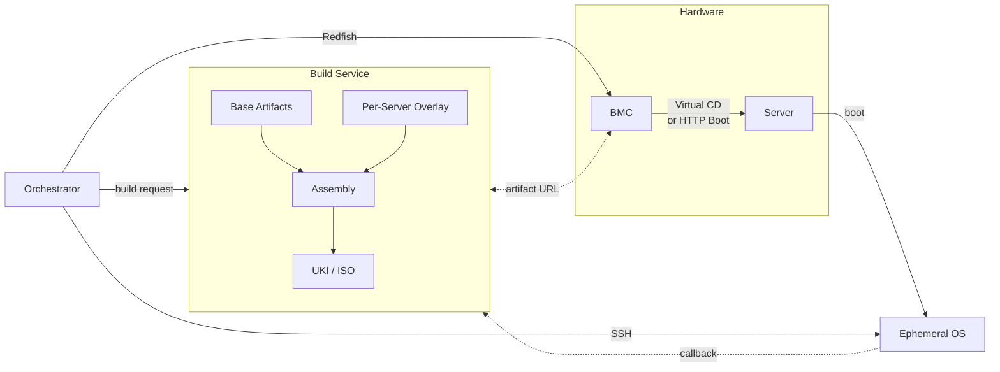
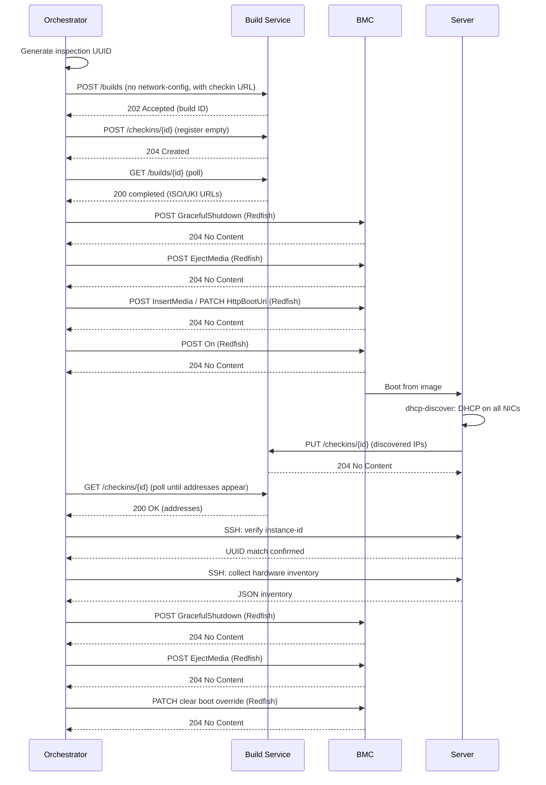
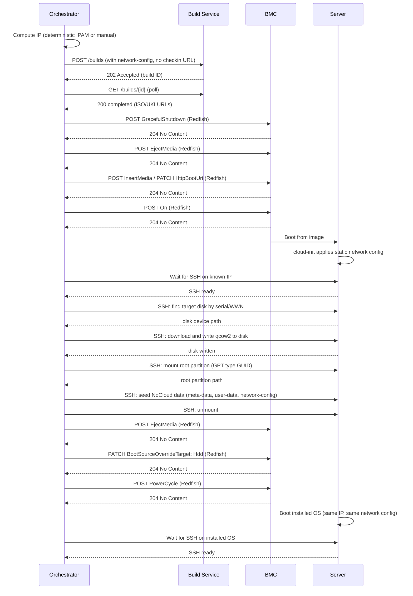

Baremetal provisioning has no shortage of tools, and some of them work well. But they share a common ancestry that shapes how they operate, and that ancestry is **PXE**.

> **Note:** PXE (Preboot Execution Environment) is a firmware protocol that lets a server boot from the network before any OS is installed. The typical flow is to chainload an iPXE binary from the PXE firmware, and iPXE handles the actual network boot, fetching a kernel and initramfs over HTTP or TFTP.
>
> That chainload itself happens over the network. The PXE firmware still needs a DHCP server and a TFTP server just to fetch the iPXE binary in the first place.

When most of these tools were designed, PXE was the only vendor-neutral way to boot and provision an arbitrary server over the network in an automated fashion. So PXE became a fundamental requirement, not a pluggable transport. The DHCP server needs a `next-server` option pointing at a TFTP server and a `filename` option specifying the boot binary. The TFTP server hosts boot menus and kernel images. In practice, this meant the provisioning system needed to take control of the DHCP server on the network, or at minimum coordinate closely with whoever managed it. The provisioning system and the network's DHCP infrastructure became tightly coupled, and every tool in this space inherits that coupling to some degree. Some of these tools have evolved (UEFI support, HTTP Boot, virtual media integration), but the PXE-era design is still at the core. The DHCP server still needs special configuration. The provisioning system still expects, at some level, to control or coordinate with network boot infrastructure. Even when a tool supports newer boot methods, the documentation and default paths most often assume PXE is in the picture.

PXE is no longer the only option for modern server hardware. Every modern server has a **BMC** that can deliver a boot image without PXE, without TFTP, and without the provisioning system touching the DHCP configuration. Any existing DHCP that hands out addresses and provides basic connectivity is enough. Most of the time, existing network infrastructure can be used with minimal to zero modifications.

## What If We Started Over?

What would a baremetal provisioning system look like if we designed it today, with intentional restrictions?

**No PXE support:** Not deprecated, not optional. Explicitly unsupported. The system will not generate PXE boot menus, will not serve files over TFTP, and will not require DHCP options 66 or 67.

**No legacy BIOS boot:** UEFI only. No CSM compatibility, no MBR boot paths. If the server can't boot an EFI executable, it's out of scope.

**Redfish BMC only:** No IPMI. All server management happens through a [Redfish](https://www.dmtf.org/standards/redfish) API. If the BMC doesn't speak Redfish, it's out of scope. Every provisioning operation goes through Redfish. In practice, some BMC firmware has bugs that leave the Redfish service in a bad state, and the only reliable recovery is a raw IPMI cold reset. That's not a provisioning operation, it's a last-resort recovery path for broken firmware.

**BMC/Firmware-driven delivery:** Every modern UEFI server has a BMC with a Redfish API. That BMC can mount a virtual CD image over its management interface and boot from it. Many BMCs can also accept a UEFI HTTP Boot URI and tell the firmware to fetch an EFI binary directly over HTTP. Both paths deliver a boot image to the server without PXE, without TFTP, and without the provisioning system touching the DHCP configuration.

**Minimal DHCP dependency:** We don't want to control a DHCP server with the provisioning system, and we can go further than just not requiring PXE options. A server might have multiple NICs, and we need a way to assign static IPs to each of them without relying on DHCP at all. The network identity of the server gets baked into the artifact at build time, not negotiated at boot time. For some NICs, DHCP might still be the right choice, so we keep that option available. The decision of static vs DHCP per interface is offloaded to whoever is driving the provisioning, not hardcoded in the system itself. The mechanics of how this works are covered in [The Ephemeral OS](#the-ephemeral-os).

**Swappable components:** The system has to be flexible enough that core parts of the workflow can be updated or replaced without refactoring or recompiling the whole thing. It's physically impossible to test every baremetal server model that exists, and the variety only grows over time. We accept that entropy is ever-increasing and design around it. The build process, the boot flow, the discovery logic, the OS configuration, all of these need to be swappable pieces, not welded into a monolith.

These constraints are deliberate. By dropping PXE, legacy boot, and IPMI, minimizing DHCP dependency, and keeping the system modular, we stop carrying the design baggage that makes existing tools complex to operate, difficult to set up environments for, and painful to update for new hardware.

### Turning Constraints into Solutions



**Pre-built base artifacts:** The kernel and a base initramfs are pre-built ahead of time, for example from a Dockerfile. The base initramfs is a complete ephemeral OS with everything needed to boot, configure networking, and run provisioning tasks. It has no server-specific identity baked in. It's a generic foundation.

**Per-server customization via [CPIO](https://man7.org/linux/man-pages/man1/cpio.1.html) overlay:** Each build appends a small overlay to the base initramfs carrying everything specific to one server: network configuration, SSH authorized keys, cloud-init seed data, a checkin URL. The base stays the same across all servers, and the overlay is what makes each build unique. The mechanics of how this works are covered in [How Builds Work](#how-builds-work).

**Cloud-init for network and OS configuration:** Cloud-init configuration is injected into the ephemeral OS as a NoCloud datasource through the CPIO overlay. IPAM happens in the layer above, in the provisioner itself. The system receives already flattened IPAM data and injects it as cloud-init network config. Cloud-init applies it at boot. The network config injected into the ephemeral OS can optionally be reused for the target OS as well, so the server keeps its network identity without any address change. This is a choice the consumer makes, not something the system enforces.

**Single build artifact (UKI):** All of this gets packaged into a **[Unified Kernel Image](https://uapi-group.org/specifications/specs/unified_kernel_image/)**. A UKI bundles the kernel, initramfs, and command line into one EFI executable that UEFI firmware can execute directly. One file, one fetch, nothing to assemble at boot time. Traditional PXE setups ship these as separate artifacts, with each step being a separate network request and its own failure mode. A UKI eliminates that entirely.

**ISO as a thin wrapper:** For virtual CD boot, the UKI gets wrapped in a bootable ISO. The bootloader chainloads the EFI binary, and from that point on the boot path is identical to UEFI HTTP Boot. One build produces both artifacts, covering both delivery mechanisms.

**Content-addressed caching:** Since every input to the build is known ahead of time, the build request itself can serve as a cache key. The mechanics of this are covered in [Build Endpoints](#build-endpoints).

**Orchestrator:** The system needs two things working together. A service that assembles UKI artifacts on demand from a build request, and an orchestrator that can handle Redfish BMC operations and run provisioning tasks over SSH against the ephemeral OS. The choice of Ansible here is intentional. It already has mature modules for Redfish BMC control and SSH-based server provisioning, but the same tool can also configure network infrastructure when needed, for example Top-of-Rack switches, making it a single automation layer across servers and their surrounding infrastructure. Network automation is out of scope for this post, but the point is that Ansible covers all three domains (BMC, server, network) without introducing additional tools. The playbooks are the swappable piece here. Different hardware, different provisioning workflows, different target OS installations can all be handled by swapping or extending playbooks without touching the build service.

## The Build Service

The orchestrator needs a way to request build artifacts on demand. It collects the per-server parameters, decides what goes into the overlay, and needs to hand that off to something that assembles the UKI and ISO. That something is a standalone service with a REST API. What follows is the API design for that service. We'll walk through the endpoints, the build mechanics, and the ephemeral OS, giving you enough to implement your own version or adapt the design to your environment.

Why REST? The service needs to be reachable from three directions: the orchestrator submits builds, the BMC or UEFI firmware fetches artifacts, and booted servers call back with checkin data. HTTP covers all three. The same server that handles the API can serve artifact files directly and accept a `curl -X PUT` callback from an initramfs that has no client libraries. One listen address, one port, one protocol. The consumers range from Ansible's `uri` module to `curl` one-liners, and HTTP is the one thing all of them already speak. It's also simple to implement. Any language's standard library can stand up an HTTP server with JSON request handling and static file serving, no frameworks or generated code required.

So the service handles build orchestration, artifact assembly, and file serving on one HTTP endpoint. The API surface breaks down into a few distinct groups, and the simplest ones are worth covering first because they set the stage for how everything else works.

### Artifacts and Health

Not everything the service exposes is a REST resource. Two endpoints fall outside the REST model entirely, and they're the most straightforward parts of the API.

**`GET /artifacts/{id}/{filename}`** serves build artifacts as plain files. When a build completes, the resulting UKI and ISO get written to disk. This endpoint is just a static file server with a path prefix. No JSON, no content negotiation. The BMC's virtual media subsystem would fetch the ISO from this URL. The UEFI firmware would fetch the UKI EFI binary from this URL. Both expect a raw file download, not a REST resource. The artifacts need to live on disk as real files because some BMC implementations fetch them using HTTP range requests, downloading chunks in parallel or resuming interrupted transfers. Streaming from memory or generating on the fly wouldn't work. The endpoint needs to support `HEAD` requests too, which BMCs use to check the content length before initiating a virtual media mount.

The artifact URLs would be returned in the build status response once a build completes, so the consumer never has to construct them manually. The orchestrator submits a build, polls until completion, and gets back a JSON object with `artifacts.isoUrl` and `artifacts.ukiUrl` ready to pass to the Redfish virtual media insert or UEFI HTTP Boot override.

**`GET /healthz`** returns `ok` as plain text. Standard liveness probe. Nothing else to say about it.

### Build Endpoints

The build endpoints are the core of the API. They handle build request submission, tracking build progress, and managing the build lifecycle.

**`POST /api/v1/builds`** accepts a build request and returns immediately with a build ID and a status URL. The response is HTTP 202 (Accepted), not 201 (Created), because the build hasn't happened yet. It's been enqueued. The request body specifies four required fields: `kernel` and `initramfs` (names of pre-built base artifacts on the server), `cmdline` (the kernel command line to embed), and `architecture` (`amd64` or `arm64`). Optionally, it includes a `files` array for injecting files into the CPIO overlay and `dirOverrides` for setting directory permissions within the overlay. Together, these two fields allow arbitrary file injection into the initramfs at build time. A `tlsArtifacts` boolean controls whether the artifact URLs in the build response use HTTPS (pointing at the TLS listener) or plain HTTP. The `kernel` and `initramfs` values are plain names that reference pre-built, per-architecture artifacts available on the service (e.g. `vmlinuz-amd64`, `initramfs-arm64.img`). If a referenced artifact doesn't exist, the request is rejected.

The build ID is a content-based hash. The service normalizes the request (sorts fields deterministically), computes a SHA-256 hash, and uses that as the ID. If the same build request comes in twice, the second call returns the existing build instead of starting a new one. This is what makes the caching work. The orchestrator doesn't need to track whether a build already exists. It just submits the request, and the service handles deduplication transparently. Failed builds get automatically cleaned up and retried on resubmission.

**`GET /api/v1/builds/{id}`** returns the current state of a build. The state field transitions through `pending`, `running`, `completed`, and `failed`. The orchestrator polls this endpoint in a loop until the state is either `completed` or `failed`. On completion, the response includes an `artifacts` object with `ukiUrl` and `isoUrl`. On failure, it includes an `error` string.

**`GET /api/v1/builds`** lists all builds. Useful for debugging and monitoring, not used in the normal provisioning flow.

**`DELETE /api/v1/builds/{id}`** deletes a single build and its artifacts from disk. **`DELETE /api/v1/builds`** purges everything. These are housekeeping operations for managing disk space on the artifact storage.

When a build fails, the `error` field in the status response carries whatever went wrong. Failed builds are cleaned up automatically and retried on resubmission. There isn't much else the orchestrator can do. Retry the build, and if it fails again, go look at the service logs.

<details>
<summary>OpenAPI specification for build endpoints</summary>

```yaml
paths:
  /api/v1/builds:
    get:
      operationId: ListBuilds
      summary: List all builds
      responses:
        "200":
          description: List of all builds
          content:
            application/json:
              schema:
                type: array
                items:
                  $ref: "#/components/schemas/BuildStatus"
    delete:
      operationId: PurgeBuilds
      summary: Delete all builds and their artifacts
      responses:
        "204":
          description: All builds purged
    post:
      operationId: CreateBuild
      summary: Submit a new build request
      requestBody:
        required: true
        content:
          application/json:
            schema:
              $ref: "#/components/schemas/BuildRequest"
      responses:
        "202":
          description: Build accepted
          content:
            application/json:
              schema:
                $ref: "#/components/schemas/BuildAccepted"
        "400":
          description: Invalid request
          content:
            application/json:
              schema:
                $ref: "#/components/schemas/Error"
        "503":
          description: Queue full
          content:
            application/json:
              schema:
                $ref: "#/components/schemas/Error"
  /api/v1/builds/{id}:
    get:
      operationId: GetBuild
      summary: Get build status
      parameters:
        - name: id
          in: path
          required: true
          schema:
            type: string
      responses:
        "200":
          description: Build status
          content:
            application/json:
              schema:
                $ref: "#/components/schemas/BuildStatus"
        "404":
          description: Build not found
          content:
            application/json:
              schema:
                $ref: "#/components/schemas/Error"
    delete:
      operationId: DeleteBuild
      summary: Delete a build and its artifacts
      parameters:
        - name: id
          in: path
          required: true
          schema:
            type: string
      responses:
        "204":
          description: Build deleted
        "404":
          description: Build not found
          content:
            application/json:
              schema:
                $ref: "#/components/schemas/Error"
components:
  schemas:
    Architecture:
      type: string
      enum:
        - amd64
        - arm64
    File:
      type: object
      required:
        - path
      properties:
        path:
          type: string
          description: Absolute path inside the initramfs
        contentBase64:
          type: string
          description: Base64-encoded file content (required for regular files, ignored for symlinks)
        linkTarget:
          type: string
          description: Symlink target path (when set, creates a symlink instead of a regular file)
        mode:
          type: string
          description: "Octal permission mode (e.g. \"0644\", \"0755\"). Default 0644 for files, 0777 for symlinks."
        uid:
          type: integer
          description: Owner UID (default 0)
        gid:
          type: integer
          description: Owner GID (default 0)
        dirMode:
          type: string
          description: "Octal permission mode for auto-created parent directories (e.g. \"0755\")"
        dirUid:
          type: integer
          description: UID for auto-created parent directories (default 0)
        dirGid:
          type: integer
          description: GID for auto-created parent directories (default 0)
    DirOverride:
      type: object
      required:
        - path
      properties:
        path:
          type: string
          description: Directory path inside the initramfs to override permissions for
        mode:
          type: string
          description: "Octal directory permission mode (e.g. \"0755\")"
        uid:
          type: integer
          description: Owner UID (default 0)
        gid:
          type: integer
          description: Owner GID (default 0)
    BuildRequest:
      type: object
      required:
        - kernel
        - initramfs
        - cmdline
        - architecture
      properties:
        kernel:
          type: string
          description: Name of kernel source directory
        initramfs:
          type: string
          description: Name of initramfs source directory
        cmdline:
          type: string
          description: Kernel command line
        architecture:
          $ref: "#/components/schemas/Architecture"
        files:
          type: array
          items:
            $ref: "#/components/schemas/File"
        dirOverrides:
          type: array
          items:
            $ref: "#/components/schemas/DirOverride"
        tlsArtifacts:
          type: boolean
          description: "When true, artifact URLs use HTTPS with TLS base URL. Default is HTTP."
    BuildAccepted:
      type: object
      required:
        - id
        - statusUrl
      properties:
        id:
          type: string
        statusUrl:
          type: string
    Artifacts:
      type: object
      properties:
        ukiUrl:
          type: string
        isoUrl:
          type: string
    BuildStatus:
      type: object
      required:
        - id
        - state
        - createdAt
      properties:
        id:
          type: string
        state:
          type: string
          enum:
            - pending
            - running
            - completed
            - failed
        error:
          type: string
        artifacts:
          $ref: "#/components/schemas/Artifacts"
        createdAt:
          type: string
          format: date-time
        completedAt:
          type: string
          format: date-time
    Error:
      type: object
      required:
        - message
      properties:
        message:
          type: string
```

</details>

### Checkin Endpoints

The build endpoints handle the provisioning case where the server's identity is known ahead of time. But there's another case. Sometimes you need to boot a server you know nothing about. You have BMC credentials, and that's it. No MAC address, no IP, no hardware manifest. You want to boot an ephemeral OS into it, discover what's there, and collect hardware inventory.

The problem is connectivity. The server boots, gets an IP via DHCP from whatever DHCP server happens to be on the network, and now it's running. But the orchestrator has no idea what IP it got. It can't SSH in. It can't reach the server at all. The server needs a way to call home and say "here I am, this is my address."

This is the callback use case we mentioned when discussing why REST was the right choice. The checkin API is a minimal rendezvous point between the orchestrator and a booted server that doesn't yet have a known identity.

The flow has two sides. The orchestrator generates a unique ID before booting the server, bakes that ID into the ephemeral image as a checkin URL, and pre-registers it with the service via `POST`. The server boots, discovers its own IP addresses, and reports them back via `PUT` to that same checkin URL. The orchestrator polls `GET` until the addresses show up. Once they do, it can SSH in and get to work.

**`POST /api/v1/checkins/{id}`** registers a checkin ID with an empty addresses array. The orchestrator calls this before booting the server. The ID is typically a UUID generated per inspection session. This step is what makes the `PUT` from the booted server work. Without pre-registration, the `PUT` returns 404. That's intentional. It prevents a random server on the network from writing to an arbitrary checkin ID and confusing the orchestrator. Only IDs that were explicitly reserved can be updated.

**`PUT /api/v1/checkins/{id}`** updates a checkin record with discovered IP addresses. This is the callback. The booted server runs a background service that collects its non-loopback IPv4 addresses and PUTs them as a JSON body. The server already has `curl` in the initramfs. The checkin URL was injected into the image at build time. No client library, no service discovery. Just a `curl -X PUT` in a loop until it gets a 204 back.

**`GET /api/v1/checkins/{id}`** returns the checkin record. The orchestrator polls this until the `addresses` array is non-empty. The record exists from the moment of registration (the `POST`), but the addresses are empty until the server updates them. So the polling condition isn't just "does this return 200" but "does the addresses array have entries."

**`DELETE /api/v1/checkins/{id}`** removes a checkin record after the orchestrator is done with it. **`DELETE /api/v1/checkins`** purges all records. Cleanup operations, same pattern as the build endpoints.

If the addresses never show up, the server either didn't boot, didn't get a DHCP lease, or didn't reach the service. The orchestrator should poll with a timeout and, if it expires, fall back to the BMC console for manual debugging. There's no automatic recovery here. If the network path between the server and the service doesn't work, no amount of retrying will fix it.

<details>
<summary>OpenAPI specification for checkin endpoints</summary>

```yaml
paths:
  /api/v1/checkins/{id}:
    post:
      operationId: CreateCheckin
      summary: Register a new checkin ID
      parameters:
        - name: id
          in: path
          required: true
          schema:
            type: string
      requestBody:
        required: true
        content:
          application/json:
            schema:
              $ref: "#/components/schemas/CheckinRequest"
      responses:
        "204":
          description: Checkin created
        "400":
          description: Invalid JSON body
          content:
            application/json:
              schema:
                $ref: "#/components/schemas/Error"
    put:
      operationId: UpdateCheckin
      summary: Update an existing checkin
      parameters:
        - name: id
          in: path
          required: true
          schema:
            type: string
      requestBody:
        required: true
        content:
          application/json:
            schema:
              $ref: "#/components/schemas/CheckinRequest"
      responses:
        "204":
          description: Checkin updated
        "400":
          description: Invalid JSON body
          content:
            application/json:
              schema:
                $ref: "#/components/schemas/Error"
        "404":
          description: Checkin ID not registered
          content:
            application/json:
              schema:
                $ref: "#/components/schemas/Error"
    get:
      operationId: GetCheckin
      summary: Get a checkin record
      parameters:
        - name: id
          in: path
          required: true
          schema:
            type: string
      responses:
        "200":
          description: Checkin record
          content:
            application/json:
              schema:
                $ref: "#/components/schemas/Checkin"
        "404":
          description: Checkin not found
          content:
            application/json:
              schema:
                $ref: "#/components/schemas/Error"
    delete:
      operationId: DeleteCheckin
      summary: Delete a checkin record
      parameters:
        - name: id
          in: path
          required: true
          schema:
            type: string
      responses:
        "204":
          description: Checkin deleted
        "404":
          description: Checkin not found
          content:
            application/json:
              schema:
                $ref: "#/components/schemas/Error"
  /api/v1/checkins:
    delete:
      operationId: PurgeCheckins
      summary: Delete all checkin records
      responses:
        "204":
          description: All checkins purged
components:
  schemas:
    CheckinRequest:
      type: object
      required:
        - addresses
      properties:
        addresses:
          type: array
          items:
            type: string
          description: IP addresses discovered on the server
    Checkin:
      type: object
      required:
        - id
        - addresses
        - timestamp
      properties:
        id:
          type: string
        addresses:
          type: array
          items:
            type: string
        timestamp:
          type: string
          format: date-time
```

</details>

### ACL

The service would be reachable from two very different classes of clients. The orchestrator is a trusted control plane that needs full access to create builds, register checkins, and delete resources. The booted servers and BMCs are untrusted. They need to fetch artifacts and update checkin records, nothing more. Exposing the full management API to every machine on the provisioning network is unnecessary and sloppy.

So the service needs to split access by source network. Trusted networks would be CIDR allowlists in the service configuration. Clients from those networks get unrestricted access to all endpoints. Clients from everywhere else are limited to the minimum they need: `PUT` on checkins (so booted servers can call home), `GET` and `HEAD` on artifacts (so BMCs and firmware can fetch images), and the health check. Everything else, creating builds, registering checkin IDs, deleting resources, must be rejected.

### TLS

The service deals with two kinds of traffic that might need encryption. Artifact downloads can be hundreds of megabytes, and the checkin callback carries IP addresses of freshly booted servers. In a locked-down environment, sending either of those in plaintext over a shared provisioning network may not be acceptable.

So the service needs to support a separate TLS listener alongside the plain HTTP one. Artifact URLs in build responses would point at the HTTPS endpoint instead (controlled by the `tlsArtifacts` flag on the build request), so BMCs and firmware fetch images over TLS. The checkin callback from booted servers would go over HTTPS too. The CA certificate gets injected into the ephemeral image via the CPIO overlay, same as any other per-server file, so the booted server can verify it's talking to the real service. Certificate rotation is a matter of rebuilding images with the new CA. Since artifacts are built on demand and cached by content hash, a new certificate produces a new build automatically.

## How Builds Work

The build request references a pre-built kernel and initramfs by name. These are the generic base artifacts described earlier. The build pipeline takes them and produces two output artifacts: a UKI (EFI executable) and an ISO (for virtual CD). If the request includes overlay files, those get injected first.

### The CPIO Overlay

Per-server customization happens through a CPIO overlay, and this is where the `files` and `dirOverrides` fields from the build request come in.

The Linux kernel can extract multiple concatenated initramfs archives. Each archive is a gzip-compressed CPIO stream, and the kernel processes them in order. Files in later archives override files from earlier ones. Instead of unpacking the base initramfs, injecting files, and repacking the whole thing, the service builds a small CPIO archive containing only the custom files and appends it to the base. The result looks like this:

<details>
<summary>Initramfs CPIO overlay structure</summary>

```
[base initramfs (gzip)] [padding] [overlay (gzip)]
```

</details>

At boot, the kernel extracts both streams into the root filesystem. The overlay's files appear on top of the base.

Each entry in the `files` array becomes a file (or symlink) inside that overlay archive. The `contentBase64` field carries the file content, `linkTarget` creates a symlink instead, and `mode` sets permissions. Parent directories are created automatically in the CPIO archive. If you inject `/root/.ssh/authorized_keys`, the archive includes directory entries for `/root` and `/root/.ssh` with default `0755` permissions. The `dirOverrides` field is how you change those defaults. `/root/.ssh` needs `0700`, and there's no way to express that through the file entry alone, so you pass a directory override for it.

Typical overlay files for a provisioning build include cloud-init seed data (`meta-data`, `user-data`, `network-config`), SSH authorized keys for remote access, and symlinks for tooling the ephemeral OS expects. For an inspection build, the overlay also includes a checkin URL so the booted server knows where to report its IP addresses.

### UKI Assembly

Once the initramfs is ready (base plus overlay, or just the base if no files were specified), it gets bundled into a UKI. The assembly embeds four sections into a systemd EFI stub using `objcopy`: OS release metadata, the kernel command line from the build request's `cmdline` field, the initramfs, and the kernel image. The output is a single EFI executable that UEFI firmware can boot directly.

### ISO Wrapping

For BMCs that support virtual media but not UEFI HTTP Boot, the UKI gets wrapped into a bootable ISO. A minimal GRUB configuration chainloads the UKI with zero timeout. The ISO is what gets mounted as a virtual CD through the BMC's Redfish interface. Once GRUB hands off to the UKI, the boot path is identical to UEFI HTTP Boot from that point on.

## The Ephemeral OS

The base initramfs shouldn't be a rescue shell or a minimal busybox environment. It needs to be a purpose-built provisioning OS that runs entirely in RAM. Once a server boots this image, everything needed to inspect hardware, configure networking, write an OS to disk, and report back to the orchestrator should already be there. No package installs over the network, no downloading tools at runtime.

Alpine Linux with OpenRC is a good fit for the base. Alpine produces small images, the base system is minimal, and it builds static binaries well. The entire OS, including firmware blobs for server-class NICs, can fit inside the initramfs.

Cloud-init with the NoCloud datasource handles early configuration. The seed data injected via the CPIO overlay lands at `/var/lib/cloud/seed/nocloud/`, and cloud-init picks it up on boot. The module list should be stripped down to what baremetal provisioning actually needs: hostname, DNS resolution, SSH keys, user accounts, and `runcmd` for arbitrary commands. No package management modules, no cloud provider integrations.

Two custom init services would handle the cases that cloud-init doesn't cover:

**`dhcp-discover`** would bridge the gap between inspection and provisioning. It checks whether a `network-config` file exists in the NoCloud seed directory. If it does, cloud-init handles networking with the injected configuration, and this service does nothing. If it doesn't, the service enumerates all physical NICs and starts DHCP on each of them. The obvious use case is inspection, where no network identity is known ahead of time and the server needs to get connectivity from whatever DHCP server is on the network. But it works for provisioning too. If you want some NICs on static IPs and others on DHCP, you inject a cloud-init network config that covers only the static interfaces and let this service pick up the rest. Or skip the network config entirely and let everything run on DHCP if that's what your environment needs.

**`checkin`** would be the call-home service for zero-knowledge discovery. It reads a URL from the NoCloud seed directory (injected by the orchestrator at build time), collects the server's non-loopback IPv4 addresses, and PUTs them to the checkin API in a background loop. If the checkin URL file doesn't exist (the provisioning case, where the server's IP is already known), the service is a no-op.

SSH should be configured for key-only root access. The authorized keys arrive via the CPIO overlay at `/root/.ssh/authorized_keys`.

The image would also include storage tools (LVM, mdadm, filesystem utilities, parted) and server-class NIC firmware (Intel, Mellanox, Broadcom, QLogic, etc.). For hardware inventory collection, something like [ghw](https://github.com/jaypipes/ghw) could be used. The system doesn't prescribe how you collect hardware data, only that the tooling is baked into the image ahead of time. A serial console getty on the architecture-appropriate port gives BMC console access when SSH isn't reachable.

## Inspecting an Unknown Server

Everything described so far exists to support two concrete workflows. Inspection is the first one, and it's optional. Most BMC web UIs expose enough hardware data to get provisioning started, and when that's sufficient, inspection can be skipped entirely. Provisioning needs a few pieces of hardware data. A MAC address for network config matching, a disk serial or WWN for targeting the right drive. Every Redfish-capable BMC exposes NIC MACs, disk identifiers, and basic system info through its management interface. Inspection is typically a one-time operation per server. You collect the data once, then provision as many times as you want. Doing it manually through the BMC console is perfectly fine. If you have a handful of servers to bring up, clicking through a web UI is faster than setting up an automated discovery pipeline.

But if you have a rack of unknown servers, or you want structured JSON output that can feed directly into a provisioning pipeline, or you just don't want to log into BMC web UIs one by one, that's where the automated inspection workflow comes in. You have BMC credentials and nothing else. No MAC address, no IP, no hardware manifest. The playbook boots an ephemeral OS, the server gets an IP via DHCP from whatever DHCP server is on the network, calls back to the build service with its address, and the playbook SSHes in to collect a full hardware inventory. This is the one case where a DHCP server on the provisioning network is required. The server has no pre-assigned IP, so it needs to get one dynamically before it can report back.



The first thing the playbook does is generate a UUID for this inspection session. That ID anchors the entire flow. It goes into the cloud-init `meta-data` as the instance ID, into the hostname, and most importantly, into a checkin URL that gets baked into the ephemeral image.

<details>
<summary>Generate inspection UUID and meta-data</summary>

```yaml
- name: Generate unique inspection ID
  ansible.builtin.set_fact:
    _inspect_id: "{{ lookup('pipe', 'uuidgen') }}"

- name: Build inspection meta-data
  ansible.builtin.set_fact:
    _inspect_meta_data:
      instance-id: "{{ _inspect_id }}"
      local-hostname: "inspect-{{ _inspect_id[:8] }}"
```

</details>

The overlay files get assembled next, using the same CPIO overlay mechanism described in [How Builds Work](#how-builds-work). For inspection, the overlay carries cloud-init seed data, SSH authorized keys, and the checkin URL file. The checkin URL points at the build service's endpoint with this UUID as the path component.

<details>
<summary>Overlay files for inspection image</summary>

```yaml
- name: Build overlay files for inspection ISO
  ansible.builtin.set_fact:
    _overlay_files:
      - path: "/var/lib/cloud/seed/nocloud/meta-data"
        contentBase64: "{{ _inspect_meta_data | to_nice_yaml | b64encode }}"
        mode: "0644"
      - path: "/var/lib/cloud/seed/nocloud/user-data"
        contentBase64: "{{ _inspect_user_data | b64encode }}"
        mode: "0644"
      - path: "/var/lib/cloud/seed/nocloud/checkin-url"
        contentBase64: "{{ (_callback_url ~ '/api/v1/checkins/' ~ _inspect_id) | b64encode }}"
        mode: "0644"
      - path: "/usr/local/bin/python"
        linkTarget: "/usr/bin/python3"
```

</details>

Notice what's **not** in that list: a `network-config` file. This is deliberate. Without it, the `dhcp-discover` init service in the ephemeral OS kicks in and starts DHCP on every NIC it finds. The server gets connectivity from whatever DHCP server happens to be on the network. No static IP assignment, no IPAM, no prior knowledge of the network topology.

The playbook submits the build request and pre-registers the checkin ID with the service.

<details>
<summary>Submit build request and register checkin ID</summary>

```yaml
- name: Submit build request
  ansible.builtin.uri:
    url: "{{ _api_url }}/api/v1/builds"
    method: POST
    body_format: json
    body: "{{ _inspect_build_request | combine({'tlsArtifacts': tls | default(false) | bool}) }}"
    status_code: 202
  register: build_submit

- name: Register checkin ID
  ansible.builtin.uri:
    url: "{{ _api_url }}/api/v1/checkins/{{ _inspect_id }}"
    method: POST
    body_format: json
    body:
      addresses: []
    status_code: 204
```

</details>

Once the build completes, the playbook has an ISO URL or a UKI URL. From here, Redfish takes over. Power off the server, clear any stale boot settings left over from a previous session, attach the image, power on. Every Redfish call carries basic auth credentials inline rather than using session-based authentication. This keeps the playbook stateless and avoids session lifecycle management. The auth parameters are omitted from the snippets below for brevity.

<details>
<summary>Redfish boot sequence: eject, insert media, set boot override</summary>

```yaml
- name: Eject any previously mounted virtual media
  ansible.builtin.uri:
    url: "https://{{ bmc_host }}/redfish/v1/Systems/{{ bmc_resource_id }}/VirtualMedia/Cd/Actions/VirtualMedia.EjectMedia"
    method: POST
    body_format: json
    body: {}
  when: boot_method == 'cd'

- name: Insert virtual media (ISO)
  community.general.redfish_command:
    baseuri: "{{ bmc_host }}"
    category: Systems
    command: VirtualMediaInsert
    virtual_media:
      image_url: "{{ iso_url }}"
      media_types:
        - CD
      inserted: true
      write_protected: true
  when: boot_method == 'cd'

- name: Set UEFI HTTP Boot override
  ansible.builtin.uri:
    url: "https://{{ bmc_host }}/redfish/v1/Systems/{{ bmc_resource_id }}"
    method: PATCH
    body_format: json
    body:
      Boot:
        HttpBootUri: "{{ uki_url }}"
        BootSourceOverrideTarget: "UefiHttp"
        BootSourceOverrideMode: "UEFI"
        BootSourceOverrideEnabled: "Once"
  when: boot_method == 'uefi-http'
```

</details>

Two things happen on the server side after boot. The `dhcp-discover` service sees no `network-config` file, enumerates all physical NICs, and starts DHCP on each. The `checkin` service reads the baked-in URL, enters a background loop, collects non-loopback IPv4 addresses via `ip -4 -j addr show`, and PUTs them to the checkin endpoint every 5 seconds until it gets a 204 back.

The playbook is polling on the other side, waiting for the addresses array to become non-empty.

<details>
<summary>Poll checkin endpoint for server address</summary>

```yaml
- name: Poll checkin endpoint until server reports in
  ansible.builtin.uri:
    url: "{{ _api_url }}/api/v1/checkins/{{ _inspect_id }}"
    method: GET
    status_code: [200, 404]
  register: checkin_result
  until: >-
    checkin_result.status == 200
    and (checkin_result.json.addresses | default([]) | length > 0)
  retries: 120
  delay: 10
```

</details>

A DHCP-assigned IP on a shared network isn't enough to trust. The server that checked in might not be the one you booted. Another machine could have grabbed the same checkin ID if there were a bug, or the DHCP lease could have been reassigned. The playbook verifies each discovered address by SSHing in and reading `/var/lib/cloud/data/instance-id`, the file cloud-init writes from the `meta-data` it processed at boot. If the value matches the UUID generated at the start of this session, the address belongs to the right server.

<details>
<summary>Verify SSH connectivity and instance-id on discovered addresses</summary>

```yaml
- name: Verify SSH connectivity and instance-id on each address
  ansible.builtin.command:
    cmd: >-
      ssh -o StrictHostKeyChecking=no -o UserKnownHostsFile=/dev/null
      -o ConnectTimeout=10
      -i {{ ssh_private_key_file | default('~/.ssh/uki-on-demand') }}
      root@{{ item }}
      cat /var/lib/cloud/data/instance-id
  register: ssh_checks
  loop: "{{ _discovered_addresses }}"
  failed_when: false
  changed_when: false

- name: Find first address with matching instance-id
  ansible.builtin.set_fact:
    _verified_host: "{{ item.item }}"
  loop: "{{ ssh_checks.results }}"
  when:
    - _verified_host is not defined
    - item.rc == 0
    - item.stdout | trim == _inspect_id
```

</details>

With SSH access confirmed, the playbook runs hardware inventory collection. Whatever tooling you bake into the initramfs for this is up to you. The goal is a structured inventory covering system identity, CPU, memory, storage devices with serials and WWNs, and physical NICs with MAC addresses. The output goes to a local JSON file.

<details>
<summary>Run hardware inventory and save to JSON</summary>

```yaml
- name: Run hardware inventory script
  ansible.builtin.command:
    cmd: /usr/local/bin/hw-inventory {{ _inspect_id }}
  register: hw_inventory_output
  changed_when: false

- name: Write inventory to local JSON file
  ansible.builtin.copy:
    content: "{{ hw_inventory_output.stdout }}\n"
    dest: "{{ inventory_output_dir | default('/tmp') }}/inspection-{{ _inspect_id }}.json"
    mode: "0644"
  delegate_to: 127.0.0.1
```

</details>

After collection, the playbook cleans up. Power off, clear boot settings, eject virtual media. The server is back in the state it started in. You now have the MAC addresses, disk serials, WWNs, and full hardware profile needed for provisioning, collected without knowing anything about the server upfront.

## Provisioning a Known Server

Provisioning is the second workflow and requires more upfront knowledge. You need BMC credentials, the server's MAC address, a disk identifier (serial or WWN), and either a target IP or a network range to allocate from. The playbook includes a pure-Ansible IPAM that can derive a stable IP from the BMC identity automatically, so an explicit address isn't always necessary. This data can come from a prior inspection run, from the BMC web UI, or from a vendor asset database. How you got it doesn't matter.

Unlike inspection, provisioning would inject a network configuration into the image. The primary interface gets a static IP so the orchestrator knows where to reach it, but other NICs can still use DHCP if that's what your environment needs. Since cloud-init handles the network config, the per-interface choice between static and DHCP is just a matter of what you put in the Netplan v2 structure. There's no checkin callback. The orchestrator just waits for SSH to come up on the expected address.



The IP can be assigned manually or computed automatically. The default derives it from a deterministic hash of the BMC identity.

<details>
<summary>Deterministic IPAM offset calculation</summary>

```yaml
_ipam_offset: >-
  {{ ((bmc_host ~ '/' ~ bmc_resource_id) | hash('sha256'))[:8]
     | int(base=16)
     % (server_subnet | ansible.utils.ipaddr('size') - 3) + 2 }}
server_host: >-
  {{ server_subnet | ansible.utils.ipaddr(_ipam_offset | int)
     | ansible.utils.ipaddr('address') }}
```

</details>

This concatenates the BMC host and resource ID into a unique string, takes the first 8 hex characters of its SHA-256 hash, and maps the result into the usable host range of the subnet. The same BMC identity always produces the same IP. Multiple servers on the same subnet get different addresses without any external IPAM service. Or you can set the IP manually and bypass the computation entirely.

The network config is a Netplan v2 structure defined in the per-server vars. It matches the target NIC by MAC address and assigns the computed (or manual) IP.

<details>
<summary>Netplan v2 network config for provisioning</summary>

```yaml
nocloud_network_config:
  version: 2
  ethernets:
    eth0:
      match:
        macaddress: "{{ server_mac }}"
      addresses:
        - "{{ server_host }}/{{ server_subnet | ansible.utils.ipaddr('prefix') }}"
      routes:
        - to: default
          via: "{{ server_gateway }}"
      nameservers:
        addresses: "{{ server_dns }}"
```

</details>

This same network config gets used twice. First, it's injected into the ephemeral OS via the CPIO overlay so cloud-init applies it at boot. Later, it's written to the target disk's NoCloud seed directory so the installed OS comes up on the same address. The server keeps its network identity across the reboot from ephemeral to installed OS, which means the playbook can SSH in after the reboot without any address change.

The overlay assembly is similar to inspection but with key differences. There's no checkin URL (the server's IP is already known), and there **is** a `network-config` file. Its presence tells the `dhcp-discover` service to do nothing.

<details>
<summary>Overlay files for provisioning image</summary>

```yaml
- name: Build base overlay files for ISO
  ansible.builtin.set_fact:
    _overlay_files:
      - path: "/var/lib/cloud/seed/nocloud/meta-data"
        contentBase64: "{{ nocloud_meta_data | to_nice_yaml | b64encode }}"
        mode: "0644"
      - path: "/var/lib/cloud/seed/nocloud/user-data"
        contentBase64: "{{ _iso_user_data | b64encode }}"
        mode: "0644"
      - path: "/usr/local/bin/python"
        linkTarget: "/usr/bin/python3"

- name: Add network-config to overlay files
  ansible.builtin.set_fact:
    _overlay_files: "{{ _overlay_files + [_net_file] }}"
  vars:
    _net_file:
      path: "/var/lib/cloud/seed/nocloud/network-config"
      contentBase64: "{{ nocloud_network_config | to_nice_yaml | b64encode }}"
      mode: "0644"
  when: nocloud_network_config is defined
```

</details>

The build submission and Redfish boot flow are identical to inspection. Build the image, poll until complete, power off the server, attach the image via virtual media or UEFI HTTP Boot, power on. The difference is what happens after boot. Instead of polling a checkin endpoint, the playbook just waits for SSH on the known IP.

<details>
<summary>Wait for SSH on provisioned server</summary>

```yaml
- name: Wait for target server SSH
  ansible.builtin.wait_for:
    host: "{{ server_host }}"
    port: 22
    delay: "{{ boot_wait_delay }}"
    timeout: "{{ ssh_wait_timeout }}"
```

</details>

Once SSH is up, the playbook connects to the ephemeral OS and writes an OS image to disk. This example uses a qcow2 cloud image, but nothing in the design requires it. You could write a playbook that pulls an OCI image instead, or runs a debootstrap, or does anything else you can do over SSH. The build service doesn't care what happens after boot. The playbook is yours to write.

The target disk is found by serial number or WWN in `/dev/disk/by-id/`, not by device name. Device names like `/dev/sda` can change between boots depending on probe order. Stable identifiers don't.

<details>
<summary>Find target disk by serial or WWN</summary>

```yaml
- name: Find disk by serial
  ansible.builtin.find:
    paths: /dev/disk/by-id
    patterns: "*{{ disk_serial }}*"
    excludes: "*-part*"
    file_type: any
  register: disk_by_serial
  when: disk_serial is defined

- name: Find disk by WWN
  ansible.builtin.find:
    paths: /dev/disk/by-id
    patterns: "*{{ disk_wwn }}*"
    excludes: "*-part*"
    file_type: any
  register: disk_by_wwn
  when: disk_wwn is defined and disk_serial is not defined
```

</details>

The image itself is a standard cloud qcow2 (Debian, Ubuntu, whatever your environment uses). The playbook downloads it and writes it raw to the target disk using `qemu-img convert`. This converts the sparse qcow2 into a raw block image directly onto the drive.

<details>
<summary>Download and write qcow2 image to disk</summary>

```yaml
- name: Download qcow2 image
  ansible.builtin.command: >-
    curl -fSL -o /tmp/disk.qcow2
    "{{ qcow2_image_url }}"

- name: Write qcow2 image to disk
  ansible.builtin.command: >-
    qemu-img convert -f qcow2 -O raw
    /tmp/disk.qcow2
    "{{ target_disk_device }}"
```

</details>

After writing the image, the playbook needs to find the root partition to seed cloud-init data. Instead of hardcoding partition numbers like `/dev/sda1`, it uses GPT type GUIDs from the [Discoverable Partitions Specification](https://uapi-group.org/specifications/specs/discoverable_partitions_specification/). Standard Linux cloud images stamp their root partition with the architecture-appropriate GUID during image creation. The playbook selects the right GUID for the build architecture and matches it with `lsblk`.

<details>
<summary>Find root partition by GPT type GUID</summary>

```yaml
- name: Select root partition type GUID for architecture
  ansible.builtin.set_fact:
    nocloud_root_partition_type_guid: >-
      {{ nocloud_root_partition_type_guid_arm64
         if (hostvars['127.0.0.1']['build_request']['architecture'] | default('amd64')) == 'arm64'
         else nocloud_root_partition_type_guid_amd64 }}

- name: Find root partition by GPT type GUID
  ansible.builtin.shell:
    cmd: >-
      set -o pipefail &&
      lsblk -ln -o PATH,PARTTYPE {{ target_disk_device }}
      | awk '$2 == "{{ nocloud_root_partition_type_guid }}" { print $1; exit }'
    executable: /bin/bash
  register: root_partition_result
  changed_when: false
```

</details>

With the root partition identified, the playbook mounts it and seeds the NoCloud directory. The `meta-data` carries instance identity. The `user-data` carries user accounts, SSH keys, and whatever else cloud-init should configure on first boot. The `network-config` is the same Netplan v2 data that brought up the ephemeral OS.

<details>
<summary>Seed NoCloud directory on target disk</summary>

```yaml
- name: Populate NoCloud seed directory
  block:
    - name: Create NoCloud seed directory
      ansible.builtin.file:
        path: /mnt/target/var/lib/cloud/seed/nocloud
        state: directory
        mode: "0755"

    - name: Write meta-data
      ansible.builtin.copy:
        content: "{{ nocloud_meta_data | to_nice_yaml }}"
        dest: /mnt/target/var/lib/cloud/seed/nocloud/meta-data
        mode: "0644"

    - name: Write user-data
      ansible.builtin.copy:
        content: "#cloud-config\n{{ nocloud_user_data | to_nice_yaml }}"
        dest: /mnt/target/var/lib/cloud/seed/nocloud/user-data
        mode: "0644"

    - name: Write network-config
      ansible.builtin.copy:
        content: "{{ nocloud_network_config | to_nice_yaml }}"
        dest: /mnt/target/var/lib/cloud/seed/nocloud/network-config
        mode: "0644"
      when: nocloud_network_config is defined

  always:
    - name: Unmount root partition
      ansible.posix.mount:
        path: /mnt/target
        state: unmounted
```

</details>

After unmounting, the playbook power-cycles the server into the installed OS. Eject virtual media, clear the boot override back to HDD, power on. The server comes up on the same IP with the same network config, no address change.

<details>
<summary>Clear boot settings and wait for SSH on installed OS</summary>

```yaml
- name: Clear boot settings
  ansible.builtin.uri:
    url: "https://{{ bmc_host }}/redfish/v1/Systems/{{ bmc_resource_id }}"
    method: PATCH
    body_format: json
    body:
      Boot:
        HttpBootUri: ""
        BootSourceOverrideTarget: "Hdd"
        BootSourceOverrideEnabled: "Continuous"

- name: Wait for SSH on installed OS
  ansible.builtin.wait_for:
    host: "{{ server_host }}"
    port: 22
    delay: "{{ boot_wait_delay }}"
    timeout: "{{ ssh_wait_timeout }}"
```

</details>

At this point the server is running its target OS with the identity and configuration you specified. The entire flow, from build request to SSH on the installed OS, required no PXE, no TFTP, no managed DHCP options, and no manual interaction with the server.

## What This Actually Changes

The whole point of this design is that the moving parts are small and under your control.

The build service itself would be a single HTTP server with a handful of endpoints. The API surface fits in one OpenAPI file. No database, no message queue, no distributed state. Build artifacts are files on disk. Checkin records live in memory.

The playbooks are not generated, not locked behind an abstraction layer, not tied to a specific version of the service. If your hardware needs a different Redfish path, a different disk discovery strategy, or a different OS installation method, you change the playbook. If you want to replace Ansible with something else entirely, the service doesn't care. It takes a build request over HTTP and gives back an artifact URL.

The network setup is minimal. The service needs to be reachable over HTTP from the orchestrator and from the BMCs or booted servers. That's one firewall rule, maybe two if you separate management and provisioning networks. No DHCP options to coordinate with a network team, no TFTP server to keep running, no boot menus to maintain. Adding a new server or a new subnet changes nothing on the infrastructure side.

The architecture is mostly push. The orchestrator builds an image with everything baked in, pushes it to the BMC via Redfish, and SSHes into the booted server to drive provisioning. The server's network identity, SSH access, and configuration are all pushed in. The orchestrator decides what happens, the server doesn't need to discover a provisioning system or register itself anywhere. The booted server may still pull things from the network depending on the provisioning workflow (downloading a qcow2 image, pulling an OCI container), but those are decisions made by the orchestrator, not requirements of the system itself. The only built-in pull paths are the BMC downloading boot artifacts over HTTP and the optional checkin callback for zero-knowledge discovery.

The tradeoff is scope. This design requires Redfish BMCs and UEFI firmware. IPMI-only hardware and legacy BIOS boot are explicitly out. That's a deliberate choice, not a gap. The simplicity gained from dropping PXE and legacy boot far outweighs the loss of hardware that should have been retired years ago.

The API spec, the build mechanics, the ephemeral OS design, and the delivery model are all laid out here. Nothing in this design requires a specific vendor, a specific orchestration tool, or a specific programming language. If your environment has Redfish BMCs and UEFI firmware, you have everything you need to build this yourself.

| | **Traditional (PXE)** | **Modern** |
|---|---|---|
| **Boot delivery** | PXE firmware → TFTP → iPXE chainload | Redfish Virtual CD or UEFI HTTP Boot |
| **Boot artifacts** | Separate kernel, initramfs, boot menu | Single UKI (one EFI binary) |
| **DHCP dependency** | Requires options 66/67, next-server; tight coupling | Standard DHCP or none; no special options |
| **Network infrastructure** | TFTP server, DHCP coordination | One HTTP server |
| **BMC protocol** | IPMI, Redfish | Redfish |
| **Firmware support** | Legacy BIOS + UEFI with CSM | UEFI only |
| **Per-server config** | DHCP reservations, boot menu entries, kickstart/preseed/cloud-init | CPIO overlay baked into artifact at build time, optional cloud-init |
| **Server discovery** | PXE registration, MAC-based DHCP | Checkin callback or known IP |
| **Provisioning model** | Server pulls config from provisioning system | Orchestrator pushes everything via SSH |
| **Adding a server/subnet** | DHCP reconfiguration, TFTP updates, boot menu changes | No infrastructure changes |

Traditional PXE provisioning requires a dedicated network segment with managed DHCP, TFTP services, and coordination with the network team for every subnet change. This design needs only basic IP connectivity between the orchestrator, the BMC, and the server.

## Conclusion

Modern baremetal provisioning doesn't need to inherit the complexity of a previous generation. If you're willing to draw a line under legacy BIOS, IPMI, and TFTP, what you get in return is a system that is dramatically simpler to operate, easier to maintain, and more reliable than the tools that came before it. The hardware has moved on. The provisioning stack should too.
